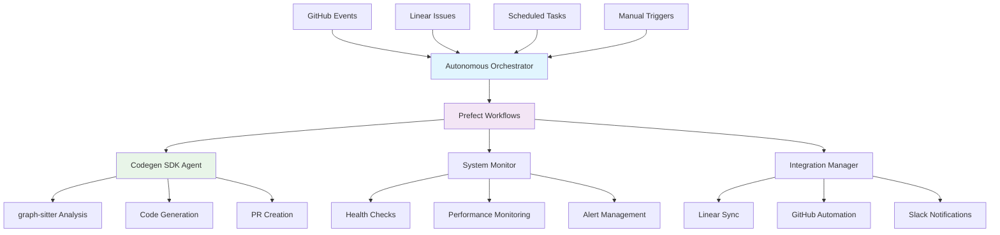

# 🚀 Consolidated Autonomous CI/CD System with Prefect Orchestration

## 📋 Overview

This document describes the comprehensive autonomous CI/CD system that consolidates and enhances the existing Prefect integration PRs (#121 and #132) into a unified, powerful orchestration platform. The system integrates:

- **🤖 Codegen SDK** - AI-powered autonomous operations
- **⚡ Prefect** - Workflow orchestration and monitoring  
- **📋 Linear** - Task management and issue tracking
- **🐙 GitHub** - Code management and PR automation
- **🌳 graph-sitter** - Deep code analysis and manipulation
- **💬 Slack** - Real-time notifications and alerts

## 🏗️ Architecture



## 🎯 Key Features

### ✨ Autonomous Operations
- **🔍 Component Analysis** - Deep analysis of code components with graph-sitter
- **🚨 Failure Analysis** - Automatic failure detection and recovery
- **📊 Performance Monitoring** - Continuous performance tracking and optimization
- **🔒 Security Audit** - Automated security scanning and remediation
- **📦 Dependency Management** - Smart dependency updates and testing
- **🧪 Test Optimization** - Intelligent test suite optimization

### 🔄 Workflow Orchestration
- **⚡ Prefect Integration** - Robust workflow management and scheduling
- **🎛️ Event-Driven Triggers** - Automatic response to GitHub/Linear events
- **🔄 Self-Healing** - Autonomous error recovery and system restoration
- **📈 Scalable Execution** - Concurrent workflow processing with resource management

### 🔗 Platform Integration
- **📋 Linear Synchronization** - Automatic issue creation and status updates
- **🐙 GitHub Automation** - PR lifecycle management and code reviews
- **💬 Slack Notifications** - Real-time status updates and alerts
- **🌳 graph-sitter Analysis** - Deep code understanding and manipulation

## 🚀 Quick Start

### 1. Environment Setup

```bash
# Required environment variables
export CODEGEN_ORG_ID="your-org-id"
export CODEGEN_TOKEN="your-api-token"
export GITHUB_TOKEN="your-github-token"
export LINEAR_API_KEY="your-linear-api-key"
export SLACK_WEBHOOK_URL="your-slack-webhook"

# Optional Prefect configuration
export PREFECT_API_URL="http://localhost:4200/api"
export PREFECT_WORKSPACE="your-workspace"
```

### 2. Installation

```bash
# Install the package with orchestration dependencies
pip install -e .
pip install prefect aiohttp psutil

# Initialize the orchestration system
python scripts/autonomous_orchestrator.py --action initialize
```

### 3. Basic Usage

```bash
# Run a health check
python scripts/autonomous_orchestrator.py --action health-check

# Analyze a specific component
python scripts/autonomous_orchestrator.py \
  --action component-analysis \
  --component "contexten/agents" \
  --linear-issue-id "ZAM-1084"

# Execute performance monitoring
python scripts/autonomous_orchestrator.py \
  --action execute \
  --operation performance_monitoring \
  --wait
```

## 🛠️ Configuration

### OrchestrationConfig

The system uses a comprehensive configuration class that supports:

```python
from contexten.orchestration import OrchestrationConfig

config = OrchestrationConfig(
    # Core credentials
    codegen_org_id="your-org-id",
    codegen_token="your-token",
    github_token="your-github-token",
    linear_api_key="your-linear-key",
    
    # System settings
    max_concurrent_workflows=5,
    auto_recovery_enabled=True,
    monitoring_enabled=True,
    
    # Alert thresholds
    alert_thresholds={
        "cpu_usage_percent": 80,
        "memory_usage_percent": 80,
        "error_rate_percent": 10
    }
)
```

### Configuration File

Create a YAML configuration file:

```yaml
# orchestration_config.yaml
codegen_org_id: "your-org-id"
codegen_token: "your-token"
github_token: "your-github-token"
linear_api_key: "your-linear-key"
slack_webhook_url: "your-slack-webhook"

max_concurrent_workflows: 5
auto_recovery_enabled: true
monitoring_enabled: true

alert_thresholds:
  cpu_usage_percent: 80
  memory_usage_percent: 80
  disk_usage_percent: 90
  error_rate_percent: 10
```

## 🔄 Workflow Types

The system supports 20 different autonomous workflow types:

### 📊 Analysis Workflows
- `component_analysis` - Comprehensive component analysis
- `failure_analysis` - Failure detection and recovery
- `performance_monitoring` - Performance tracking
- `code_quality_check` - Code quality analysis

### 🔧 Maintenance Workflows  
- `dependency_management` - Dependency updates
- `security_audit` - Security scanning
- `test_optimization` - Test suite optimization
- `dead_code_cleanup` - Unused code removal

### 🔗 Integration Workflows
- `linear_sync` - Linear synchronization
- `github_automation` - GitHub automation
- `slack_notifications` - Slack notifications

### 🏥 System Workflows
- `health_check` - System health monitoring
- `backup_operations` - Data backup
- `resource_optimization` - Resource optimization

### 🚀 Advanced Workflows
- `autonomous_refactoring` - AI-powered refactoring
- `intelligent_deployment` - Smart deployments
- `predictive_maintenance` - Predictive analysis

### 🛡️ Recovery Workflows
- `error_healing` - Autonomous error healing
- `system_recovery` - System restoration
- `data_recovery` - Data recovery

## 🤖 GitHub Actions Integration

The system includes comprehensive GitHub Actions workflows:

### Automatic Triggers
- **Workflow Failures** → Failure Analysis
- **Code Pushes** → Performance Monitoring  
- **Scheduled Tasks** → Maintenance Operations
- **Manual Dispatch** → Custom Operations

### Example Workflow Dispatch

```yaml
# Trigger component analysis
name: Component Analysis
on:
  workflow_dispatch:
    inputs:
      component:
        description: 'Component to analyze'
        required: true
        type: string
      linear_issue_id:
        description: 'Linear issue ID'
        required: false
        type: string
```

## 📊 Monitoring & Observability

### System Health Monitoring

The system continuously monitors:

- **🖥️ System Resources** - CPU, memory, disk usage
- **🔗 API Connectivity** - Codegen, Linear, GitHub, Slack
- **⚡ Workflow Performance** - Execution times, success rates
- **🚨 Error Tracking** - Failure patterns, recovery success

### Health Check Dashboard

```bash
# Get comprehensive system status
python scripts/autonomous_orchestrator.py --action status
```

Output includes:
- Active workflow count
- Success/failure rates  
- System resource usage
- Component health scores
- Recent alerts and issues

### Alert Management

Configurable alerts for:
- High resource usage
- API connectivity issues
- Workflow failures
- Performance degradation

## 🔧 Advanced Usage

### Programmatic API

```python
from contexten.orchestration import (
    AutonomousOrchestrator, 
    PrefectOrchestrator,
    AutonomousWorkflowType,
    OrchestrationConfig
)

# Initialize orchestrator
config = OrchestrationConfig()
orchestrator = PrefectOrchestrator(config)
await orchestrator.initialize()

# Trigger workflows
run_id = await orchestrator.trigger_component_analysis(
    component="contexten/agents",
    linear_issue_id="ZAM-1084"
)

# Monitor execution
status = await orchestrator.get_workflow_status(run_id)
print(f"Workflow status: {status.state_type}")
```

### Custom Workflow Creation

```python
from prefect import flow, task

@flow(name="custom-analysis")
async def custom_analysis_workflow(component: str):
    # Custom workflow logic
    result = await analyze_component(component)
    await update_linear_issue(result)
    return result

# Register with orchestrator
deployment = await create_workflow_deployment(custom_analysis_workflow)
```

## 🔍 Component Analysis Deep Dive

The component analysis system provides comprehensive analysis of code components:

### Analysis Types

1. **Code Quality Analysis**
   - Unused imports and functions
   - Parameter type validation
   - Error handling patterns
   - Code duplication detection

2. **Architectural Analysis**
   - Design pattern consistency
   - Dependency management
   - Interface design review
   - Scalability assessment

3. **Integration Analysis**
   - External API usage
   - Database connections
   - File system operations
   - Third-party library integration

### graph-sitter Integration

The system leverages graph-sitter for:
- **AST Parsing** - Deep code structure analysis
- **Symbol Resolution** - Cross-reference tracking
- **Code Transformation** - Safe refactoring operations
- **Dependency Mapping** - Import/export analysis

## 🚨 Error Handling & Recovery

### Autonomous Error Healing

The system includes sophisticated error recovery:

1. **Failure Detection** - Automatic failure pattern recognition
2. **Root Cause Analysis** - AI-powered failure investigation  
3. **Recovery Strategy Selection** - Multiple recovery approaches
4. **Automated Remediation** - Self-healing capabilities
5. **Prevention Updates** - Learning from failures

### Recovery Strategies

- **Retry with Backoff** - Intelligent retry mechanisms
- **Resource Cleanup** - Memory and connection management
- **Configuration Reset** - System state restoration
- **Fallback Execution** - Alternative execution paths
- **Human Escalation** - Automated help requests

## 📋 Linear Integration

### Automatic Issue Management

The system automatically:
- Creates main issues for component analysis
- Generates sub-issues for granular tasks
- Updates issue status based on progress
- Adds analysis results as comments
- Manages issue assignments and labels

### Issue Templates

```markdown
# Component Analysis: contexten/agents

## Analysis Scope
- Code quality review
- Architecture assessment  
- Integration point analysis
- Performance optimization

## Sub-Issues
- [ ] Code quality analysis
- [ ] Architecture review
- [ ] Integration testing
- [ ] Performance profiling

## Expected Outcomes
- Identified optimization opportunities
- Refactoring recommendations
- Integration improvements
- Performance enhancements
```

## 🐙 GitHub Integration

### PR Lifecycle Management

The system handles:
- **Automatic PR Creation** - Based on analysis results
- **PR Review Automation** - AI-powered code reviews
- **Branch Management** - Creation and cleanup
- **Deployment Validation** - Pre-merge testing
- **Merge Automation** - Approved PR merging

### Code Review Integration

```python
# Automatic PR review
await orchestrator.trigger_workflow(
    AutonomousWorkflowType.GITHUB_AUTOMATION,
    parameters={
        "action": "review_pr",
        "pr_number": 123,
        "focus_areas": ["security", "performance", "maintainability"]
    }
)
```

## 💬 Slack Integration

### Real-time Notifications

The system sends notifications for:
- Workflow completions
- System health alerts
- Analysis results
- Error conditions
- Recovery actions

### Notification Examples

```json
{
  "text": "🚀 Component Analysis Complete",
  "attachments": [{
    "color": "good",
    "fields": [
      {"title": "Component", "value": "contexten/agents", "short": true},
      {"title": "Status", "value": "✅ Success", "short": true},
      {"title": "Issues Found", "value": "3 optimization opportunities", "short": true},
      {"title": "Linear Issue", "value": "ZAM-1084", "short": true}
    ]
  }]
}
```

## 🔒 Security Considerations

### Credential Management
- Environment variable configuration
- Prefect secrets integration
- Secure API token handling
- Minimal permission principles

### Access Control
- Role-based workflow access
- API rate limiting
- Audit logging
- Secure communication channels

## 📈 Performance Optimization

### Workflow Efficiency
- Concurrent execution (up to 5 parallel workflows)
- Resource-aware scheduling
- Intelligent caching
- Optimized API usage

### System Monitoring
- Real-time performance metrics
- Resource usage tracking
- Bottleneck identification
- Capacity planning

## 🧪 Testing & Validation

### Automated Testing
- Unit tests for all components
- Integration tests for workflows
- End-to-end system tests
- Performance benchmarks

### Validation Procedures
- Configuration validation
- API connectivity tests
- Workflow execution tests
- Recovery mechanism tests

## 📚 Troubleshooting

### Common Issues

1. **Codegen SDK Connection Errors**
   ```bash
   # Verify credentials
   echo $CODEGEN_ORG_ID
   echo $CODEGEN_TOKEN
   
   # Test connection
   python -c "from codegen import Agent; Agent(org_id='$CODEGEN_ORG_ID', token='$CODEGEN_TOKEN')"
   ```

2. **Prefect Workflow Failures**
   ```bash
   # Check Prefect server status
   prefect server start
   
   # View workflow logs
   python scripts/autonomous_orchestrator.py --action status
   ```

3. **Integration API Issues**
   ```bash
   # Test Linear API
   curl -H "Authorization: Bearer $LINEAR_API_KEY" https://api.linear.app/graphql
   
   # Test GitHub API  
   curl -H "Authorization: token $GITHUB_TOKEN" https://api.github.com/user
   ```

### Debug Mode

```bash
# Enable debug logging
export LOG_LEVEL=DEBUG

# Run with verbose output
python scripts/autonomous_orchestrator.py --action health-check
```

## 🚀 Future Enhancements

### Planned Features
- **Multi-Repository Support** - Cross-project orchestration
- **Advanced Analytics** - Predictive maintenance
- **Custom Workflow Builder** - Visual workflow designer
- **Enhanced AI Integration** - More sophisticated analysis
- **Real-time Dashboard** - Web-based monitoring interface

### Extensibility
- Plugin architecture for custom workflows
- API for external integrations
- Webhook support for real-time events
- Custom notification channels

## 📄 License

This implementation follows the same license as the parent graph-sitter project.

## 🤝 Contributing

1. Fork the repository
2. Create a feature branch
3. Implement your changes
4. Add comprehensive tests
5. Update documentation
6. Submit a pull request

## 📞 Support

For issues and questions:
- Create GitHub issues for bugs
- Use Linear for feature requests
- Join Slack for discussions
- Check documentation for guidance

---

**🎉 The Consolidated Autonomous CI/CD System represents the next evolution of intelligent software development, combining the power of AI, robust orchestration, and seamless integrations to create a truly autonomous development experience.**

