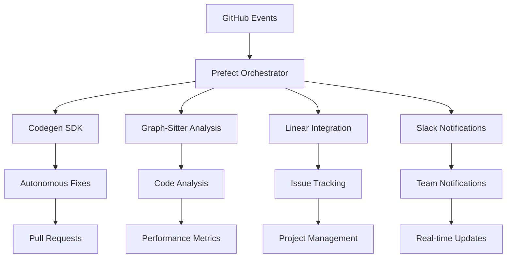

# 🚀 Autonomous CI/CD Implementation Guide

## 📋 Overview

This document provides a complete implementation guide for the autonomous CI/CD project flow system for the graph-sitter project. The system integrates **Codegen SDK**, **Prefect**, **Linear**, and **GitHub** to create a fully autonomous development workflow.

## 🏗️ Architecture

### System Components



### Core Modules

1. **Prefect Integration** (`src/contexten/extensions/prefect/`)
   - Workflow orchestration and scheduling
   - Task management and monitoring
   - Notification system

2. **Enhanced Analysis** (`scripts/analyze_unused_code.py`)
   - Unused code detection
   - Parameter validation
   - Optimization opportunities

3. **Setup and Configuration** (`scripts/setup_autonomous_cicd_enhanced.py`)
   - System initialization
   - Configuration validation
   - Health checks

## 🚀 Quick Start

### 1. Environment Setup

Create a `.env` file with the required configuration:

```bash
# Codegen SDK Configuration
CODEGEN_ORG_ID=your_organization_id
CODEGEN_TOKEN=your_api_token

# Prefect Configuration
PREFECT_API_KEY=your_prefect_api_key
PREFECT_WORKSPACE=your_workspace

# Integration APIs
GITHUB_TOKEN=your_github_token
LINEAR_API_KEY=your_linear_api_key
SLACK_WEBHOOK_URL=your_slack_webhook

# Autonomous Behavior Settings
AUTO_FIX_CONFIDENCE_THRESHOLD=0.75
MAX_AUTO_FIXES_PER_DAY=10
PERFORMANCE_REGRESSION_THRESHOLD=20.0
```

### 2. Install Dependencies

```bash
# Install Prefect and additional dependencies
pip install prefect>=3.0.0 prefect[kubernetes]>=3.0.0

# Install the project
pip install -e .
```

### 3. Run Setup Script

```bash
python scripts/setup_autonomous_cicd_enhanced.py
```

### 4. Analyze Codebase

```bash
python scripts/analyze_unused_code.py
```

## 🔧 Configuration

### Prefect Workflows

The system includes four main workflows:

#### 1. Autonomous Maintenance
- **Schedule**: Daily at 2 AM UTC
- **Purpose**: Comprehensive codebase maintenance
- **Actions**: 
  - Code analysis
  - Fix generation and application
  - Performance monitoring
  - Dependency updates

#### 2. Failure Analysis
- **Trigger**: CI/CD failure events
- **Purpose**: Analyze and fix build failures
- **Actions**:
  - Log analysis
  - Root cause identification
  - Automatic fix generation
  - PR creation

#### 3. Dependency Updates
- **Schedule**: Weekly on Monday at 6 AM
- **Purpose**: Smart dependency management
- **Actions**:
  - Security vulnerability scanning
  - Compatibility analysis
  - Automated updates with testing

#### 4. Performance Optimization
- **Schedule**: Every 30 minutes
- **Purpose**: Monitor and optimize performance
- **Actions**:
  - Performance regression detection
  - Bottleneck identification
  - Automatic optimization

### Configuration Parameters

| Parameter | Default | Description |
|-----------|---------|-------------|
| `AUTO_FIX_CONFIDENCE_THRESHOLD` | 0.75 | Minimum confidence for auto-fixes |
| `MAX_AUTO_FIXES_PER_DAY` | 10 | Maximum automatic fixes per day |
| `PERFORMANCE_REGRESSION_THRESHOLD` | 20.0 | Performance regression alert threshold (%) |
| `MAINTENANCE_SCHEDULE` | "0 2 * * *" | Daily maintenance schedule (cron) |
| `SECURITY_SCAN_SCHEDULE` | "0 */6 * * *" | Security scan schedule (cron) |

## 🔍 Code Analysis Results

### Unused Code Identification

The analysis script identifies several categories of unused code:

1. **Unused Imports** - Import statements not used in the file
2. **Unused Functions** - Functions not called externally
3. **Unused Classes** - Classes not instantiated or inherited
4. **Unused Variables** - Module-level constants not referenced

### Parameter Validation Issues

Common parameter issues detected:

1. **Missing Environment Variables** - Required config not set
2. **Hardcoded Values** - Configuration that should be parameterized
3. **Inconsistent Timeouts** - Different timeout values across modules
4. **Type Mismatches** - Parameter type inconsistencies

### Optimization Opportunities

1. **Large Files** - Files over 500 lines that could be split
2. **Complex Functions** - Functions with too many parameters
3. **Dependency Bloat** - Modules with excessive imports
4. **Dead Code Paths** - Unreachable or experimental code

## 🤖 Autonomous Operations

### Workflow Execution

```python
from contexten.extensions.prefect.client import PrefectOrchestrator

# Initialize orchestrator
orchestrator = PrefectOrchestrator()
await orchestrator.initialize()

# Run autonomous maintenance
run_id = await orchestrator.run_autonomous_maintenance(
    repo_url="https://github.com/your-org/your-repo",
    branch="main",
    auto_apply_fixes=True
)

# Monitor progress
status = await orchestrator.get_workflow_status(run_id)
print(f"Workflow status: {status['status']}")
```

### Manual Triggers

```python
# Analyze a specific failure
failure_run_id = await orchestrator.run_failure_analysis(
    repo_url="https://github.com/your-org/your-repo",
    workflow_run_id="12345",
    failure_logs="Error logs here..."
)

# Update dependencies
update_run_id = await orchestrator.run_dependency_update(
    repo_url="https://github.com/your-org/your-repo",
    update_strategy="security-only"
)
```

### Notification System

The system sends notifications for:

- ✅ Workflow completions
- ❌ Workflow failures
- 🔧 Fixes applied
- 🔒 Security updates
- ⚠️ Performance regressions
- 🚨 Critical alerts

## 📊 Monitoring and Metrics

### System Metrics

The orchestrator provides comprehensive metrics:

```python
metrics = await orchestrator.get_system_metrics()
print(f"Success rate: {metrics['success_rate']:.1f}%")
print(f"Average runtime: {metrics['average_runtime_seconds']:.1f}s")
print(f"Active workflows: {metrics['active_runs']}")
```

### Performance Tracking

- **Workflow Success Rates** - Track automation effectiveness
- **Fix Confidence Scores** - Monitor AI fix quality
- **Performance Regressions** - Detect system slowdowns
- **Security Vulnerability Counts** - Track security posture

## 🛡️ Safety Mechanisms

### Confidence Thresholds

- **Auto-fixes**: Only applied above 75% confidence
- **Critical Changes**: Require human approval
- **Rollback Capability**: Automatic rollback on failure

### Rate Limiting

- **Maximum Fixes**: 10 automatic fixes per day
- **Workflow Concurrency**: 5 concurrent workflows maximum
- **API Rate Limits**: Respect all external API limits

### Human Oversight

- **Audit Trails**: All actions logged and traceable
- **Manual Override**: Human can stop/modify any workflow
- **Approval Gates**: Critical changes require approval

## 🔧 Troubleshooting

### Common Issues

#### Configuration Errors
```bash
# Check configuration
python -c "from contexten.extensions.prefect.config import get_config, validate_config; config = get_config(); print(validate_config(config))"
```

#### Prefect Connection Issues
```bash
# Test Prefect connection
prefect cloud login
prefect deployment ls
```

#### Codegen Authentication
```bash
# Test Codegen SDK
python -c "from codegen import Agent; agent = Agent(org_id='your_org', token='your_token'); print('Connected!')"
```

### Debug Mode

Enable debug logging:

```bash
export LOG_LEVEL=DEBUG
export PREFECT_LOGGING_LEVEL=DEBUG
```

### Health Checks

```python
from contexten.extensions.prefect.client import PrefectOrchestrator

orchestrator = PrefectOrchestrator()
await orchestrator.initialize()

# Check system health
metrics = await orchestrator.get_system_metrics()
active_workflows = await orchestrator.list_active_workflows()

print(f"System healthy: {len(active_workflows) < 10}")
```

## 📈 Performance Optimization

### Workflow Optimization

1. **Parallel Execution** - Run independent tasks concurrently
2. **Caching** - Cache analysis results and dependencies
3. **Resource Management** - Optimize memory and CPU usage
4. **Batch Processing** - Group similar operations

### Scaling Considerations

1. **Horizontal Scaling** - Multiple Prefect workers
2. **Resource Limits** - Set appropriate CPU/memory limits
3. **Queue Management** - Separate queues for different priorities
4. **Load Balancing** - Distribute work across workers

## 🔮 Future Enhancements

### Planned Features

1. **Machine Learning Integration**
   - Predictive failure analysis
   - Intelligent fix suggestion
   - Performance trend prediction

2. **Advanced Integrations**
   - Multi-cloud support
   - Advanced monitoring (Datadog, New Relic)
   - Team collaboration features

3. **Enhanced Automation**
   - Cross-repository learning
   - Automated testing strategies
   - Intelligent deployment decisions

### Roadmap

- **Phase 1** (Current): Basic autonomous operations
- **Phase 2** (Month 2): Advanced AI integration
- **Phase 3** (Month 3): Cross-repository coordination
- **Phase 4** (Month 4): Predictive capabilities

## 📚 API Reference

### PrefectOrchestrator

Main orchestrator class for managing workflows.

#### Methods

- `initialize()` - Initialize the orchestrator
- `run_autonomous_maintenance(repo_url, branch, **kwargs)` - Run maintenance workflow
- `run_failure_analysis(repo_url, workflow_run_id, failure_logs)` - Analyze failures
- `get_workflow_status(run_id)` - Get workflow status
- `cancel_workflow(run_id)` - Cancel running workflow
- `get_system_metrics()` - Get system metrics

### Configuration Classes

- `PrefectConfig` - Main configuration class
- `WorkflowConfig` - Individual workflow configuration
- `TaskConfig` - Task-specific configuration

### Notification System

- `send_notification(type, message, data)` - Send notifications
- `NotificationType` - Enum of notification types
- `NotificationChannel` - Enum of notification channels

## 🤝 Contributing

### Development Setup

1. Clone the repository
2. Install development dependencies: `pip install -e .[dev]`
3. Run tests: `pytest`
4. Run analysis: `python scripts/analyze_unused_code.py`

### Adding New Workflows

1. Create workflow function in `workflows.py`
2. Add configuration in `config.py`
3. Update orchestrator in `client.py`
4. Add tests and documentation

### Code Quality

- **Type Hints**: All functions must have type hints
- **Documentation**: Comprehensive docstrings required
- **Testing**: 90%+ test coverage target
- **Linting**: Pass all ruff and mypy checks

## 📄 License

This implementation follows the same license as the parent graph-sitter project.

---

**Ready to revolutionize your development workflow with autonomous CI/CD!** 🚀

For questions or support, please create an issue in the repository or contact the development team.

