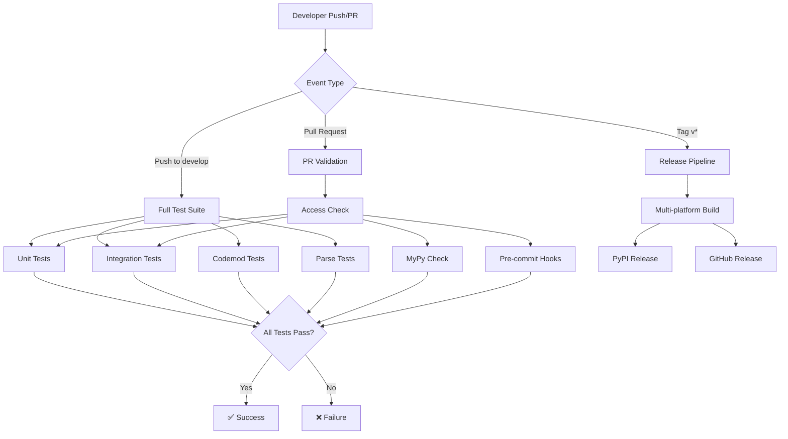

# CI/CD Flow Documentation

## Overview

Graph-sitter uses GitHub Actions for continuous integration and deployment. The CI/CD pipeline ensures code quality, runs comprehensive tests, and automates releases to PyPI.

## Workflow Architecture

## Workflow Details

### 1. Test Workflow (`test.yml`)

**Triggers:**
- Push to `develop` branch
- Pull requests targeting `develop`
- Manual workflow dispatch

**Jobs:**

#### Access Check
- Validates that the triggering actor has write permissions
- Uses `actions-cool/check-user-permission@v2`
- Required for all subsequent jobs

#### Unit Tests
- **Matrix Strategy**: 8 parallel groups for faster execution
- **Environment**: Ubuntu Latest with Python setup
- **Test Command**: `uv run pytest` with coverage and parallel execution
- **Timeout**: 5 minutes per group
- **Coverage**: Reports to Codecov

#### Codemod Tests
- **Conditional**: Currently disabled (`if: false`)
- **Matrix**: Tests both sync/async graph modes and small/large codebases
- **Concurrency**: Prevents overlapping runs
- **Cache**: Uses OSS repos cache for performance
- **Timeout**: 15 minutes

#### Parse Tests
- **Conditional**: Triggered by `parse-tests` label, push, or manual dispatch
- **Dependencies**: Installs yarn and pnpm for JavaScript parsing
- **Timeout**: 15 minutes
- **Notification**: Slack alerts on failure (currently disabled)

#### Integration Tests
- **Environment**: Requires GitHub token for API access
- **Scope**: Tests Codegen integration functionality
- **Timeout**: 5 minutes

### 2. Release Workflow (`release.yml`)

**Triggers:**
- Tags matching `v*` pattern
- Workflow call with release tag
- Pull requests to `develop` (build only)

**Build Matrix:**
- **Operating Systems**: Ubuntu (x86_64, ARM), macOS (latest, 13)
- **Python Versions**: 3.12, 3.13
- **Build Tool**: `cibuildwheel` for cross-platform wheels

**Release Process:**
1. **Multi-platform Build**: Creates wheels for all OS/Python combinations
2. **Artifact Collection**: Downloads all build artifacts
3. **PyPI Release**: Uses trusted publishing with OIDC
4. **GitHub Release**: Creates release with artifacts and auto-generated notes

### 3. Pre-commit Workflow (`pre-commit.yml`)

**Purpose**: Ensures code quality and consistency
**Triggers**: Pull requests and pushes
**Checks**:
- Code formatting (Black, isort)
- Linting (Ruff)
- Type checking preparation
- Import sorting
- Trailing whitespace removal

### 4. MyPy Workflow (`mypy.yml`)

**Purpose**: Static type checking
**Configuration**: Uses `mypy.ini` for settings
**Scope**: Validates type annotations across the codebase

### 5. Documentation Generation (`generate-docs.yml`)

**Purpose**: Automatically updates documentation
**Trigger**: Changes to documentation files
**Process**: Builds and deploys documentation to hosting platform

### 6. Auto-release Workflow (`auto-release.yml`)

**Purpose**: Automated version bumping and release creation
**Trigger**: Specific commit patterns or manual dispatch
**Process**: 
- Analyzes commit messages for version bump type
- Updates version numbers
- Creates release tags
- Triggers release workflow

### 7. Cache Management (`cache-delete.yml`)

**Purpose**: Manages GitHub Actions cache storage
**Trigger**: Manual or scheduled
**Function**: Cleans up old cache entries to stay within limits

## Environment Setup

### Required Secrets
- `CODECOV_TOKEN`: For test coverage reporting
- `CODECOV_STATIC_TOKEN`: For static analysis coverage
- `GHA_PAT`: GitHub Personal Access Token for API access
- `SLACK_WEBHOOK_URL`: For failure notifications
- PyPI trusted publishing (OIDC) for releases

### Development Environment
- **Python**: 3.12-3.13 (3.13+ recommended)
- **Package Manager**: UV for fast dependency management
- **Virtual Environment**: `.venv` directory
- **Pre-commit**: Automated code quality checks

## Performance Optimizations

### Test Parallelization
- Unit tests split into 8 parallel groups
- Integration tests use `pytest-xdist` for parallel execution
- Codemod tests use matrix strategy for different configurations

### Caching Strategy
- UV package cache for faster dependency installation
- OSS repositories cache for integration tests
- Build cache for Cython extensions

### Conditional Execution
- Parse tests only run when labeled or on main branch
- Codemod tests can be triggered with `big-codemod-tests` label
- Integration tests skip on draft PRs

## Monitoring and Alerts

### Coverage Reporting
- **Tool**: Codecov
- **Threshold**: Configurable per project
- **Reports**: Per-job flags for detailed analysis

### Failure Notifications
- **Slack Integration**: Alerts for critical failures
- **GitHub Checks**: Detailed status reporting
- **Email**: GitHub's built-in notifications

## Security Considerations

### Permission Model
- Write access required for triggering workflows
- Secrets isolated per environment
- OIDC for PyPI publishing (no long-lived tokens)

### Code Scanning
- Pre-commit hooks prevent common issues
- MyPy catches type-related bugs
- Dependency scanning (implicit via UV)

## Troubleshooting Common Issues

### Test Failures
1. **Cython Compilation**: Ensure modules are built before testing
2. **Environment Issues**: Check Python version compatibility
3. **Dependency Conflicts**: Use `uv sync --reinstall-package codegen`

### Build Failures
1. **Platform Issues**: Check matrix configuration
2. **Dependency Missing**: Verify system dependencies
3. **Cache Corruption**: Clear GitHub Actions cache

### Release Issues
1. **Tag Format**: Must match `v*` pattern
2. **Permissions**: Ensure OIDC is configured for PyPI
3. **Artifacts**: Verify all platforms built successfully

## Best Practices

### For Contributors
1. **Local Testing**: Run `uv run pytest` before pushing
2. **Pre-commit**: Install hooks with `pre-commit install`
3. **Type Hints**: Add type annotations for new code
4. **Documentation**: Update docs for new features

### For Maintainers
1. **Release Planning**: Use semantic versioning
2. **Cache Management**: Monitor cache usage
3. **Security Updates**: Keep actions up to date
4. **Performance**: Monitor test execution times

## Future Improvements

### Planned Enhancements
- [ ] Re-enable codemod tests with better performance
- [ ] Add security scanning workflow
- [ ] Implement automatic dependency updates
- [ ] Add performance benchmarking
- [ ] Enhance Slack notifications with more context

### Metrics to Track
- Test execution time trends
- Build success rates
- Coverage trends
- Release frequency
- Cache hit rates

