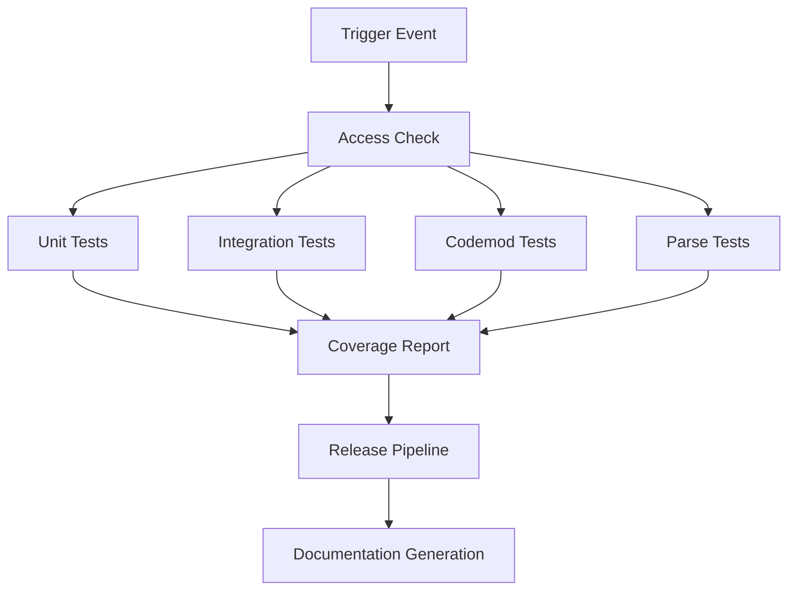

# 🚀 CI/CD Flow Documentation

## Overview

Graph-sitter employs a comprehensive CI/CD pipeline built on GitHub Actions that ensures code quality, reliability, and seamless deployment. The pipeline is designed for high performance with parallel execution, intelligent caching, and conditional testing based on change patterns.

## 🔄 Pipeline Architecture

### Trigger Events
The CI/CD pipeline is triggered by:
- **Push to `develop` branch**: Full test suite execution
- **Pull Request to `develop`**: Comprehensive validation before merge
- **Manual Dispatch**: On-demand pipeline execution for testing and debugging

### Pipeline Stages Overview


## 🛡️ Stage 1: Access Control

**Purpose**: Verify contributor permissions and security
**File**: `.github/workflows/test.yml`

```yaml
access-check:
  runs-on: ubuntu-latest
  steps:
    - uses: actions-cool/check-user-permission@v2
      with:
        require: write
        username: ${{ github.triggering_actor }}
        error-if-missing: true
```

**Key Features**:
- Validates that the triggering actor has write permissions
- Prevents unauthorized code execution
- Fails fast if permissions are insufficient

## ⚡ Stage 2: Unit Tests

**Purpose**: Fast, isolated component testing with parallel execution
**Execution Time**: ~5 minutes
**Parallelization**: 8 concurrent groups

```yaml
unit-tests:
  needs: access-check
  runs-on: ubuntu-latest
  strategy:
    matrix:
      group: [1, 2, 3, 4, 5, 6, 7, 8]
```

**Test Configuration**:
- **Test Runner**: pytest with xdist for parallel execution
- **Coverage**: Comprehensive code coverage reporting
- **Timeout**: 15 seconds per test, 5 minutes total
- **Splits**: Tests divided into 8 groups for optimal performance

**Command Executed**:
```bash
uv run pytest \
  -n auto \
  --cov src \
  --splits 8 --group ${{ matrix.group }} \
  --timeout 15 \
  -o junit_suite_name="${{github.job}}-${{ matrix.group }}" \
  tests/unit
```

## 🔗 Stage 3: Integration Tests

**Purpose**: End-to-end workflow validation with real scenarios
**Execution Time**: ~5 minutes
**Dependencies**: GitHub token for API testing

```yaml
integration-tests:
  needs: access-check
  runs-on: ubuntu-latest
  env:
    GITHUB_TOKEN: ${{ secrets.GHA_PAT }}
```

**Test Scope**:
- Codegen SDK integration testing
- Real GitHub API interactions
- Cross-module functionality validation
- Error handling and recovery scenarios

**Command Executed**:
```bash
uv run pytest \
  -n auto \
  -o junit_suite_name="${{github.job}}" \
  tests/integration/codegen
```

## 🔄 Stage 4: Codemod Tests (Conditional)

**Purpose**: Large-scale codebase transformation validation
**Execution Time**: ~15 minutes
**Trigger Conditions**: 
- Manual workflow dispatch
- Push to develop branch
- PR with `big-codemod-tests` label

```yaml
codemod-tests:
  needs: access-check
  if: false  # Currently disabled - re-enable when needed
  strategy:
    matrix:
      sync_graph: [true, false]
      size: [small, large]
```

**Test Matrix**:
- **Sync Graph**: Tests with/without graph synchronization
- **Size**: Small and large codebase scenarios
- **Exclusions**: Large tests only run when specifically requested

**Features**:
- **OSS Repository Caching**: Speeds up test execution
- **Concurrency Control**: Prevents resource conflicts
- **Adaptive Test Selection**: Based on PR labels and context

## 📝 Stage 5: Parse Tests (Conditional)

**Purpose**: Multi-language parsing accuracy validation
**Execution Time**: ~15 minutes
**Trigger Conditions**:
- PR with `parse-tests` label
- Push to develop branch
- Manual workflow dispatch

```yaml
parse-tests:
  needs: access-check
  if: contains(github.event.pull_request.labels.*.name, 'parse-tests') || 
      github.event_name == 'push' || 
      github.event_name == 'workflow_dispatch'
```

**Test Environment**:
- **Language Support**: JavaScript, TypeScript, Python
- **Package Managers**: yarn, pnpm, npm
- **Real Codebases**: Tests against actual open-source repositories

**Setup Commands**:
```bash
npm install -g yarn &
npm install -g pnpm
```

## 📊 Coverage and Reporting

**Coverage Tool**: Codecov
**Report Generation**: Automatic after each test stage
**Flags**: Stage-specific coverage flags for detailed analysis

```yaml
- uses: ./.github/actions/report
  with:
    flag: unit-tests
    codecov_token: ${{ secrets.CODECOV_TOKEN }}
```

**Coverage Metrics**:
- Line coverage
- Branch coverage
- Function coverage
- File-level coverage reports

## 🚀 Release Pipeline

**File**: `.github/workflows/release.yml`
**Trigger**: Tag creation or manual dispatch

### Release Stages:
1. **Version Validation**: Ensure proper semantic versioning
2. **Build Artifacts**: Create distribution packages
3. **PyPI Publication**: Automated package publishing
4. **GitHub Release**: Create release with changelog
5. **Slack Notification**: Team notification of successful release

```yaml
release:
  runs-on: ubuntu-latest
  steps:
    - name: Build and publish to PyPI
      uses: ./.github/actions/release-pypi
    - name: Notify Slack
      uses: ./.github/actions/release-slack-bot
```

## 📚 Documentation Generation

**File**: `.github/workflows/generate-docs.yml`
**Purpose**: Automatic documentation updates
**Trigger**: Push to develop branch

```yaml
generate-docs:
  runs-on: ubuntu-latest
  steps:
    - name: Generate API documentation
      run: |
        uv run python scripts/generate_docs.py
        git add docs/
        git commit -m "Auto-update documentation"
        git push
```

## 🔧 Custom Actions

### Setup Environment Action
**Path**: `.github/actions/setup-environment/action.yml`
**Purpose**: Standardized environment setup across all jobs

```yaml
- name: Setup Python
  uses: actions/setup-python@v4
  with:
    python-version: '3.13'
- name: Install UV
  run: pip install uv
- name: Install dependencies
  run: uv sync
```

### OSS Repos Caching Action
**Path**: `.github/actions/setup-oss-repos/action.yml`
**Purpose**: Cache open-source repositories for testing

```yaml
- name: Cache OSS repositories
  uses: actions/cache@v3
  with:
    path: ~/.cache/oss-repos
    key: oss-repos-${{ hashFiles('**/requirements.txt') }}
```

### ATS (Adaptive Test Selection) Action
**Path**: `.github/actions/run-ats/action.yml`
**Purpose**: Intelligent test selection based on changes

```yaml
- name: Run adaptive tests
  with:
    collect_args: "--size=${{matrix.size}} --sync-graph=${{matrix.sync_graph}}"
    codecov_flags: codemod-tests-${{matrix.size}}-${{matrix.sync_graph}}
```

## 🔍 Quality Gates

### Pre-commit Hooks
**File**: `.github/workflows/pre-commit.yml`
**Purpose**: Code quality enforcement before commit

```yaml
pre-commit:
  runs-on: ubuntu-latest
  steps:
    - uses: pre-commit/action@v3.0.0
```

**Checks Include**:
- Code formatting (black, isort)
- Linting (ruff, mypy)
- Security scanning (bandit)
- Import sorting
- Trailing whitespace removal

### MyPy Type Checking
**File**: `.github/workflows/mypy.yml`
**Purpose**: Static type checking validation

```yaml
mypy:
  runs-on: ubuntu-latest
  steps:
    - name: Run MyPy
      run: uv run mypy src/
```

## 📈 Performance Optimizations

### Parallel Execution
- **Unit Tests**: 8 parallel groups
- **Matrix Strategies**: Multiple configurations tested simultaneously
- **Concurrent Jobs**: Independent stages run in parallel

### Intelligent Caching
- **Dependencies**: UV lock file caching
- **OSS Repositories**: Cached for codemod tests
- **Build Artifacts**: Cached between stages

### Conditional Execution
- **Resource-intensive tests**: Only when needed
- **Label-based triggers**: Selective test execution
- **Change-based selection**: Run tests relevant to changes

### Timeout Management
- **Test timeouts**: 15 seconds per test
- **Job timeouts**: 5-15 minutes per stage
- **Workflow timeout**: 60 minutes total

## 🚨 Error Handling and Recovery

### Failure Notifications
```yaml
- name: Notify parse tests failure
  uses: slackapi/slack-github-action@v2.1.0
  if: failure() && github.event_name == 'push'
  with:
    webhook: ${{ secrets.SLACK_WEBHOOK_URL }}
```

### Retry Mechanisms
- **Flaky test detection**: Automatic retry for intermittent failures
- **Network timeouts**: Retry on connection issues
- **Resource conflicts**: Intelligent backoff and retry

### Graceful Degradation
- **Optional tests**: Continue pipeline if non-critical tests fail
- **Fallback strategies**: Alternative approaches when primary methods fail
- **Partial success reporting**: Report successful components even if others fail

## 🔐 Security Considerations

### Secret Management
- **GitHub Secrets**: Secure storage of API tokens and keys
- **Environment Isolation**: Secrets only available to authorized workflows
- **Rotation Policy**: Regular secret rotation and updates

### Access Control
- **Permission Validation**: Verify contributor access before execution
- **Branch Protection**: Prevent direct pushes to protected branches
- **Review Requirements**: Mandatory code review before merge

### Vulnerability Scanning
- **Dependency Scanning**: Automated vulnerability detection
- **Code Analysis**: Security-focused static analysis
- **Container Scanning**: Docker image vulnerability assessment

## 📊 Monitoring and Metrics

### Pipeline Metrics
- **Execution Time**: Track performance trends
- **Success Rate**: Monitor pipeline reliability
- **Resource Usage**: Optimize resource allocation

### Test Metrics
- **Coverage Trends**: Track coverage improvements
- **Test Duration**: Identify slow tests
- **Flaky Test Detection**: Monitor test reliability

### Deployment Metrics
- **Release Frequency**: Track deployment cadence
- **Rollback Rate**: Monitor deployment success
- **Time to Production**: Measure delivery speed

## 🛠️ Maintenance and Updates

### Regular Maintenance Tasks
- **Dependency Updates**: Automated dependency updates via Renovate
- **Action Updates**: Keep GitHub Actions up to date
- **Cache Cleanup**: Regular cache invalidation and cleanup

### Performance Tuning
- **Test Optimization**: Regular review and optimization of test suite
- **Resource Allocation**: Adjust based on usage patterns
- **Parallel Execution**: Optimize parallelization strategies

### Documentation Updates
- **Pipeline Changes**: Document all pipeline modifications
- **Best Practices**: Update based on lessons learned
- **Troubleshooting**: Maintain comprehensive troubleshooting guides

## 🎯 Best Practices

### Development Workflow
1. **Feature Branches**: Always work on feature branches
2. **Small PRs**: Keep pull requests focused and small
3. **Test Coverage**: Maintain high test coverage
4. **Documentation**: Update documentation with code changes

### CI/CD Optimization
1. **Fast Feedback**: Optimize for quick feedback loops
2. **Parallel Execution**: Maximize parallelization opportunities
3. **Caching Strategy**: Implement effective caching
4. **Resource Efficiency**: Optimize resource usage

### Quality Assurance
1. **Automated Testing**: Comprehensive automated test coverage
2. **Code Review**: Mandatory peer review process
3. **Static Analysis**: Continuous code quality monitoring
4. **Security Scanning**: Regular security assessments

## 🔮 Future Enhancements

### Planned Improvements
- **Advanced Test Selection**: AI-powered test selection based on code changes
- **Performance Benchmarking**: Automated performance regression detection
- **Multi-Environment Testing**: Testing across different environments
- **Enhanced Monitoring**: Real-time pipeline monitoring and alerting

### Experimental Features
- **Canary Deployments**: Gradual rollout strategies
- **A/B Testing**: Pipeline configuration testing
- **Machine Learning**: ML-powered optimization
- **Cross-Platform Testing**: Extended platform support

This CI/CD pipeline represents a mature, production-ready system designed for reliability, performance, and maintainability. It provides comprehensive testing coverage while maintaining fast feedback loops essential for productive development workflows.

