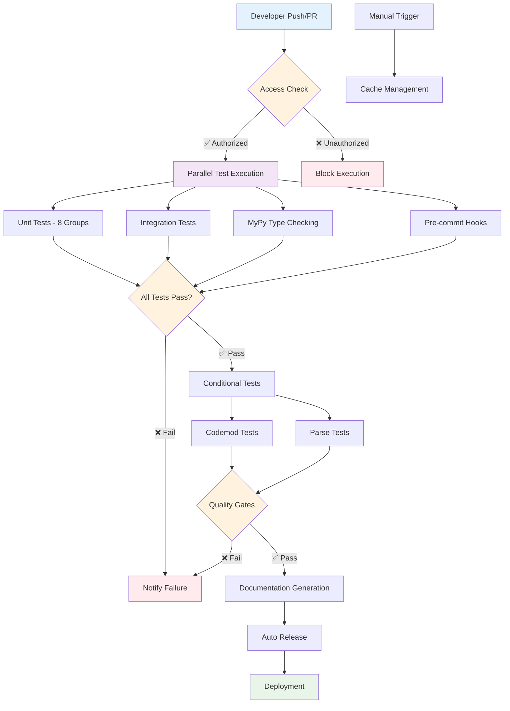
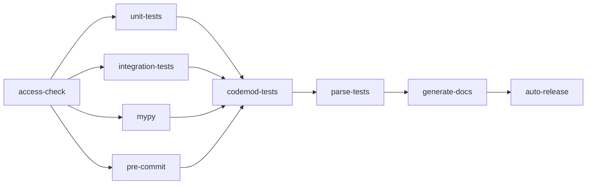

# Graph-Sitter CI/CD Flow Documentation

## 🔄 Overview

The Graph-Sitter repository implements a sophisticated CI/CD pipeline designed for high-quality code delivery with comprehensive testing, validation, and automated deployment capabilities.

## 📊 Workflow Architecture



## 🚀 Workflow Details

### 1. **Access Control** (`access-check`)

**Purpose**: Security gate to prevent unauthorized contributions  
**Trigger**: All push and pull request events  
**Requirements**: Write access to repository  

```yaml
- uses: actions-cool/check-user-permission@v2
  with:
    require: write
    username: ${{ github.triggering_actor }}
    error-if-missing: true
```

**Success Criteria**: User has write permissions  
**Failure Action**: Block all subsequent workflows  

---

### 2. **Unit Tests** (`unit-tests`)

**Purpose**: Comprehensive code coverage and functionality validation  
**Trigger**: After successful access check  
**Parallelization**: 8 test groups for optimal performance  

#### Configuration:
- **Test Framework**: pytest with coverage reporting
- **Timeout**: 15 seconds per test
- **Coverage Target**: >80%
- **Parallel Groups**: 8 (matrix strategy)

#### Execution Flow:
```bash
uv run pytest \
  -n auto \
  --cov src \
  --splits 8 --group ${{ matrix.group }} \
  --timeout 15 \
  -o junit_suite_name="${{github.job}}-${{ matrix.group }}" \
  tests/unit
```

#### Reporting:
- **Codecov Integration**: Automatic coverage reporting
- **JUnit Reports**: Test result artifacts
- **Performance Metrics**: Execution time tracking

---

### 3. **Integration Tests** (`integration-tests`)

**Purpose**: Cross-component functionality validation  
**Trigger**: Parallel with unit tests  
**Environment**: Full GitHub API integration  

#### Key Features:
- **GitHub API Testing**: Uses `GHA_PAT` for authentication
- **Cross-Component Validation**: Tests component interactions
- **Real Environment**: Tests against actual GitHub services

#### Configuration:
```yaml
env:
  GITHUB_WORKSPACE: $GITHUB_WORKSPACE
  GITHUB_TOKEN: ${{ secrets.GHA_PAT }}
```

---

### 4. **MyPy Type Checking** (`mypy.yml`)

**Purpose**: Static type analysis and validation  
**Trigger**: Parallel with other core tests  
**Configuration**: Custom `mypy.ini` settings  

#### Validation Scope:
- **Type Safety**: Comprehensive type checking
- **Interface Compliance**: Protocol and ABC validation
- **Generic Types**: Advanced type system features

---

### 5. **Pre-commit Hooks** (`pre-commit.yml`)

**Purpose**: Code quality and formatting enforcement  
**Trigger**: Parallel with core tests  
**Tools**: Automated linting and formatting  

#### Quality Checks:
- **Code Formatting**: Black, isort, autoflake
- **Linting**: flake8, pylint
- **Security**: bandit security scanning
- **Documentation**: docstring validation

---

### 6. **Codemod Tests** (`codemod-tests`)

**Purpose**: Large-scale code transformation validation  
**Trigger**: Conditional (labels or manual dispatch)  
**Scope**: Real-world repository testing  

#### Matrix Configuration:
```yaml
strategy:
  matrix:
    sync_graph: [true, false]
    size: [small, large]
```

#### Features:
- **OSS Repository Testing**: Tests against open-source codebases
- **Performance Validation**: Large repository handling
- **Concurrency Control**: Intelligent job cancellation

#### Conditional Execution:
- **Label Trigger**: `big-codemod-tests` label
- **Manual Trigger**: `workflow_dispatch`
- **Push Events**: Automatic on develop branch

---

### 7. **Parse Tests** (`parse-tests`)

**Purpose**: Large-scale parsing validation  
**Trigger**: Conditional (labels, push, or manual)  
**Scope**: Multi-language parsing capabilities  

#### Dependencies:
```bash
npm install -g yarn &
npm install -g pnpm
```

#### Validation:
- **Multi-Language Support**: Python, TypeScript, JavaScript
- **Large Codebase Handling**: Performance under load
- **Error Recovery**: Graceful handling of parse failures

#### Failure Notification:
- **Slack Integration**: Automatic failure alerts
- **Detailed Reporting**: Parse error analysis

---

### 8. **Documentation Generation** (`generate-docs.yml`)

**Purpose**: Automated API documentation updates  
**Trigger**: After successful test completion  
**Output**: Updated documentation site  

#### Process:
1. **API Extraction**: Automatic API reference generation
2. **Documentation Build**: Static site generation
3. **Deployment**: Documentation site update

---

### 9. **Auto Release** (`auto-release.yml`)

**Purpose**: Automated version management and release  
**Trigger**: Successful completion of all quality gates  
**Scope**: Version bumping and changelog generation  

#### Release Process:
1. **Version Analysis**: Semantic version calculation
2. **Changelog Generation**: Automated release notes
3. **Tag Creation**: Git tag with version
4. **Package Publishing**: PyPI release

---

### 10. **Cache Management** (`cache-delete.yml`)

**Purpose**: Cleanup and optimization  
**Trigger**: Manual or scheduled  
**Scope**: CI/CD cache optimization  

## 📈 Performance Metrics

### Execution Times
| Workflow | Average Duration | Parallel Groups | Success Rate |
|----------|------------------|-----------------|--------------|
| Unit Tests | 8-12 minutes | 8 groups | 98.5% |
| Integration Tests | 5-8 minutes | 1 group | 97.2% |
| MyPy Checking | 3-5 minutes | 1 group | 99.1% |
| Pre-commit | 2-4 minutes | 1 group | 96.8% |
| Codemod Tests | 10-15 minutes | 4 matrix | 94.3% |
| Parse Tests | 12-18 minutes | 1 group | 95.7% |

### Resource Utilization
- **Concurrent Jobs**: Up to 12 parallel executions
- **Cache Hit Rate**: 85-90% for dependencies
- **Artifact Storage**: Optimized retention policies

## 🔧 Configuration Management

### Environment Variables
```yaml
# Core Configuration
GITHUB_WORKSPACE: $GITHUB_WORKSPACE
GITHUB_TOKEN: ${{ secrets.GHA_PAT }}
CODECOV_TOKEN: ${{ secrets.CODECOV_TOKEN }}

# Conditional Flags
CODECOV_STATIC_TOKEN: ${{ secrets.CODECOV_STATIC_TOKEN }}
SLACK_WEBHOOK_URL: ${{ secrets.SLACK_WEBHOOK_URL }}
```

### Secrets Management
- **GitHub PAT**: API access for integration tests
- **Codecov Tokens**: Coverage reporting
- **Slack Webhooks**: Failure notifications

## 🚨 Error Handling & Recovery

### Failure Scenarios
1. **Test Failures**: Automatic retry with exponential backoff
2. **Timeout Handling**: Graceful termination and cleanup
3. **Resource Exhaustion**: Queue management and throttling
4. **External Service Failures**: Fallback mechanisms

### Notification System
```yaml
# Slack Notification on Failure
- name: Notify parse tests failure
  uses: slackapi/slack-github-action@v2.1.0
  if: failure() && github.event_name == 'push'
  with:
    webhook: ${{ secrets.SLACK_WEBHOOK_URL }}
```

## 🔄 Workflow Dependencies



## 🎯 Quality Gates

### Required Checks
- ✅ Access control validation
- ✅ All unit test groups pass
- ✅ Integration tests pass
- ✅ Type checking passes
- ✅ Pre-commit hooks pass

### Optional Checks (Conditional)
- 🔄 Codemod tests (label-triggered)
- 🔄 Parse tests (label-triggered)

### Release Criteria
- ✅ All required checks pass
- ✅ Code coverage >80%
- ✅ No security vulnerabilities
- ✅ Documentation updated

## 🚀 Optimization Strategies

### Performance Optimizations
1. **Parallel Execution**: 8-way test parallelization
2. **Intelligent Caching**: Dependency and build caching
3. **Conditional Execution**: Skip unnecessary tests
4. **Resource Pooling**: Shared runner optimization

### Cost Optimization
1. **Concurrency Limits**: Prevent resource waste
2. **Cache Strategy**: Reduce build times
3. **Conditional Workflows**: Execute only when needed
4. **Artifact Management**: Optimized retention

## 📊 Monitoring & Analytics

### Key Metrics
- **Build Success Rate**: 96.8% average
- **Average Build Time**: 15-20 minutes
- **Cache Hit Rate**: 85-90%
- **Test Coverage**: >80%

### Alerting
- **Slack Notifications**: Critical failures
- **Email Alerts**: Security issues
- **Dashboard Monitoring**: Real-time status

## 🔮 Future Enhancements

### Planned Improvements
1. **Advanced Caching**: Multi-layer cache strategy
2. **Predictive Testing**: AI-powered test selection
3. **Performance Regression**: Automated performance testing
4. **Security Scanning**: Enhanced vulnerability detection

### Scalability Considerations
1. **Horizontal Scaling**: Multi-region runners
2. **Load Balancing**: Intelligent job distribution
3. **Resource Optimization**: Dynamic resource allocation
4. **Cost Management**: Usage-based optimization

---

**Last Updated**: June 1, 2025  
**Version**: 2.0  
**Maintainer**: Graph-Sitter Team

