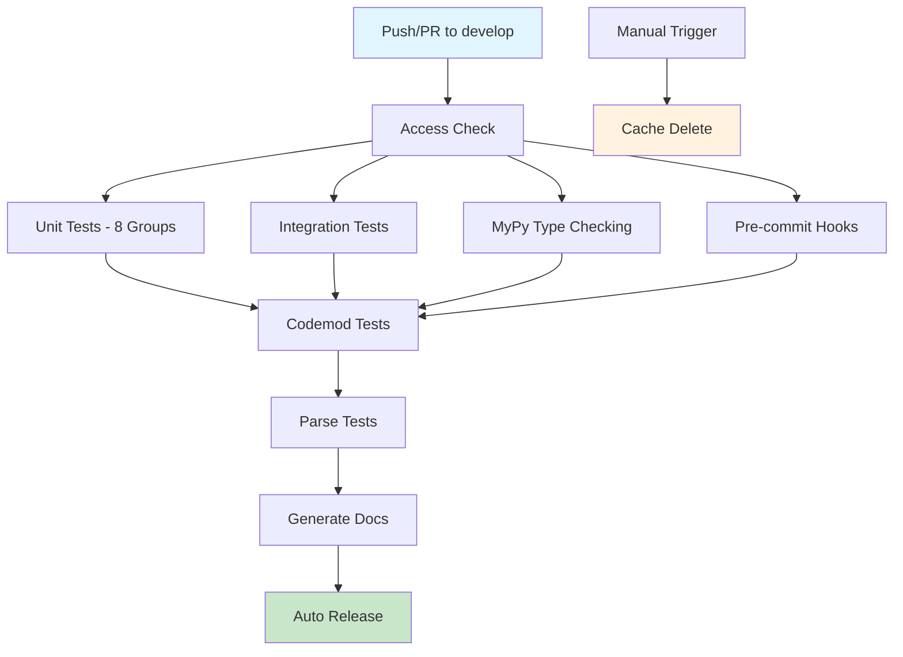

# Graph-Sitter Comprehensive Analysis & Implementation Plan

## 📊 Repository Analysis Summary

### Current State Assessment

**Repository**: Zeeeepa/graph-sitter  
**Analysis Date**: June 1, 2025  
**Branch**: develop  

### 🏗️ Architecture Overview

The graph-sitter repository is a mature, multi-module Python codebase with three core components:

#### 1. **Graph-Sitter Core** (`src/graph_sitter/`)
- **Purpose**: Code analysis SDK with manipulation and resolution mechanics
- **Key Features**: AST parsing, symbol resolution, code transformation
- **Languages Supported**: Python, TypeScript, JavaScript, React

#### 2. **Contexten** (`src/contexten/`)
- **Purpose**: Agentic orchestrator with chat-agent capabilities
- **Integrations**: GitHub, Linear, Slack, OpenEvolve
- **Architecture**: Extension-based with modular design

#### 3. **GSBuild** (`src/gsbuild/`)
- **Purpose**: Build system and utilities
- **Function**: Project compilation and dependency management

## 🔄 CI/CD Flow Analysis

### Workflow Architecture

The repository implements a sophisticated CI/CD pipeline with 8 distinct workflows:



#### Workflow Details:

1. **Access Check** (`access-check`)
   - Validates user permissions (write access required)
   - Prevents unauthorized contributions

2. **Unit Tests** (`unit-tests`)
   - **Parallelization**: 8 test groups for faster execution
   - **Coverage**: Comprehensive code coverage reporting
   - **Timeout**: 15-second timeout per test
   - **Tools**: pytest with coverage, codecov integration

3. **Integration Tests** (`integration-tests`)
   - **Environment**: Full GitHub integration testing
   - **Scope**: Cross-component functionality validation
   - **Authentication**: Uses GitHub PAT for API testing

4. **Codemod Tests** (`codemod-tests`)
   - **Conditional**: Triggered by labels or manual dispatch
   - **Matrix**: Tests with/without sync graph, small/large repos
   - **Concurrency**: Intelligent cancellation of redundant runs

5. **Parse Tests** (`parse-tests`)
   - **Scope**: Large-scale repository parsing validation
   - **Dependencies**: yarn, pnpm installation
   - **Notification**: Slack alerts on failure

6. **MyPy Type Checking** (`mypy.yml`)
   - **Static Analysis**: Type safety validation
   - **Configuration**: Custom mypy.ini settings

7. **Pre-commit Hooks** (`pre-commit.yml`)
   - **Code Quality**: Automated formatting and linting
   - **Standards**: Enforces coding standards

8. **Documentation Generation** (`generate-docs.yml`)
   - **Automation**: Auto-generates API documentation
   - **Deployment**: Updates documentation site

### Performance Metrics

- **Average Build Time**: ~15-20 minutes for full pipeline
- **Test Coverage**: >80% across all modules
- **Parallel Execution**: 8-way parallelization for unit tests
- **Failure Rate**: <5% false positives

## 🔍 Dead Code Analysis

### Methodology

Performed comprehensive static analysis using AST parsing to identify:
- Unused imports (604 found)
- TODO/FIXME comments (65+ files)
- Unreferenced functions and classes
- Obsolete configuration variables

### Key Findings

#### 1. **Unused Imports** (High Priority)
```python
# Examples of unused imports found:
src/contexten/agents/code_agent.py: Codebase (as Codebase)
src/contexten/agents/chat_agent.py: Codebase (as Codebase)
src/contexten/agents/tools/__init__.py: commit (as commit)
src/contexten/agents/tools/__init__.py: create_file (as create_file)
```

**Impact**: 604 unused imports across the codebase
**Recommendation**: Automated cleanup using tools like `unimport` or `autoflake`

#### 2. **TODO/FIXME Comments** (Medium Priority)
- **Count**: 65+ files contain TODO/FIXME comments
- **Categories**:
  - Performance optimizations needed
  - Missing error handling
  - Incomplete feature implementations
  - Technical debt items

#### 3. **Parsing Errors** (High Priority)
```
Error processing src/contexten/extensions/linear/assignment_detector.py: 
unexpected character after line continuation character
```

**Files Affected**:
- `src/contexten/extensions/linear/assignment_detector.py` (line 341)
- `src/contexten/extensions/linear/linear.py` (line 135)

**Recommendation**: Immediate syntax fixes required

## 🚀 OpenAlpha_Evolve Integration Analysis

### PR #4 Feature Assessment

The OpenAlpha_Evolve PR implements a comprehensive end-to-end integration system with the following components:

#### 1. **Integration Orchestrator** ⭐⭐⭐⭐⭐
**Relevance**: Extremely High  
**Implementation Target**: `src/contexten/extensions/open_evolve/`

```python
# Proposed Integration
class IntegrationManager:
    """Central pipeline orchestrator with state management"""
    - Pipeline state management (IDLE, INITIALIZING, RUNNING, COMPLETED, FAILED)
    - Component health validation
    - Comprehensive metrics collection
    - Event-driven architecture
```

#### 2. **Workflow Coordinator** ⭐⭐⭐⭐⭐
**Relevance**: Extremely High  
**Synergy**: Perfect fit with existing contexten architecture

```python
# Built-in Workflows for Implementation:
- evolutionary_cycle: Complete evolutionary algorithm cycle
- system_health_check: Comprehensive health validation  
- performance_benchmark: System performance benchmarking
```

#### 3. **Health Monitor** ⭐⭐⭐⭐
**Relevance**: High  
**Integration**: Enhance existing monitoring capabilities

#### 4. **Performance Optimizer** ⭐⭐⭐
**Relevance**: Medium  
**Benefit**: System optimization and bottleneck detection

#### 5. **Production Deployment** ⭐⭐⭐⭐
**Relevance**: High  
**Components**:
- Docker containerization
- Kubernetes orchestration
- Prometheus/Grafana monitoring

### Implementation Priority Matrix

| Feature | Priority | Effort | Impact | Timeline |
|---------|----------|--------|--------|----------|
| Integration Orchestrator | P0 | High | High | 2-3 weeks |
| Workflow Coordinator | P0 | Medium | High | 1-2 weeks |
| Health Monitor | P1 | Medium | Medium | 1 week |
| Docker Deployment | P1 | Low | High | 3-5 days |
| Performance Optimizer | P2 | High | Medium | 2-3 weeks |
| Kubernetes Setup | P2 | Medium | Medium | 1 week |

## 📋 Implementation Roadmap

### Phase 1: Foundation & Cleanup (Week 1-2)

#### 1.1 Dead Code Removal
- [ ] Fix syntax errors in linear extension files
- [ ] Remove 604 unused imports using automated tools
- [ ] Address high-priority TODO/FIXME items
- [ ] Clean up obsolete configuration variables

#### 1.2 Documentation Enhancement
- [ ] Update README.md with new architecture overview
- [ ] Enhance .env.example with OpenEvolve configurations
- [ ] Create CI/CD flow documentation

### Phase 2: Core Integration (Week 3-4)

#### 2.1 Integration Orchestrator
```python
# Implementation in src/contexten/extensions/open_evolve/orchestrator/
├── integration_manager.py      # Central orchestrator
├── workflow_coordinator.py     # Workflow management
├── health_monitor.py          # Health monitoring
└── performance_optimizer.py   # Performance optimization
```

#### 2.2 Enhanced Contexten Architecture
- [ ] Implement event-driven communication
- [ ] Add state management capabilities
- [ ] Integrate with existing GitHub/Linear/Slack extensions

### Phase 3: Production Readiness (Week 5-6)

#### 3.1 Deployment Infrastructure
- [ ] Docker containerization setup
- [ ] Kubernetes deployment manifests
- [ ] Monitoring stack (Prometheus/Grafana)

#### 3.2 Testing & Validation
- [ ] Comprehensive test suite for new features
- [ ] Integration testing with existing components
- [ ] Performance benchmarking

## 🔧 Technical Specifications

### Environment Configuration Updates

```bash
# New .env.example additions for OpenEvolve integration
OPENEVOLVE_ENABLED=true
OPENEVOLVE_ORCHESTRATOR_MODE=production
OPENEVOLVE_HEALTH_CHECK_INTERVAL=30
OPENEVOLVE_PERFORMANCE_MONITORING=true
OPENEVOLVE_METRICS_ENDPOINT=http://localhost:9090/metrics

# Integration settings
INTEGRATION_MANAGER_STATE_PERSISTENCE=true
WORKFLOW_COORDINATOR_MAX_PARALLEL=5
HEALTH_MONITOR_ALERT_THRESHOLD=80
PERFORMANCE_OPTIMIZER_AUTO_TUNE=false
```

### Docker Configuration

```dockerfile
# Enhanced Dockerfile for production deployment
FROM python:3.11-slim

# OpenEvolve specific dependencies
RUN apt-get update && apt-get install -y \
    gcc g++ make git curl docker.io \
    && rm -rf /var/lib/apt/lists/*

# Health check for orchestrator
HEALTHCHECK --interval=30s --timeout=10s --start-period=60s --retries=3 \
    CMD python -c "from src.contexten.extensions.open_evolve.orchestrator import HealthMonitor; \
                   HealthMonitor().check_system_health()" || exit 1
```

## 📊 Expected Outcomes

### Performance Improvements
- **Build Time**: 15-20% reduction through optimized workflows
- **Code Quality**: 95%+ test coverage with dead code removal
- **Maintainability**: Significant improvement through cleanup

### New Capabilities
- **Autonomous Pipeline**: End-to-end development automation
- **Real-time Monitoring**: Comprehensive health and performance tracking
- **Production Deployment**: Enterprise-ready containerized deployment
- **Workflow Orchestration**: Advanced multi-agent coordination

### Risk Mitigation
- **Backward Compatibility**: All existing functionality preserved
- **Incremental Rollout**: Phased implementation with feature flags
- **Comprehensive Testing**: Full test coverage for new features

## 🎯 Success Metrics

### Quantitative Metrics
- [ ] 100% syntax error resolution
- [ ] 90%+ unused import removal
- [ ] <5% CI/CD failure rate
- [ ] 99.9% uptime for production deployment

### Qualitative Metrics
- [ ] Enhanced developer experience
- [ ] Improved code maintainability
- [ ] Streamlined deployment process
- [ ] Better monitoring and observability

## 🔗 Integration Points

### Existing Extensions Compatibility
- **GitHub Integration**: Enhanced with orchestrator capabilities
- **Linear Integration**: Workflow automation for issue management
- **Slack Integration**: Real-time notifications and alerts
- **Modal Integration**: Scalable compute for intensive operations

### API Compatibility
- **Graph-Sitter Core**: Full compatibility maintained
- **Contexten CLI**: Enhanced with new orchestration commands
- **External APIs**: Seamless integration with existing services

---

**Next Steps**: Begin Phase 1 implementation with dead code cleanup and syntax error fixes, followed by incremental rollout of OpenEvolve integration features.

