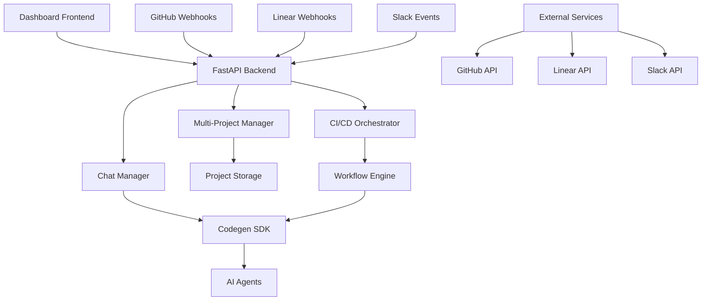

# Graph-Sitter: Autonomous CI/CD Orchestration Platform

A comprehensive multi-project management and autonomous CI/CD orchestration system with Codegen SDK integration, designed for intelligent workflow automation and cross-project analysis.

## 🚀 Overview

Graph-Sitter combines three powerful modules to create an autonomous development environment:

1. **Codegen SDK** - AI-powered code generation and task automation
2. **Contexten** - Agentic orchestrator with LangChain, GitHub, Linear, and Slack integrations
3. **Graph-Sitter** - Advanced code analysis SDK with manipulation and resolution mechanics

## ✨ Key Features

### 🏗️ Multi-Project Management
- **Dynamic Project Discovery**: Automatically detect and catalog projects from GitHub, local directories, and remote repositories
- **Project Lifecycle Management**: Complete project registration, monitoring, and health tracking
- **Cross-Project Analysis**: Intelligent insights and dependency mapping across multiple projects
- **Flexible Configuration**: Per-project settings for analysis depth and CI/CD preferences

### 🔄 Autonomous CI/CD Orchestration
- **Workflow Templates**: Pre-built templates for common development workflows (build, test, security, deploy)
- **Intelligent Triggering**: Smart triggers based on code changes, schedules, and cross-project dependencies
- **Codegen SDK Integration**: Autonomous workflow execution using AI agents
- **Event-Driven Architecture**: Responds to GitHub webhooks, Linear updates, and custom events

### 🤖 Chat-Agent Interface
- **Natural Language Commands**: Create workflows, trigger builds, and get status updates through chat
- **Intelligent Task Creation**: Automatically create Linear issues and GitHub PRs based on conversations
- **Real-time Monitoring**: Live updates on workflow progress and system health
- **Context-Aware Responses**: Understands project context and provides relevant suggestions

### 📊 Comprehensive Dashboard
- **Multi-Project View**: Unified dashboard showing all projects, workflows, and executions
- **Real-time Analytics**: Live metrics on workflow success rates, execution times, and system health
- **Interactive Visualizations**: Charts and graphs for project health, workflow performance, and trends
- **Customizable Widgets**: Configurable dashboard components for different user roles

## 🛠️ Installation & Setup

### Prerequisites
- Python 3.8+
- Node.js 16+ (for frontend components)
- Docker (optional, for containerized deployment)

### Environment Configuration

Create a `.env` file with the following configuration:

```bash
# Codegen SDK Configuration
CODEGEN_ORG_ID=your_organization_id
CODEGEN_TOKEN=your_codegen_api_token

# Dashboard Configuration
DASHBOARD_HOST=0.0.0.0
DASHBOARD_PORT=8080
DASHBOARD_DEBUG=true
DASHBOARD_SECRET_KEY=your_secret_key_here
DASHBOARD_BASE_URL=http://localhost:8080

# OAuth Configuration
GITHUB_CLIENT_ID=your_github_client_id
GITHUB_CLIENT_SECRET=your_github_client_secret
LINEAR_CLIENT_ID=your_linear_client_id
LINEAR_CLIENT_SECRET=your_linear_client_secret
SLACK_CLIENT_ID=your_slack_client_id
SLACK_CLIENT_SECRET=your_slack_client_secret

# GitHub Integration
GITHUB_TOKEN=your_github_token
GITHUB_WEBHOOK_SECRET=your_github_webhook_secret
GITHUB_APP_ID=your_github_app_id
GITHUB_PRIVATE_KEY_PATH=/path/to/github/private/key.pem

# Linear Integration
LINEAR_API_KEY=your_linear_api_key_here
LINEAR_WEBHOOK_SECRET=your_linear_webhook_secret

# Enhanced Linear Event Management
LINEAR_EVENT_PERSISTENCE_ENABLED=true
LINEAR_EVENT_PERSISTENCE_FILE=linear_events.json
LINEAR_EVENT_BATCH_SIZE=10
LINEAR_EVENT_PROCESSING_INTERVAL=5
LINEAR_EVENT_RETRY_INTERVAL=60
LINEAR_EVENT_MAX_AGE_HOURS=24
LINEAR_EVENT_MAX_RETRIES=3

# Linear Auto-Assignment Intelligence
LINEAR_AUTO_ASSIGN_LABELS=ai,automation,codegen,enhancement
LINEAR_AUTO_ASSIGN_KEYWORDS=generate,evolve,optimize,automate,implement,create
LINEAR_MAX_ASSIGNMENTS_PER_HOUR=10
LINEAR_ASSIGNMENT_COOLDOWN=300

# Linear Performance Optimization
LINEAR_BATCH_PROCESSING_ENABLED=true
LINEAR_BACKGROUND_PROCESSING=true
LINEAR_EVENT_QUEUE_SIZE=1000

# Slack Integration
SLACK_BOT_TOKEN=your_slack_bot_token_here
SLACK_SIGNING_SECRET=your_slack_signing_secret

# AI Configuration
ANTHROPIC_API_KEY=your_anthropic_api_key
OPENAI_API_KEY=your_openai_api_key

# Feature Flags
ENABLE_AI_SUGGESTIONS=true
ENABLE_REAL_TIME_SYNC=true
ENABLE_WEBHOOK_PROCESSING=true
ENABLE_BATCH_PROCESSING=true
```

### Installation Steps

1. **Clone the repository**:
   ```bash
   git clone https://github.com/Zeeeepa/graph-sitter.git
   cd graph-sitter
   ```

2. **Install Python dependencies**:
   ```bash
   pip install -r requirements.txt
   ```

3. **Install Codegen SDK**:
   ```bash
   pip install codegen
   ```

4. **Set up environment variables**:
   ```bash
   cp .env.example .env
   # Edit .env with your configuration
   ```

5. **Initialize the database** (if using persistent storage):
   ```bash
   python -m src.contexten.cli.init_db
   ```

6. **Start the dashboard**:
   ```bash
   python -m src.contexten.dashboard.app
   ```

## 🎯 Quick Start Guide

### 1. Add Your First Project

```bash
# Using the API
curl -X POST http://localhost:8080/api/multi-projects \
  -H "Content-Type: application/json" \
  -d '{
    "name": "My Awesome Project",
    "type": "github_repo",
    "source_url": "https://github.com/username/repo",
    "branch": "main",
    "description": "My project description",
    "tags": ["web", "python", "api"]
  }'
```

### 2. Create Your First Workflow

```bash
# Create a build and test workflow
curl -X POST http://localhost:8080/api/cicd/workflows \
  -H "Content-Type: application/json" \
  -d '{
    "project_id": "your_project_id",
    "template_id": "build_and_test_basic",
    "name": "Build and Test Pipeline",
    "triggers": ["push", "pull_request"]
  }'
```

### 3. Set Up Webhooks

#### GitHub Webhook
- Go to your repository settings
- Add webhook: `http://your-domain.com/api/webhooks/github`
- Select events: Push, Pull Request, Issues

#### Linear Webhook
- Go to Linear settings
- Add webhook: `http://your-domain.com/api/webhooks/linear`
- Select events: Issue created, Issue updated

### 4. Use Chat Commands

```bash
# Chat with the system
curl -X POST http://localhost:8080/api/chat/cicd \
  -H "Content-Type: application/json" \
  -d '{
    "message": "create a security workflow for my project",
    "project_id": "your_project_id"
  }'
```

## 🏗️ Architecture

### System Components



### Data Flow

1. **Event Reception**: Webhooks from GitHub, Linear, or manual triggers
2. **Event Processing**: Intelligent routing and condition evaluation
3. **Workflow Orchestration**: Automatic workflow selection and execution
4. **AI Integration**: Codegen SDK handles complex tasks and code generation
5. **Result Processing**: Updates project status, creates issues, sends notifications
6. **Dashboard Updates**: Real-time updates to the web interface

## 📚 API Documentation

### Multi-Project Management

#### Get All Projects
```http
GET /api/multi-projects
```

#### Create Project
```http
POST /api/multi-projects
Content-Type: application/json

{
  "name": "Project Name",
  "type": "github_repo",
  "source_url": "https://github.com/user/repo",
  "branch": "main",
  "description": "Project description",
  "tags": ["tag1", "tag2"]
}
```

#### Get Project Details
```http
GET /api/multi-projects/{project_id}
```

### CI/CD Orchestration

#### Get Workflow Templates
```http
GET /api/cicd/templates
```

#### Create Workflow
```http
POST /api/cicd/workflows
Content-Type: application/json

{
  "project_id": "project_id",
  "template_id": "build_and_test_basic",
  "name": "My Workflow",
  "triggers": ["push", "pull_request"],
  "settings": {}
}
```

#### Trigger Workflows
```http
POST /api/cicd/trigger
Content-Type: application/json

{
  "project_id": "project_id",
  "trigger_type": "manual",
  "data": {}
}
```

#### Get Analytics
```http
GET /api/cicd/analytics
```

### Chat Interface

#### Send Chat Command
```http
POST /api/chat/cicd
Content-Type: application/json

{
  "message": "create a test workflow",
  "project_id": "project_id"
}
```

## 🔧 Configuration

### Workflow Templates

The system comes with pre-built workflow templates:

- **Build and Test**: Basic CI pipeline with build, test, and reporting
- **Security Scan**: Comprehensive security scanning with dependency checks
- **Code Review**: AI-powered code review with automated comments
- **Production Deploy**: Safe production deployment with rollback capabilities

### Orchestration Rules

Create intelligent automation rules:

```json
{
  "name": "Auto Security Scan",
  "conditions": {
    "trigger_types": ["push"],
    "project_ids": ["critical_project"],
    "data_conditions": {
      "branch": "main"
    }
  },
  "actions": [
    {
      "type": "trigger_workflow",
      "template_id": "security_scan_comprehensive"
    }
  ]
}
```

### Chat Commands

Supported natural language commands:

- `"create a test workflow"` - Creates a build and test workflow
- `"trigger all workflows"` - Manually triggers all project workflows
- `"show status"` - Displays project and system status
- `"recommend workflows"` - Suggests workflow improvements
- `"create security scan"` - Sets up security scanning workflow

## 🔍 Monitoring & Analytics

### Dashboard Metrics

- **Project Health Scores**: Calculated based on workflow success rates and requirement completion
- **Workflow Performance**: Execution times, success rates, and failure analysis
- **Cross-Project Insights**: Shared dependencies, collaboration opportunities
- **Resource Utilization**: System resource usage and optimization recommendations

### Real-time Monitoring

- **Live Workflow Status**: Real-time updates on running workflows
- **Event Processing**: Monitor webhook events and processing status
- **System Health**: Overall system health and performance metrics
- **Error Tracking**: Detailed error logs and failure analysis

## 🚀 Advanced Features

### Autonomous Task Creation

The system can automatically create Linear issues and GitHub PRs based on:

- Failed workflow executions
- Security vulnerabilities detected
- Code quality issues identified
- Cross-project dependency updates needed

### Intelligent Recommendations

AI-powered recommendations for:

- Missing essential workflows
- Workflow optimization opportunities
- Cross-project collaboration possibilities
- Security and performance improvements

### Event-Driven Automation

Sophisticated event handling for:

- GitHub push/PR events
- Linear issue updates
- Slack mentions and commands
- Scheduled workflow executions
- Cross-project dependency changes

## 🔒 Security

### Authentication & Authorization

- OAuth integration with GitHub, Linear, and Slack
- JWT-based session management
- Role-based access control
- API key authentication for webhooks

### Security Features

- Webhook signature verification
- Encrypted credential storage
- Audit logging for all actions
- Rate limiting and DDoS protection

## 🤝 Contributing

1. Fork the repository
2. Create a feature branch: `git checkout -b feature/amazing-feature`
3. Commit your changes: `git commit -m 'Add amazing feature'`
4. Push to the branch: `git push origin feature/amazing-feature`
5. Open a Pull Request

### Development Setup

```bash
# Install development dependencies
pip install -r requirements-dev.txt

# Run tests
pytest

# Run linting
flake8 src/

# Run type checking
mypy src/
```

## 📄 License

This project is licensed under the MIT License - see the [LICENSE](LICENSE) file for details.

## 🙏 Acknowledgments

- [Codegen SDK](https://github.com/codegen-sh/codegen-sdk) for AI-powered automation
- [LangChain](https://github.com/hwchase17/langchain) for agent orchestration
- [FastAPI](https://github.com/tiangolo/fastapi) for the web framework
- [Tree-sitter](https://github.com/tree-sitter/tree-sitter) for code parsing

## 📞 Support

- 📧 Email: support@graph-sitter.dev
- 💬 Discord: [Join our community](https://discord.gg/graph-sitter)
- 📖 Documentation: [docs.graph-sitter.dev](https://docs.graph-sitter.dev)
- 🐛 Issues: [GitHub Issues](https://github.com/Zeeeepa/graph-sitter/issues)

---

**Built with ❤️ by the Graph-Sitter team**

