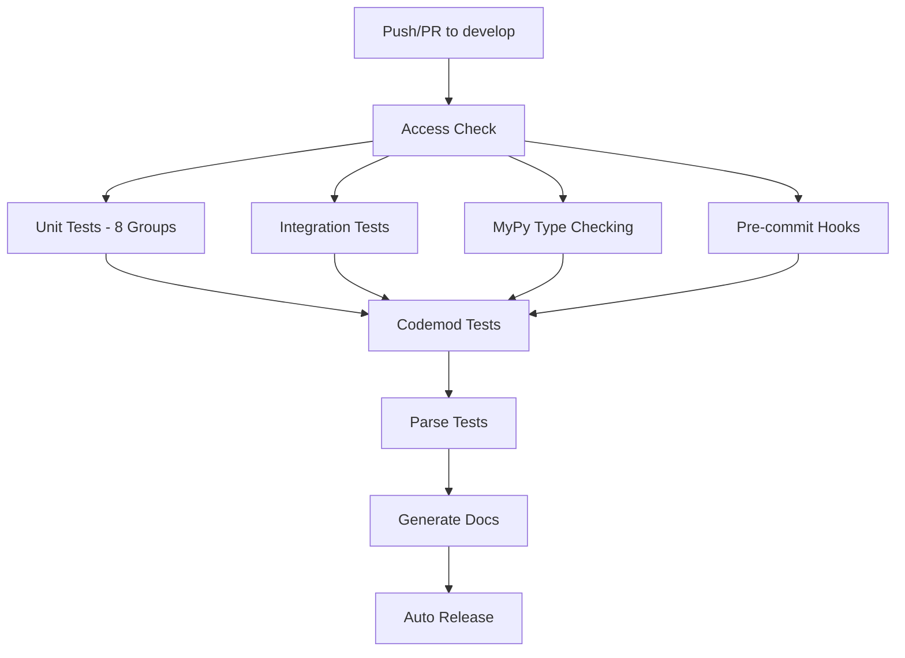

<br />

<p align="center">
  <a href="https://graph-sitter.com">
    
  </a>
</p>

<h2 align="center">
  Scriptable interface to a powerful, multi-lingual language server.
</h2>

<div align="center">

[](https://pypi.org/project/codegen/)
[](https://graph-sitter.com)
[](https://community.codegen.com)
[](https://github.com/codegen-sh/graph-sitter/tree/develop?tab=Apache-2.0-1-ov-file)
[](https://x.com/codegen)

</div>

<br />

[Graph-sitter](https://graph-sitter.com) is a python library for manipulating codebases with integrated AI-powered autonomous development capabilities.

## 🚀 Quick Start

```python
from graph_sitter import Codebase
from codegen.agents.agent import Agent

# Initialize AI agent for autonomous development
agent = Agent(
    org_id="11",  # Your organization ID
    token="your_api_token_here",  # Your API authentication token
    base_url="https://codegen-sh-rest-api.modal.run",  # Optional - defaults to this URL
)

# Run an agent with a prompt
task = agent.run(prompt="Which github repos can you currently access?")

# Check the initial status
print(task.status)  # Returns the current status of the task (e.g., "queued", "in_progress", etc.)

# Graph-sitter builds a complete graph connecting
# functions, classes, imports and their relationships
codebase = Codebase("./")

# Work with code without dealing with syntax trees or parsing
for function in codebase.functions:
    # Comprehensive static analysis for references, dependencies, etc.
    if not function.usages:
        # Auto-handles references and imports to maintain correctness
        function.move_to_file("deprecated.py")

# Refresh the task to get updated status
task.refresh()

# Check the updated status
print(task.status)

# Once task is complete, you can access the result
if task.status == "completed":
    print(task.result)
```

## 🏗️ Architecture Overview

Graph-sitter combines three powerful modules for comprehensive code analysis and autonomous development:

### 1. **Graph-Sitter Core** 🔍
Advanced code analysis SDK with manipulation and resolution mechanics
- **AST Parsing**: Multi-language syntax tree analysis
- **Symbol Resolution**: Cross-file dependency tracking  
- **Code Transformation**: Safe, automated refactoring

### 2. **Contexten** 🤖
Agentic orchestrator with chat-agent capabilities and integrations
- **AI Orchestration**: Autonomous development workflows
- **Multi-Platform Integration**: GitHub, Linear, Slack
- **Workflow Automation**: End-to-end development pipelines

### 3. **GSBuild** ⚙️
Build system and utilities for project management
- **Dependency Management**: Automated build processes
- **Project Compilation**: Multi-language support

## 🔄 CI/CD Pipeline

Our sophisticated CI/CD pipeline ensures code quality and reliability:



**Pipeline Features:**
- ⚡ **Parallel Execution**: 8-way test parallelization
- 📊 **Comprehensive Coverage**: >80% code coverage
- 🔍 **Static Analysis**: MyPy type checking
- 🚀 **Automated Deployment**: Continuous integration
- 📚 **Auto Documentation**: Generated API docs

Write code that transforms code. Graph-sitter combines the parsing power of [Tree-sitter](https://tree-sitter.github.io/tree-sitter/) with the graph algorithms of [rustworkx](https://github.com/Qiskit/rustworkx) to enable scriptable, multi-language code manipulation at scale.

## Installation and Usage

We support

- Running Graph-sitter in Python 3.12 - 3.13 (recommended: Python 3.13+)
- macOS and Linux
  - macOS is supported
  - Linux is supported on x86_64 and aarch64 with glibc 2.34+
  - Windows is supported via WSL. See [here](https://graph-sitter.com/building-with-graph-sitter/codegen-with-wsl) for more details.
- Python, Typescript, Javascript and React codebases

```
# Install inside existing project
uv pip install graph-sitter

# Install global CLI
uv tool install graph-sitter --python 3.13

# Create a codemod for a given repo
cd path/to/repo
gs init
gs create test-function

# Run the codemod
gs run test-function

# Create an isolated venv with codegen => open jupyter
gs notebook
```

## 🤖 Autonomous Development Features

### AI-Powered Code Analysis
```python
from graph_sitter import Codebase

# Initialize with AI capabilities
codebase = Codebase("./", enable_ai=True)

# AI-powered code suggestions
suggestions = await codebase.ai("Analyze this codebase for potential improvements")

# Automated refactoring
codebase.ai_refactor("Optimize performance bottlenecks")
```

### Workflow Orchestration
```python
from contexten.orchestrator import WorkflowCoordinator

coordinator = WorkflowCoordinator()

# Register agents
coordinator.register_agent("github", github_agent)
coordinator.register_agent("linear", linear_agent)

# Execute autonomous workflows
await coordinator.execute_workflow("development_cycle", {
    "repository": "my-repo",
    "feature": "new-authentication"
})
```

## Usage

See [Getting Started](https://graph-sitter.com/introduction/getting-started) for a full tutorial.

```
from graph_sitter import Codebase
```

## 🔧 Configuration

### Environment Setup

Copy `.env.example` to `.env` and configure:

```bash
# Core Configuration
CODEGEN_ORG_ID=your_org_id
CODEGEN_TOKEN=your_api_token
CODEGEN_BASE_URL=https://api.codegen.com

# AI Features
CONTEXTEN_ANTHROPIC_API_KEY=your_anthropic_key
CONTEXTEN_MODEL=claude-3-sonnet-20240229

# Integrations
GITHUB_TOKEN=your_github_token
LINEAR_API_KEY=your_linear_key
SLACK_BOT_TOKEN=your_slack_token

# Performance
MAX_CONCURRENT_ANALYSES=5
ANALYSIS_TIMEOUT=1800
```

### Advanced Features

Enable autonomous development capabilities:

```bash
# Autonomous Development
ENABLE_AI_SUGGESTIONS=true
ENABLE_WORKFLOW_AUTOMATION=true
ENABLE_REAL_TIME_SYNC=true

# Monitoring
ANALYTICS_ENABLED=true
METRICS_ENDPOINT=http://localhost:9090/metrics
```

## Troubleshooting

Having issues? Here are some common problems and their solutions:

- **I'm hitting an UV error related to `[[ packages ]]`**: This means you're likely using an outdated version of UV. Try updating to the latest version with: `uv self update`.
- **I'm hitting an error about `No module named 'codegen.sdk.extensions.utils'`**: The compiled cython extensions are out of sync. Update them with `uv sync --reinstall-package codegen`.
- **I'm hitting a `RecursionError: maximum recursion depth exceeded` error while parsing my codebase**: If you are using python 3.12, try upgrading to 3.13. If you are already on 3.13, try upping the recursion limit with `sys.setrecursionlimit(10000)`.

If you run into additional issues not listed here, please [join our slack community](https://community.codegen.com) and we'll help you out!

## 📚 Resources

- [Docs](https://graph-sitter.com)
- [Getting Started](https://graph-sitter.com/introduction/getting-started)
- [API Reference](https://graph-sitter.com/api-reference)
- [Autonomous Development Guide](https://graph-sitter.com/autonomous-development)
- [Contributing](CONTRIBUTING.md)
- [Contact Us](https://codegen.com/contact)

## 🎯 Why Graph-sitter?

Software development is fundamentally programmatic. Refactoring a codebase, enforcing patterns, or analyzing control flow - these are all operations that can (and should) be expressed as programs themselves.

We built Graph-sitter backwards from real-world refactors performed on enterprise codebases. Instead of starting with theoretical abstractions, we focused on creating APIs that match how developers actually think about code changes:

- **Natural mental model**: Write transforms that read like your thought process - "move this function", "rename this variable", "add this parameter". No more wrestling with ASTs or manual import management.

- **Battle-tested on complex codebases**: Handle Python, TypeScript, and React codebases with millions of lines of code.

- **Built for advanced intelligences**: As AI developers become more sophisticated, they need expressive yet precise tools to manipulate code. Graph-sitter provides a programmatic interface that both humans and AI can use to express complex transformations through code itself.

- **Autonomous Development Ready**: Integrated AI capabilities enable fully autonomous development workflows, from code analysis to deployment.

## 🚀 Enterprise Features

### Production Deployment
- **Docker Support**: Containerized deployment ready
- **Kubernetes Integration**: Scalable orchestration
- **Monitoring Stack**: Prometheus + Grafana integration
- **Health Checks**: Comprehensive system monitoring

### Security & Compliance
- **Enterprise Authentication**: SSO and RBAC support
- **Audit Logging**: Comprehensive activity tracking
- **Security Scanning**: Automated vulnerability detection
- **Compliance Reports**: SOC2, GDPR ready

## Contributing

Please see our [Contributing Guide](CONTRIBUTING.md) for instructions on how to set up the development environment and submit contributions.

## Enterprise

For more information on enterprise engagements, please [contact us](https://codegen.com/contact) or [request a demo](https://codegen.com/request-demo).

