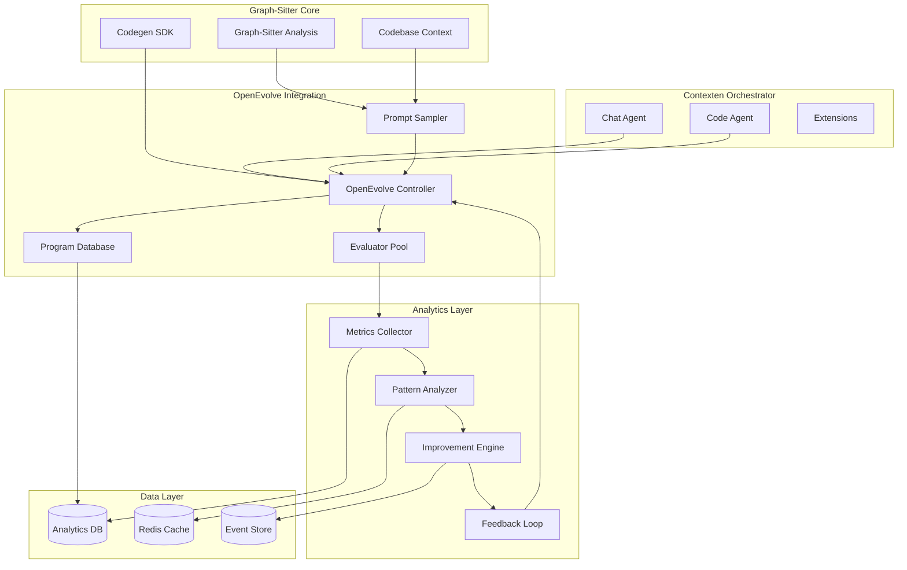

# OpenEvolve Integration Architecture

## Overview

This document defines the technical architecture for integrating OpenEvolve's continuous learning capabilities into the Graph-Sitter CI/CD system. The architecture follows established patterns while introducing autonomous optimization capabilities.

## System Architecture

### High-Level Architecture Diagram



## Component Architecture

### 1. OpenEvolve Controller Extension

```python
# src/contexten/extensions/openevolve/controller.py

from typing import Dict, List, Optional, Any
from dataclasses import dataclass
from contexten.extensions.base import BaseExtension
from graph_sitter.codebase.codebase_analysis import get_codebase_summary
import asyncio

@dataclass
class EvolutionConfig:
    max_iterations: int = 1000
    population_size: int = 500
    num_islands: int = 5
    evaluation_timeout: int = 300
    performance_threshold: float = 0.05  # 5% overhead limit

class OpenEvolveController(BaseExtension):
    """
    OpenEvolve Controller integrated as a Contexten extension.
    Orchestrates the evolutionary optimization process.
    """
    
    def __init__(self, config: EvolutionConfig):
        super().__init__()
        self.config = config
        self.prompt_sampler = PromptSampler()
        self.evaluator_pool = EvaluatorPool(config.num_islands)
        self.program_database = ProgramDatabase()
        self.metrics_collector = MetricsCollector()
        self.is_running = False
    
    async def start_evolution_cycle(self, codebase_context: Any) -> Dict[str, Any]:
        """Start a new evolution cycle based on current codebase state."""
        if self.is_running:
            return {"status": "already_running"}
        
        self.is_running = True
        try:
            # Generate context-rich prompts from codebase analysis
            prompts = await self.prompt_sampler.generate_prompts(codebase_context)
            
            # Execute evaluation in parallel
            evaluation_tasks = [
                self.evaluator_pool.evaluate(prompt) 
                for prompt in prompts
            ]
            
            results = await asyncio.gather(*evaluation_tasks, return_exceptions=True)
            
            # Store results and update database
            await self.program_database.store_results(results)
            
            # Collect performance metrics
            metrics = await self.metrics_collector.collect_cycle_metrics()
            
            return {
                "status": "completed",
                "evaluations": len(results),
                "performance_impact": metrics.get("overhead_percentage", 0),
                "improvements_found": len([r for r in results if r.improvement_score > 0])
            }
        finally:
            self.is_running = False
    
    async def get_optimization_suggestions(self) -> List[Dict[str, Any]]:
        """Get current optimization suggestions based on learned patterns."""
        patterns = await self.program_database.get_successful_patterns()
        suggestions = []
        
        for pattern in patterns:
            if pattern.confidence_score > 0.8:
                suggestions.append({
                    "type": pattern.optimization_type,
                    "description": pattern.description,
                    "expected_improvement": pattern.expected_improvement,
                    "confidence": pattern.confidence_score
                })
        
        return suggestions
```

### 2. Metrics Collection System

```python
# src/contexten/extensions/openevolve/metrics_collector.py

import time
import psutil
import asyncio
from typing import Dict, Any, Optional
from dataclasses import dataclass, field
from datetime import datetime

@dataclass
class PerformanceMetrics:
    component: str
    operation: str
    start_time: float
    end_time: Optional[float] = None
    memory_usage_mb: float = 0
    cpu_usage_percent: float = 0
    success: bool = True
    error_message: Optional[str] = None
    context: Dict[str, Any] = field(default_factory=dict)

class MetricsCollector:
    """
    Lightweight metrics collection system with minimal performance impact.
    """
    
    def __init__(self, sampling_rate: float = 0.1):
        self.sampling_rate = sampling_rate
        self.metrics_buffer = []
        self.buffer_size = 1000
        self.overhead_threshold = 0.05  # 5% maximum overhead
        
    async def collect_operation_metrics(self, component: str, operation: str) -> PerformanceMetrics:
        """Collect metrics for a specific operation with minimal overhead."""
        if not self._should_sample():
            return None
        
        start_time = time.perf_counter()
        process = psutil.Process()
        
        metrics = PerformanceMetrics(
            component=component,
            operation=operation,
            start_time=start_time,
            memory_usage_mb=process.memory_info().rss / 1024 / 1024,
            cpu_usage_percent=process.cpu_percent()
        )
        
        return metrics
    
    def finalize_metrics(self, metrics: PerformanceMetrics, success: bool = True, error: Optional[str] = None):
        """Finalize metrics collection for an operation."""
        if metrics is None:
            return
        
        metrics.end_time = time.perf_counter()
        metrics.success = success
        metrics.error_message = error
        
        self._buffer_metrics(metrics)
    
    async def flush_metrics_to_database(self):
        """Flush buffered metrics to database in batch."""
        if not self.metrics_buffer:
            return
        
        # Batch insert to minimize database overhead
        await self._batch_insert_metrics(self.metrics_buffer)
        self.metrics_buffer.clear()
    
    def _should_sample(self) -> bool:
        """Determine if this operation should be sampled."""
        import random
        return random.random() < self.sampling_rate
    
    def _buffer_metrics(self, metrics: PerformanceMetrics):
        """Buffer metrics for batch processing."""
        self.metrics_buffer.append(metrics)
        
        if len(self.metrics_buffer) >= self.buffer_size:
            asyncio.create_task(self.flush_metrics_to_database())
```

### 3. Pattern Analysis Engine

```python
# src/contexten/extensions/openevolve/pattern_analyzer.py

import numpy as np
from typing import List, Dict, Any, Tuple
from dataclasses import dataclass
from sklearn.cluster import DBSCAN
from sklearn.preprocessing import StandardScaler
import pandas as pd

@dataclass
class PerformancePattern:
    pattern_id: str
    pattern_type: str
    description: str
    confidence_score: float
    improvement_potential: float
    frequency: int
    last_seen: datetime
    characteristics: Dict[str, Any]

class PatternAnalyzer:
    """
    Advanced pattern recognition for identifying optimization opportunities.
    """
    
    def __init__(self):
        self.scaler = StandardScaler()
        self.clustering_model = DBSCAN(eps=0.3, min_samples=5)
        self.pattern_cache = {}
    
    async def analyze_performance_patterns(self, metrics_data: List[Dict]) -> List[PerformancePattern]:
        """Analyze performance metrics to identify patterns and anomalies."""
        if len(metrics_data) < 10:
            return []
        
        # Convert to DataFrame for analysis
        df = pd.DataFrame(metrics_data)
        
        # Feature engineering
        features = self._extract_features(df)
        
        # Normalize features
        normalized_features = self.scaler.fit_transform(features)
        
        # Cluster similar performance patterns
        clusters = self.clustering_model.fit_predict(normalized_features)
        
        patterns = []
        for cluster_id in set(clusters):
            if cluster_id == -1:  # Noise cluster
                continue
            
            cluster_data = df[clusters == cluster_id]
            pattern = self._analyze_cluster(cluster_id, cluster_data)
            
            if pattern.confidence_score > 0.7:
                patterns.append(pattern)
        
        return patterns
    
    def _extract_features(self, df: pd.DataFrame) -> np.ndarray:
        """Extract relevant features for pattern analysis."""
        features = []
        
        # Performance features
        features.append(df['duration_ms'].values)
        features.append(df['memory_usage_mb'].values)
        features.append(df['cpu_usage_percent'].values)
        
        # Success rate features
        features.append(df['success'].astype(int).values)
        
        # Time-based features
        df['hour'] = pd.to_datetime(df['timestamp']).dt.hour
        features.append(df['hour'].values)
        
        return np.column_stack(features)
    
    def _analyze_cluster(self, cluster_id: int, cluster_data: pd.DataFrame) -> PerformancePattern:
        """Analyze a cluster to extract meaningful patterns."""
        # Calculate cluster statistics
        avg_duration = cluster_data['duration_ms'].mean()
        success_rate = cluster_data['success'].mean()
        frequency = len(cluster_data)
        
        # Determine pattern type
        if success_rate < 0.8:
            pattern_type = "high_failure_rate"
            description = f"High failure rate pattern ({success_rate:.2%})"
        elif avg_duration > cluster_data['duration_ms'].quantile(0.9):
            pattern_type = "performance_bottleneck"
            description = f"Performance bottleneck (avg: {avg_duration:.0f}ms)"
        else:
            pattern_type = "normal_operation"
            description = "Normal operation pattern"
        
        # Calculate confidence based on cluster cohesion
        confidence_score = self._calculate_confidence(cluster_data)
        
        # Estimate improvement potential
        improvement_potential = self._estimate_improvement_potential(cluster_data)
        
        return PerformancePattern(
            pattern_id=f"pattern_{cluster_id}",
            pattern_type=pattern_type,
            description=description,
            confidence_score=confidence_score,
            improvement_potential=improvement_potential,
            frequency=frequency,
            last_seen=cluster_data['timestamp'].max(),
            characteristics={
                "avg_duration_ms": avg_duration,
                "success_rate": success_rate,
                "components": cluster_data['component'].unique().tolist()
            }
        )
```

### 4. Database Schema Implementation

```sql
-- Analytics Database Schema for OpenEvolve Integration

-- Core evaluation results table
CREATE TABLE openevolve_evaluations (
    id UUID PRIMARY KEY DEFAULT gen_random_uuid(),
    program_id UUID NOT NULL,
    evaluation_timestamp TIMESTAMP WITH TIME ZONE DEFAULT NOW(),
    prompt_context JSONB NOT NULL,
    generated_code TEXT,
    evaluation_metrics JSONB NOT NULL,
    performance_score FLOAT,
    quality_score FLOAT,
    improvement_score FLOAT,
    evaluator_version VARCHAR(50),
    execution_time_ms INTEGER,
    success BOOLEAN DEFAULT TRUE,
    error_details TEXT,
    
    -- Indexes for performance
    INDEX idx_program_timestamp (program_id, evaluation_timestamp),
    INDEX idx_performance_score (performance_score DESC),
    INDEX idx_evaluation_metrics_gin (evaluation_metrics) USING GIN
);

-- System performance metrics
CREATE TABLE system_performance_metrics (
    id UUID PRIMARY KEY DEFAULT gen_random_uuid(),
    component VARCHAR(100) NOT NULL,
    operation VARCHAR(100) NOT NULL,
    timestamp TIMESTAMP WITH TIME ZONE DEFAULT NOW(),
    duration_ms INTEGER NOT NULL,
    memory_usage_mb FLOAT,
    cpu_usage_percent FLOAT,
    success BOOLEAN DEFAULT TRUE,
    error_message TEXT,
    context_data JSONB,
    
    -- Partitioning by timestamp for performance
    PARTITION BY RANGE (timestamp),
    
    -- Indexes
    INDEX idx_component_operation (component, operation),
    INDEX idx_timestamp_success (timestamp, success),
    INDEX idx_duration_performance (duration_ms, cpu_usage_percent)
);

-- Learned patterns storage
CREATE TABLE learned_patterns (
    id UUID PRIMARY KEY DEFAULT gen_random_uuid(),
    pattern_type VARCHAR(50) NOT NULL,
    pattern_name VARCHAR(200) NOT NULL,
    description TEXT,
    pattern_data JSONB NOT NULL,
    confidence_score FLOAT CHECK (confidence_score >= 0 AND confidence_score <= 1),
    improvement_potential FLOAT,
    frequency INTEGER DEFAULT 1,
    first_discovered TIMESTAMP WITH TIME ZONE DEFAULT NOW(),
    last_validated TIMESTAMP WITH TIME ZONE DEFAULT NOW(),
    validation_count INTEGER DEFAULT 0,
    success_rate FLOAT DEFAULT 0,
    impact_metrics JSONB,
    
    -- Indexes
    INDEX idx_pattern_type_confidence (pattern_type, confidence_score DESC),
    INDEX idx_last_validated (last_validated DESC),
    INDEX idx_pattern_data_gin (pattern_data) USING GIN
);

-- Program evolution tracking
CREATE TABLE program_evolution_history (
    id UUID PRIMARY KEY DEFAULT gen_random_uuid(),
    parent_program_id UUID,
    child_program_id UUID NOT NULL,
    evolution_type VARCHAR(50) NOT NULL,
    generation INTEGER NOT NULL,
    evolution_strategy VARCHAR(100),
    improvement_metrics JSONB,
    evolution_timestamp TIMESTAMP WITH TIME ZONE DEFAULT NOW(),
    validation_status VARCHAR(20) DEFAULT 'pending',
    deployment_status VARCHAR(20) DEFAULT 'not_deployed',
    rollback_reason TEXT,
    
    -- Foreign key relationships
    FOREIGN KEY (parent_program_id) REFERENCES openevolve_evaluations(program_id),
    FOREIGN KEY (child_program_id) REFERENCES openevolve_evaluations(program_id),
    
    -- Indexes
    INDEX idx_generation_evolution (generation, evolution_timestamp),
    INDEX idx_parent_child (parent_program_id, child_program_id),
    INDEX idx_validation_deployment (validation_status, deployment_status)
);

-- Optimization suggestions
CREATE TABLE optimization_suggestions (
    id UUID PRIMARY KEY DEFAULT gen_random_uuid(),
    suggestion_type VARCHAR(50) NOT NULL,
    target_component VARCHAR(100) NOT NULL,
    description TEXT NOT NULL,
    implementation_details JSONB,
    expected_improvement JSONB,
    confidence_score FLOAT,
    priority_score FLOAT,
    created_at TIMESTAMP WITH TIME ZONE DEFAULT NOW(),
    status VARCHAR(20) DEFAULT 'pending',
    implemented_at TIMESTAMP WITH TIME ZONE,
    validation_results JSONB,
    
    -- Indexes
    INDEX idx_target_component_priority (target_component, priority_score DESC),
    INDEX idx_status_created (status, created_at DESC),
    INDEX idx_confidence_priority (confidence_score DESC, priority_score DESC)
);

-- Create partitions for performance metrics (monthly partitions)
CREATE TABLE system_performance_metrics_y2024m01 PARTITION OF system_performance_metrics
    FOR VALUES FROM ('2024-01-01') TO ('2024-02-01');

CREATE TABLE system_performance_metrics_y2024m02 PARTITION OF system_performance_metrics
    FOR VALUES FROM ('2024-02-01') TO ('2024-03-01');

-- Add more partitions as needed...

-- Views for common queries
CREATE VIEW performance_summary AS
SELECT 
    component,
    operation,
    DATE_TRUNC('hour', timestamp) as hour,
    COUNT(*) as operation_count,
    AVG(duration_ms) as avg_duration_ms,
    PERCENTILE_CONT(0.95) WITHIN GROUP (ORDER BY duration_ms) as p95_duration_ms,
    AVG(memory_usage_mb) as avg_memory_mb,
    AVG(cpu_usage_percent) as avg_cpu_percent,
    SUM(CASE WHEN success THEN 1 ELSE 0 END)::FLOAT / COUNT(*) as success_rate
FROM system_performance_metrics
GROUP BY component, operation, DATE_TRUNC('hour', timestamp);

CREATE VIEW top_optimization_opportunities AS
SELECT 
    suggestion_type,
    target_component,
    description,
    expected_improvement,
    confidence_score,
    priority_score
FROM optimization_suggestions
WHERE status = 'pending'
    AND confidence_score > 0.7
ORDER BY priority_score DESC, confidence_score DESC
LIMIT 20;
```

### 5. Configuration Management

```python
# src/contexten/extensions/openevolve/config.py

from dataclasses import dataclass, field
from typing import Dict, Any, List, Optional
import yaml
import os

@dataclass
class LLMConfig:
    primary_model: str = "gpt-4"
    secondary_model: str = "gpt-3.5-turbo"
    temperature: float = 0.7
    max_tokens: int = 2000
    api_base: Optional[str] = None
    api_key: Optional[str] = None

@dataclass
class DatabaseConfig:
    host: str = "localhost"
    port: int = 5432
    database: str = "graph_sitter_analytics"
    username: str = "graph_sitter"
    password: Optional[str] = None
    pool_size: int = 10
    max_overflow: int = 20

@dataclass
class PerformanceConfig:
    max_overhead_percent: float = 5.0
    sampling_rate: float = 0.1
    batch_size: int = 1000
    flush_interval_seconds: int = 60
    max_memory_usage_mb: int = 1024

@dataclass
class EvaluationConfig:
    population_size: int = 500
    num_islands: int = 5
    max_iterations: int = 1000
    evaluation_timeout_seconds: int = 300
    checkpoint_interval: int = 10
    max_concurrent_evaluations: int = 20

@dataclass
class OpenEvolveConfig:
    llm: LLMConfig = field(default_factory=LLMConfig)
    database: DatabaseConfig = field(default_factory=DatabaseConfig)
    performance: PerformanceConfig = field(default_factory=PerformanceConfig)
    evaluation: EvaluationConfig = field(default_factory=EvaluationConfig)
    
    enabled: bool = True
    debug_mode: bool = False
    log_level: str = "INFO"
    
    @classmethod
    def from_file(cls, config_path: str) -> 'OpenEvolveConfig':
        """Load configuration from YAML file."""
        with open(config_path, 'r') as f:
            config_data = yaml.safe_load(f)
        
        return cls(**config_data)
    
    @classmethod
    def from_env(cls) -> 'OpenEvolveConfig':
        """Load configuration from environment variables."""
        config = cls()
        
        # LLM configuration
        if os.getenv('OPENEVOLVE_PRIMARY_MODEL'):
            config.llm.primary_model = os.getenv('OPENEVOLVE_PRIMARY_MODEL')
        if os.getenv('OPENEVOLVE_API_KEY'):
            config.llm.api_key = os.getenv('OPENEVOLVE_API_KEY')
        
        # Database configuration
        if os.getenv('OPENEVOLVE_DB_HOST'):
            config.database.host = os.getenv('OPENEVOLVE_DB_HOST')
        if os.getenv('OPENEVOLVE_DB_PASSWORD'):
            config.database.password = os.getenv('OPENEVOLVE_DB_PASSWORD')
        
        # Performance configuration
        if os.getenv('OPENEVOLVE_MAX_OVERHEAD'):
            config.performance.max_overhead_percent = float(os.getenv('OPENEVOLVE_MAX_OVERHEAD'))
        
        return config
    
    def validate(self) -> List[str]:
        """Validate configuration and return list of errors."""
        errors = []
        
        if self.performance.max_overhead_percent <= 0 or self.performance.max_overhead_percent > 50:
            errors.append("max_overhead_percent must be between 0 and 50")
        
        if self.performance.sampling_rate <= 0 or self.performance.sampling_rate > 1:
            errors.append("sampling_rate must be between 0 and 1")
        
        if self.evaluation.population_size <= 0:
            errors.append("population_size must be positive")
        
        if not self.llm.api_key and not self.llm.api_base:
            errors.append("Either api_key or api_base must be provided for LLM configuration")
        
        return errors
```

## Integration Patterns

### 1. Event-Driven Architecture

```python
# Event-driven integration with existing Graph-Sitter events

from contexten.extensions.events import EventHandler, Event

class OpenEvolveEventHandler(EventHandler):
    def __init__(self, controller: OpenEvolveController):
        self.controller = controller
    
    async def handle_codebase_analysis_complete(self, event: Event):
        """Trigger optimization analysis when codebase analysis completes."""
        codebase_context = event.data.get('codebase_context')
        if codebase_context:
            await self.controller.start_evolution_cycle(codebase_context)
    
    async def handle_ci_pipeline_complete(self, event: Event):
        """Collect metrics when CI pipeline completes."""
        pipeline_metrics = event.data.get('pipeline_metrics')
        if pipeline_metrics:
            await self.controller.metrics_collector.collect_pipeline_metrics(pipeline_metrics)
    
    async def handle_deployment_complete(self, event: Event):
        """Validate optimizations after deployment."""
        deployment_result = event.data.get('deployment_result')
        if deployment_result:
            await self.controller.validate_deployed_optimizations(deployment_result)
```

### 2. API Integration

```python
# RESTful API for external integration

from fastapi import FastAPI, HTTPException
from typing import List, Dict, Any

app = FastAPI(title="OpenEvolve Integration API")

@app.get("/api/v1/optimization-suggestions")
async def get_optimization_suggestions() -> List[Dict[str, Any]]:
    """Get current optimization suggestions."""
    controller = get_openevolve_controller()
    return await controller.get_optimization_suggestions()

@app.post("/api/v1/trigger-evolution")
async def trigger_evolution(codebase_id: str) -> Dict[str, Any]:
    """Manually trigger evolution cycle for a codebase."""
    controller = get_openevolve_controller()
    codebase_context = await get_codebase_context(codebase_id)
    return await controller.start_evolution_cycle(codebase_context)

@app.get("/api/v1/performance-metrics")
async def get_performance_metrics(
    component: Optional[str] = None,
    start_time: Optional[datetime] = None,
    end_time: Optional[datetime] = None
) -> Dict[str, Any]:
    """Get performance metrics for analysis."""
    controller = get_openevolve_controller()
    return await controller.get_performance_metrics(component, start_time, end_time)
```

## Performance Considerations

### 1. Overhead Minimization

- **Asynchronous Processing**: All heavy computations run in background
- **Intelligent Sampling**: Adaptive sampling rates based on system load
- **Batch Operations**: Minimize database operations through batching
- **Caching Strategy**: Redis caching for frequently accessed data
- **Resource Limits**: Configurable resource limits and circuit breakers

### 2. Scalability Design

- **Horizontal Scaling**: Evaluator pool can scale across multiple nodes
- **Database Partitioning**: Time-based partitioning for large datasets
- **Load Balancing**: Distribute evaluation workload across available resources
- **Auto-scaling**: Automatic scaling based on demand and performance metrics

### 3. Monitoring and Alerting

- **Real-time Dashboards**: Performance and optimization metrics
- **Automated Alerts**: Performance degradation and system issues
- **Capacity Planning**: Resource utilization trends and forecasting
- **Health Checks**: Continuous system health monitoring

## Security Considerations

### 1. Data Protection

- **Encryption**: All sensitive data encrypted at rest and in transit
- **Access Controls**: Role-based access to optimization features
- **Audit Logging**: Comprehensive audit trail for all operations
- **Data Anonymization**: Personal data anonymization in analytics

### 2. System Security

- **Input Validation**: Strict validation of all inputs and configurations
- **Sandboxing**: Isolated execution environment for code evaluation
- **Rate Limiting**: Protection against abuse and resource exhaustion
- **Security Scanning**: Regular security scans and vulnerability assessments

## Deployment Strategy

### 1. Phased Rollout

1. **Phase 1**: Metrics collection only (read-only mode)
2. **Phase 2**: Pattern analysis and suggestion generation
3. **Phase 3**: Automated optimization with manual approval
4. **Phase 4**: Fully autonomous optimization with monitoring

### 2. Rollback Mechanisms

- **Feature Flags**: Ability to disable features quickly
- **Database Migrations**: Reversible database schema changes
- **Configuration Rollback**: Quick reversion to previous configurations
- **Performance Monitoring**: Automatic rollback on performance degradation

This architecture provides a robust, scalable, and secure foundation for integrating OpenEvolve's continuous learning capabilities into Graph-Sitter while maintaining the system's performance and reliability requirements.

