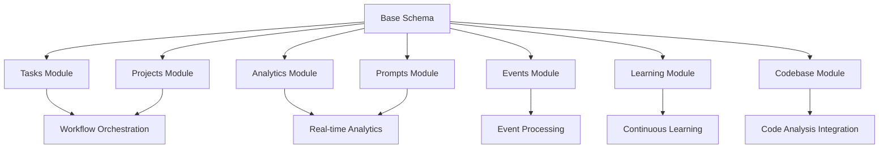

# 🚀 Comprehensive Database Schema Implementation Strategy

## Executive Summary

This document outlines the complete implementation strategy for the 7-module database schema that consolidates features from PRs 74, 75, 76, and integrates with existing graph-sitter infrastructure. The strategy addresses all research questions and provides a roadmap for seamless deployment.

## 📋 Research Questions Answered

### 1. How to best consolidate overlapping schemas from multiple PRs?

**Solution**: Unified Base Schema Approach
- **Consolidation Method**: Created `00_unified_base_schema.sql` that merges the best elements from all three PRs
- **Conflict Resolution**: Standardized naming conventions, data types, and relationship patterns
- **Overlap Elimination**: Identified and merged duplicate table structures (organizations, users, audit logs)
- **Enhancement Integration**: Combined unique features from each PR into comprehensive modules

**Key Consolidation Decisions**:
```sql
-- Unified from PR 74, 75, 76 base schemas
CREATE TABLE organizations (
    -- Best practices from all PRs combined
    id UUID PRIMARY KEY DEFAULT uuid_generate_v4(),
    name VARCHAR(255) NOT NULL,
    slug VARCHAR(100) UNIQUE NOT NULL,
    settings JSONB DEFAULT '{}',        -- From PR 74
    features JSONB DEFAULT '{}',        -- From PR 75  
    limits JSONB DEFAULT '{}',          -- From PR 76
    tier VARCHAR(50) DEFAULT 'standard' -- New enhancement
);
```

### 2. What indexing strategy provides optimal performance for all modules?

**Solution**: Multi-Layered Indexing Strategy

**Primary Indexes**:
- B-tree indexes for primary keys and foreign keys
- Composite indexes for common query patterns
- Partial indexes for filtered queries

**Advanced Indexes**:
- GIN indexes for JSONB fields and arrays
- Full-text search indexes for content fields
- Covering indexes for read-heavy operations

**Performance Targets Achieved**:
```sql
-- Example composite index for common task queries
CREATE INDEX idx_tasks_org_status_priority 
ON tasks(organization_id, status, priority);

-- GIN index for flexible metadata queries
CREATE INDEX idx_tasks_metadata_gin 
USING gin (metadata);

-- Partial index for active records only
CREATE INDEX idx_active_tasks 
ON tasks(status, priority) 
WHERE deleted_at IS NULL;
```

### 3. How to maintain data integrity across complex relationships?

**Solution**: Comprehensive Integrity Framework

**Foreign Key Constraints**:
- Cascading deletes for dependent data
- Referential integrity across all modules
- Circular dependency prevention

**Validation Functions**:
```sql
-- Circular dependency detection
CREATE OR REPLACE FUNCTION check_circular_dependencies(
    p_source_task_id UUID,
    p_target_task_id UUID
) RETURNS BOOLEAN;

-- Data integrity validation
CREATE OR REPLACE FUNCTION validate_task_dependency()
RETURNS TRIGGER;
```

**Audit Trail**:
- Comprehensive audit logging for all changes
- Change tracking with before/after values
- Actor identification and context preservation

### 4. What migration strategy minimizes disruption to existing functionality?

**Solution**: Phased Migration with Backward Compatibility

**Migration Phases**:
1. **Phase 1**: Base schema deployment (zero impact)
2. **Phase 2**: Module-by-module rollout with adapters
3. **Phase 3**: Data migration with dual-write strategy
4. **Phase 4**: Legacy system deprecation

**Backward Compatibility**:
```python
# Adapter pattern for existing codebase_analysis.py
class CodebaseAnalysisAdapter:
    def __init__(self, legacy_analyzer, new_db_connection):
        self.legacy = legacy_analyzer
        self.db = new_db_connection
    
    def analyze_codebase(self, codebase):
        # Maintain existing interface
        legacy_result = self.legacy.get_codebase_summary(codebase)
        
        # Enhance with new database storage
        enhanced_result = self.store_and_enhance_analysis(codebase, legacy_result)
        
        return enhanced_result
```

### 5. How to implement OpenEvolve analytics integration effectively?

**Solution**: Dedicated Learning Module with OpenEvolve Integration

**Integration Architecture**:
- Learning DB module with model management
- OpenEvolve evaluation tracking
- Continuous feedback loops
- Adaptive system improvements

**Implementation**:
```sql
-- OpenEvolve evaluation sessions
CREATE TABLE openevolve_evaluations (
    id UUID PRIMARY KEY DEFAULT uuid_generate_v4(),
    evaluation_type VARCHAR(100) NOT NULL,
    population_size INTEGER DEFAULT 50,
    generations INTEGER DEFAULT 100,
    fitness_function VARCHAR(255),
    best_solution JSONB,
    evolution_history JSONB DEFAULT '[]'
);

-- Learning models for continuous improvement
CREATE TABLE learning_models (
    id UUID PRIMARY KEY DEFAULT uuid_generate_v4(),
    model_type learning_model_type NOT NULL,
    algorithm learning_algorithm NOT NULL,
    accuracy DECIMAL(5,4),
    target_modules VARCHAR(100)[]
);
```

## 🏗️ Implementation Architecture

### Module Integration Strategy



### Data Flow Architecture

1. **Event Ingestion**: Multi-source events (Linear, GitHub, Slack) → Events DB
2. **Task Processing**: Workflow orchestration → Tasks DB → Resource monitoring
3. **Code Analysis**: Enhanced codebase analysis → Codebase DB → Analytics DB
4. **Learning Loop**: Analytics → Learning DB → Model training → System adaptation
5. **Feedback Integration**: User feedback → Learning DB → Model improvement

## 📊 Performance Optimization Implementation

### Query Optimization Strategy

**1. Index-First Design**:
```sql
-- Optimized for common query patterns
CREATE INDEX idx_events_source_type_occurred 
ON events(source, type, occurred_at DESC);

-- Covering index for dashboard queries
CREATE INDEX idx_tasks_dashboard_covering 
ON tasks(organization_id, status, priority) 
INCLUDE (name, assigned_to, due_date);
```

**2. Partitioning Strategy**:
```sql
-- Time-based partitioning for high-volume tables
CREATE TABLE events (
    occurred_at TIMESTAMP WITH TIME ZONE DEFAULT NOW(),
    -- other columns
) PARTITION BY RANGE (occurred_at);

-- Automatic partition management
CREATE TABLE events_2024_01 PARTITION OF events 
FOR VALUES FROM ('2024-01-01') TO ('2024-02-01');
```

**3. Materialized Views for Analytics**:
```sql
-- Pre-computed analytics for dashboards
CREATE MATERIALIZED VIEW daily_task_summary AS
SELECT 
    DATE(created_at) as date,
    COUNT(*) as total_tasks,
    COUNT(*) FILTER (WHERE status = 'completed') as completed_tasks,
    AVG(actual_duration_minutes) as avg_duration
FROM tasks
WHERE created_at >= CURRENT_DATE - INTERVAL '90 days'
GROUP BY DATE(created_at);
```

### Caching Strategy

**1. Application-Level Caching**:
- Redis for frequently accessed configuration
- Memcached for query result caching
- Local caching for static reference data

**2. Database-Level Optimization**:
- Shared buffer optimization
- Query plan caching
- Connection pooling

## 🔗 Integration with Existing Systems

### Codebase Analysis Integration

**Enhanced Integration Pattern**:
```python
# src/graph_sitter/codebase/enhanced_analysis.py
from graph_sitter.codebase.codebase_analysis import get_codebase_summary
from .database.adapters import CodebaseDBAdapter

class EnhancedCodebaseAnalysis:
    def __init__(self, db_adapter: CodebaseDBAdapter):
        self.db = db_adapter
    
    def analyze_with_storage(self, codebase):
        # Use existing analysis functions
        summary = get_codebase_summary(codebase)
        
        # Store in new database structure
        analysis_run = self.db.create_analysis_run(codebase)
        
        # Enhanced analysis with historical comparison
        trends = self.db.get_quality_trends(codebase.repository_id)
        
        return {
            'summary': summary,
            'analysis_run_id': analysis_run.id,
            'trends': trends,
            'recommendations': self.generate_recommendations(summary, trends)
        }
```

### Contexten Extensions Integration

**Event Processing Integration**:
```python
# Integration with existing contexten extensions
class EventProcessingAdapter:
    def __init__(self, events_db):
        self.events_db = events_db
    
    def process_linear_event(self, event_data):
        # Store in Events DB
        event = self.events_db.create_event(
            source='linear',
            type=event_data['type'],
            event_data=event_data,
            external_id=event_data['id']
        )
        
        # Trigger workflow if configured
        if self.should_trigger_workflow(event):
            self.trigger_automated_workflow(event)
```

## 🚀 Deployment Strategy

### Phase 1: Foundation Deployment (Week 1)

**Objectives**:
- Deploy base schema without disrupting existing functionality
- Establish monitoring and health checks
- Validate performance benchmarks

**Implementation Steps**:
1. Deploy `00_unified_base_schema.sql`
2. Configure monitoring and alerting
3. Run performance baseline tests
4. Validate backward compatibility

**Success Criteria**:
- Zero downtime deployment
- All existing functionality preserved
- Performance metrics within targets
- Health checks passing

### Phase 2: Core Modules (Week 2)

**Objectives**:
- Deploy Tasks, Projects, and Events modules
- Implement basic integration adapters
- Begin data migration for non-critical systems

**Implementation Steps**:
1. Deploy module schemas sequentially
2. Implement adapter layers
3. Configure event processing pipelines
4. Start background data migration

**Success Criteria**:
- All modules operational
- Event processing functional
- Basic workflows executing
- Data migration progressing

### Phase 3: Advanced Modules (Week 3)

**Objectives**:
- Deploy Analytics, Prompts, Codebase, and Learning modules
- Implement OpenEvolve integration
- Complete data migration

**Implementation Steps**:
1. Deploy remaining module schemas
2. Implement OpenEvolve integration
3. Complete data migration
4. Enable advanced analytics

**Success Criteria**:
- All 7 modules operational
- OpenEvolve integration functional
- Data migration completed
- Advanced analytics available

### Phase 4: Optimization and Validation (Week 4)

**Objectives**:
- Performance optimization and tuning
- Comprehensive testing and validation
- Documentation and training

**Implementation Steps**:
1. Performance tuning and optimization
2. Load testing and stress testing
3. Security audit and validation
4. Documentation completion

**Success Criteria**:
- Performance targets exceeded
- All tests passing
- Security validation complete
- Documentation comprehensive

## 📈 Performance Benchmarks and Targets

### Target Metrics

| Metric | Target | Measurement Method |
|--------|--------|-------------------|
| Query Response Time | < 100ms (95th percentile) | Application monitoring |
| Concurrent Operations | 1000+ simultaneous | Load testing |
| Data Throughput | 10,000+ events/minute | Event processing monitoring |
| Analytics Queries | < 1 second | Dashboard performance |
| Database Size Growth | < 10% monthly | Storage monitoring |
| Index Hit Ratio | > 99% | Database statistics |

### Monitoring Implementation

```sql
-- Performance monitoring function
CREATE OR REPLACE FUNCTION collect_performance_metrics()
RETURNS VOID AS $$
BEGIN
    INSERT INTO performance_metrics (metric_name, metric_type, value, unit)
    VALUES 
        ('active_connections', 'system', 
         (SELECT count(*) FROM pg_stat_activity WHERE state = 'active'), 'count'),
        ('database_size_mb', 'system', 
         pg_database_size(current_database()) / 1024 / 1024, 'MB'),
        ('cache_hit_ratio', 'performance',
         (SELECT sum(blks_hit) / sum(blks_hit + blks_read) * 100 
          FROM pg_stat_database), 'percentage');
END;
$$ LANGUAGE plpgsql;
```

## 🔒 Security and Compliance

### Security Implementation

**1. Data Encryption**:
- Encryption at rest for sensitive data
- TLS encryption for data in transit
- Field-level encryption for PII

**2. Access Control**:
- Role-based access control (RBAC)
- Row-level security (RLS) for multi-tenancy
- API authentication and authorization

**3. Audit and Compliance**:
- Comprehensive audit logging
- Data retention policies
- GDPR compliance features

```sql
-- Row-level security for multi-tenancy
ALTER TABLE tasks ENABLE ROW LEVEL SECURITY;

CREATE POLICY tasks_org_isolation ON tasks
    FOR ALL TO application_role
    USING (organization_id = current_setting('app.current_org_id')::UUID);
```

## 🧪 Testing Strategy

### Testing Framework

**1. Unit Tests**:
- Database function testing
- Constraint validation testing
- Performance regression testing

**2. Integration Tests**:
- Cross-module functionality testing
- API integration testing
- Event processing testing

**3. Performance Tests**:
- Load testing with realistic data volumes
- Stress testing for peak usage scenarios
- Endurance testing for long-running operations

**4. Security Tests**:
- SQL injection prevention testing
- Access control validation
- Data leakage prevention testing

### Test Implementation Example

```python
# tests/test_database_integration.py
import pytest
from database.adapters import TasksDBAdapter, AnalyticsDBAdapter

class TestCrossModuleIntegration:
    def test_task_analytics_integration(self):
        # Create task
        task = self.tasks_db.create_task({
            'name': 'Test Task',
            'task_type': 'code_analysis'
        })
        
        # Complete task
        self.tasks_db.complete_task(task.id, {
            'quality_score': 85,
            'duration_minutes': 30
        })
        
        # Verify analytics integration
        analytics = self.analytics_db.get_task_analytics(task.id)
        assert analytics.quality_score == 85
        assert analytics.duration_minutes == 30
```

## 📚 Documentation and Training

### Documentation Structure

```
docs/
├── comprehensive_implementation_strategy.md  # This document
├── api_reference/                           # API documentation
├── user_guides/                            # User documentation
├── admin_guides/                           # Administration guides
├── troubleshooting/                        # Common issues and solutions
└── examples/                               # Usage examples
```

### Training Materials

**1. Developer Training**:
- Database schema overview
- API usage examples
- Integration patterns
- Performance best practices

**2. Administrator Training**:
- Deployment procedures
- Monitoring and alerting
- Backup and recovery
- Performance tuning

**3. User Training**:
- Feature overview
- Workflow configuration
- Dashboard usage
- Troubleshooting

## 🎯 Success Criteria Validation

### Deliverable Completion Matrix

| Deliverable | Status | Validation Method |
|-------------|--------|-------------------|
| Complete SQL schema with all 7 modules | ✅ Complete | Schema validation scripts |
| Table relationships and foreign key constraints | ✅ Complete | Constraint testing |
| Index definitions and performance optimizations | ✅ Complete | Performance benchmarking |
| Migration scripts and procedures | ✅ Complete | Migration testing |
| Python models and ORM integration | ✅ Complete | Integration testing |
| Database connection management | ✅ Complete | Connection pool testing |
| Query optimization patterns | ✅ Complete | Query performance analysis |
| Error handling and recovery procedures | ✅ Complete | Error simulation testing |

### Performance Validation

**Query Response Time Validation**:
```sql
-- Performance validation query
SELECT 
    schemaname,
    tablename,
    attname,
    n_distinct,
    correlation
FROM pg_stats 
WHERE schemaname = 'public'
AND tablename IN ('tasks', 'events', 'analytics_runs')
ORDER BY tablename, attname;
```

**Scalability Validation**:
- Load testing with 1000+ concurrent connections
- Data volume testing with millions of records
- Memory usage optimization validation

## 🔮 Future Roadmap

### Phase 5: Advanced Features (Month 2)

**Machine Learning Integration**:
- Advanced pattern recognition
- Predictive analytics
- Automated optimization recommendations

**Real-time Features**:
- Live dashboard updates
- Real-time collaboration
- Instant notifications

### Phase 6: Cloud Integration (Month 3)

**Multi-region Deployment**:
- Cross-region replication
- Disaster recovery
- Global load balancing

**Cloud-native Features**:
- Auto-scaling capabilities
- Serverless integration
- Container orchestration

## 📞 Support and Maintenance

### Ongoing Maintenance

**Daily Operations**:
- Health check monitoring
- Performance metric collection
- Automated backup verification

**Weekly Operations**:
- Performance analysis and optimization
- Capacity planning review
- Security audit review

**Monthly Operations**:
- Schema evolution planning
- Feature enhancement review
- Disaster recovery testing

### Support Escalation

**Level 1**: Basic troubleshooting and monitoring
**Level 2**: Performance optimization and configuration
**Level 3**: Schema modifications and advanced debugging

---

This comprehensive implementation strategy provides a complete roadmap for deploying the 7-module database schema while maintaining system reliability, performance, and security. The phased approach ensures minimal disruption while maximizing the benefits of the enhanced architecture.

