# Extension Architecture Flowchart

## Overview
This document contains the comprehensive mermaid flowchart showing how all extensions in the graph-sitter project interconnect in logical sequential use calls.

## Extension Interconnection Flow

```mermaid
graph TB
    %% User Entry Points
    User[👤 User/Developer] 
    Trigger[⚡ External Trigger]
    Webhook[🔗 Webhook Event]
    
    %% Core Orchestration Layer
    subgraph "Core Orchestration Layer"
        Registry[📋 Extension Registry]
        EventBus[🚌 Event Bus]
        Orchestrator[🎭 Workflow Orchestrator]
        ConfigMgr[⚙️ Configuration Manager]
        HealthMon[💓 Health Monitor]
    end
    
    %% Extension Layer
    subgraph "Extension Ecosystem"
        %% Code Analysis & Manipulation
        subgraph "Code Analysis"
            GraphSitter[🌳 Graph Sitter<br/>Code Analysis & AST]
            Contexten[🧠 Contexten App<br/>Context Management]
        end
        
        %% AI & Automation
        subgraph "AI & Automation"
            Codegen[🤖 Codegen<br/>Agent API Integration]
            ControlFlow[🔄 ControlFlow<br/>Workflow Automation]
        end
        
        %% Development Tools
        subgraph "Development Tools"
            GitHub[🐙 GitHub<br/>Repository Operations]
            CircleCI[🔄 CircleCI<br/>CI/CD Pipeline]
        end
        
        %% Project Management
        subgraph "Project Management"
            Linear[📋 Linear<br/>Issue Management]
            Grainchain[⛓️ Grainchain<br/>Task Dependencies]
        end
        
        %% Infrastructure & Compute
        subgraph "Infrastructure"
            Modal[☁️ Modal<br/>Serverless Compute]
            Prefect[🌊 Prefect<br/>Workflow Engine]
        end
        
        %% Communication
        subgraph "Communication"
            Slack[💬 Slack<br/>Team Communication]
        end
    end
    
    %% External Services
    subgraph "External Services"
        GitHubAPI[🐙 GitHub API]
        LinearAPI[📋 Linear API]
        SlackAPI[💬 Slack API]
        CircleCIAPI[🔄 CircleCI API]
        ModalAPI[☁️ Modal API]
        PrefectAPI[🌊 Prefect API]
    end
    
    %% User Interactions
    User --> |1. Code Analysis Request| GraphSitter
    User --> |2. Issue Creation| Linear
    User --> |3. Manual Workflow Trigger| Orchestrator
    
    %% External Triggers
    Trigger --> |Git Push Event| GitHub
    Webhook --> |Linear Webhook| Linear
    Webhook --> |CircleCI Webhook| CircleCI
    Webhook --> |Slack Event| Slack
    
    %% Core System Flows
    Registry --> |Extension Discovery| EventBus
    EventBus --> |Event Routing| Orchestrator
    ConfigMgr --> |Configuration| Registry
    HealthMon --> |Status Monitoring| Registry
    
    %% Sequential Use Case 1: Code Analysis → Issue Creation → CI/CD
    GraphSitter --> |Code Issues Found| EventBus
    EventBus --> |Issue Creation Event| Linear
    Linear --> |Issue Created| EventBus
    EventBus --> |Trigger CI Build| CircleCI
    CircleCI --> |Build Status| EventBus
    EventBus --> |Notification| Slack
    
    %% Sequential Use Case 2: Codegen Agent Workflow
    Codegen --> |Request Context| Contexten
    Contexten --> |Provide Context| Codegen
    Codegen --> |Code Generation| GraphSitter
    GraphSitter --> |Analysis Results| Codegen
    Codegen --> |Create PR| GitHub
    GitHub --> |PR Created| EventBus
    EventBus --> |Update Issue| Linear
    EventBus --> |Notify Team| Slack
    
    %% Sequential Use Case 3: Workflow Automation
    ControlFlow --> |Workflow Definition| Orchestrator
    Orchestrator --> |Execute Tasks| Modal
    Modal --> |Task Results| Orchestrator
    Orchestrator --> |Update Status| Linear
    Orchestrator --> |Trigger Deployment| CircleCI
    
    %% Sequential Use Case 4: Dependency Management
    Grainchain --> |Task Dependencies| EventBus
    EventBus --> |Dependency Updates| Linear
    Linear --> |Status Changes| EventBus
    EventBus --> |Trigger Dependent Tasks| Prefect
    
    %% External API Connections
    GitHub --> |Repository Operations| GitHubAPI
    Linear --> |Issue Management| LinearAPI
    Slack --> |Message Sending| SlackAPI
    CircleCI --> |Build Triggers| CircleCIAPI
    Modal --> |Function Execution| ModalAPI
    Prefect --> |Workflow Execution| PrefectAPI
    
    %% Health and Monitoring Flows
    HealthMon --> |Monitor| GraphSitter
    HealthMon --> |Monitor| Codegen
    HealthMon --> |Monitor| GitHub
    HealthMon --> |Monitor| Linear
    HealthMon --> |Monitor| CircleCI
    HealthMon --> |Monitor| Modal
    HealthMon --> |Monitor| Prefect
    HealthMon --> |Monitor| Slack
    HealthMon --> |Monitor| Contexten
    HealthMon --> |Monitor| ControlFlow
    HealthMon --> |Monitor| Grainchain
    
    %% Configuration Management
    ConfigMgr --> |Configure| GraphSitter
    ConfigMgr --> |Configure| Codegen
    ConfigMgr --> |Configure| GitHub
    ConfigMgr --> |Configure| Linear
    ConfigMgr --> |Configure| CircleCI
    ConfigMgr --> |Configure| Modal
    ConfigMgr --> |Configure| Prefect
    ConfigMgr --> |Configure| Slack
    ConfigMgr --> |Configure| Contexten
    ConfigMgr --> |Configure| ControlFlow
    ConfigMgr --> |Configure| Grainchain
    
    %% Styling
    classDef userClass fill:#e1f5fe,stroke:#01579b,stroke-width:2px
    classDef coreClass fill:#f3e5f5,stroke:#4a148c,stroke-width:2px
    classDef extensionClass fill:#e8f5e8,stroke:#1b5e20,stroke-width:2px
    classDef externalClass fill:#fff3e0,stroke:#e65100,stroke-width:2px
    
    class User,Trigger,Webhook userClass
    class Registry,EventBus,Orchestrator,ConfigMgr,HealthMon coreClass
    class GraphSitter,Codegen,GitHub,Linear,CircleCI,Modal,Prefect,Slack,Contexten,ControlFlow,Grainchain extensionClass
    class GitHubAPI,LinearAPI,SlackAPI,CircleCIAPI,ModalAPI,PrefectAPI externalClass
```



## Common Sequential Use Cases

### 1. Code Analysis to Issue Creation Flow


### 2. Codegen Agent Workflow


### 3. CI/CD Integration Flow


### 4. Workflow Orchestration


## Extension Capabilities Matrix

| Extension | Primary Function | Input Types | Output Types | Dependencies |
|-----------|------------------|-------------|--------------|--------------|
| **Graph Sitter** | Code analysis, AST manipulation | Source code, file paths | Analysis results, code metrics | - |
| **Codegen** | AI agent integration | Prompts, context | Generated code, API responses | Contexten, Graph Sitter |
| **Contexten** | Context management | Code context requests | Structured context data | Graph Sitter |
| **GitHub** | Repository operations | Git operations, PR requests | Repository data, PR status | - |
| **Linear** | Issue management | Issue data, status updates | Issue objects, notifications | - |
| **CircleCI** | CI/CD pipeline | Build triggers, configs | Build status, artifacts | GitHub, Modal |
| **Modal** | Serverless compute | Function calls, data | Execution results | - |
| **Prefect** | Workflow engine | Workflow definitions | Execution status | Modal |
| **Slack** | Communication | Messages, notifications | Delivery status | - |
| **ControlFlow** | Workflow automation | Workflow specs | Automation results | Orchestrator |
| **Grainchain** | Task dependencies | Task relationships | Dependency graphs | Linear, Prefect |

## Event Types and Routing

### Core Events
- `extension.registered` - Extension joins the system
- `extension.health.changed` - Extension health status update
- `workflow.started` - Workflow execution begins
- `workflow.completed` - Workflow execution ends
- `error.occurred` - Error in any extension

### Domain-Specific Events
- `code.analyzed` - Code analysis completed
- `issue.created` - New issue created
- `issue.updated` - Issue status changed
- `pr.created` - Pull request created
- `build.started` - CI build started
- `build.completed` - CI build finished
- `notification.sent` - Message delivered
- `task.completed` - Individual task finished

## Configuration Schema

Each extension follows a unified configuration schema:

```yaml
extension:
  name: "extension-name"
  version: "1.0.0"
  capabilities:
    - "capability-1"
    - "capability-2"
  dependencies:
    - "required-extension"
  configuration:
    # Extension-specific config
  authentication:
    type: "oauth|token|api_key"
    # Auth details
  endpoints:
    base_url: "https://api.service.com"
    timeout: 30
    retry_count: 3
```

This flowchart provides the foundation for implementing the unified plugin extension system, showing clear interaction patterns and data flows between all components.

