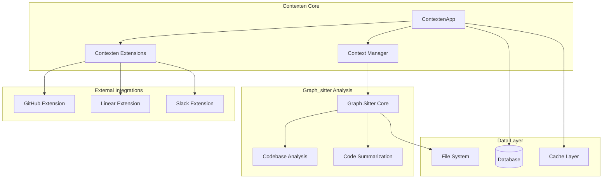

# Integration Architecture

## Overview

This document defines the integration architecture for the enhanced Contexten system, focusing on component integration patterns, API compatibility framework, and performance optimization approaches.

## System Architecture

### Core Components



### Component Integration Patterns

#### 1. Dependency Injection Pattern
```python
# contexten_app.py
from typing import Protocol
from graph_sitter.codebase.codebase_analysis import (
    get_codebase_summary,
    get_file_summary,
    get_class_summary,
    get_function_summary,
    get_symbol_summary
)

class AnalysisProvider(Protocol):
    def get_codebase_summary(self, codebase) -> str: ...
    def get_file_summary(self, file) -> str: ...
    def get_class_summary(self, cls) -> str: ...
    def get_function_summary(self, func) -> str: ...
    def get_symbol_summary(self, symbol) -> str: ...

class GraphSitterAnalysisProvider:
    """Graph_sitter implementation of analysis provider."""
    
    def get_codebase_summary(self, codebase) -> str:
        return get_codebase_summary(codebase)
    
    def get_file_summary(self, file) -> str:
        return get_file_summary(file)
    
    def get_class_summary(self, cls) -> str:
        return get_class_summary(cls)
    
    def get_function_summary(self, func) -> str:
        return get_function_summary(func)
    
    def get_symbol_summary(self, symbol) -> str:
        return get_symbol_summary(symbol)

class ContextenApp:
    def __init__(self, name: str, analysis_provider: AnalysisProvider = None):
        self.name = name
        self.analysis_provider = analysis_provider or GraphSitterAnalysisProvider()
        self._initialize_components()
```

#### 2. Event-Driven Architecture
```python
# events/event_bus.py
from typing import Dict, List, Callable, Any
from dataclasses import dataclass
from enum import Enum

class EventType(Enum):
    CODEBASE_ANALYZED = "codebase_analyzed"
    PR_CREATED = "pr_created"
    ISSUE_UPDATED = "issue_updated"
    SLACK_MESSAGE = "slack_message"

@dataclass
class Event:
    type: EventType
    data: Dict[str, Any]
    source: str
    timestamp: float

class EventBus:
    def __init__(self):
        self._handlers: Dict[EventType, List[Callable]] = {}
    
    def subscribe(self, event_type: EventType, handler: Callable):
        if event_type not in self._handlers:
            self._handlers[event_type] = []
        self._handlers[event_type].append(handler)
    
    async def publish(self, event: Event):
        handlers = self._handlers.get(event.type, [])
        for handler in handlers:
            await handler(event)

# Integration in ContextenApp
class ContextenApp:
    def __init__(self, name: str):
        self.event_bus = EventBus()
        self._setup_event_handlers()
    
    def _setup_event_handlers(self):
        self.event_bus.subscribe(EventType.CODEBASE_ANALYZED, self._on_codebase_analyzed)
        self.event_bus.subscribe(EventType.PR_CREATED, self._on_pr_created)
    
    async def _on_codebase_analyzed(self, event: Event):
        # Trigger analysis caching, notifications, etc.
        pass
    
    async def _on_pr_created(self, event: Event):
        # Trigger automatic analysis, Linear issue creation, etc.
        pass
```

#### 3. Plugin Architecture for Extensions
```python
# extensions/base.py
from abc import ABC, abstractmethod
from typing import Dict, Any

class Extension(ABC):
    def __init__(self, app: 'ContextenApp'):
        self.app = app
        self.config = {}
    
    @abstractmethod
    async def initialize(self) -> None:
        """Initialize the extension."""
        pass
    
    @abstractmethod
    async def handle_event(self, event: Event) -> None:
        """Handle incoming events."""
        pass
    
    @abstractmethod
    def get_capabilities(self) -> Dict[str, Any]:
        """Return extension capabilities."""
        pass

# Enhanced GitHub Extension
class GitHubExtension(Extension):
    def __init__(self, app: 'ContextenApp'):
        super().__init__(app)
        self.github_client = None
    
    async def initialize(self) -> None:
        self.github_client = self._create_github_client()
        self.app.event_bus.subscribe(EventType.PR_CREATED, self.handle_pr_created)
    
    async def handle_pr_created(self, event: Event):
        pr_data = event.data
        # Perform automatic code analysis
        analysis = await self._analyze_pr_changes(pr_data['pr_number'])
        
        # Create analysis comment
        await self._create_analysis_comment(pr_data['pr_number'], analysis)
    
    async def _analyze_pr_changes(self, pr_number: int) -> Dict[str, Any]:
        """Analyze PR changes using graph_sitter integration."""
        changes = await self.github_client.get_pr_changes(pr_number)
        
        analysis_results = {}
        for file_change in changes:
            if file_change['filename'].endswith('.py'):
                # Use graph_sitter analysis
                file_analysis = self.app.analysis_provider.get_file_summary(
                    file_change['content']
                )
                analysis_results[file_change['filename']] = file_analysis
        
        return {
            'files_analyzed': len(analysis_results),
            'analysis_results': analysis_results,
            'complexity_score': self._calculate_complexity(analysis_results),
            'recommendations': self._generate_recommendations(analysis_results)
        }
```

## API Compatibility Framework

### 1. Versioned API Design
```python
# api/versioning.py
from fastapi import APIRouter, Depends
from typing import Union

# V1 API (Legacy compatibility)
v1_router = APIRouter(prefix="/api/v1")

@v1_router.post("/codegen/analyze")
async def analyze_codebase_v1(request: CodegenAnalysisRequest):
    """Legacy endpoint for backward compatibility."""
    # Convert to new format internally
    contexten_request = convert_to_contexten_format(request)
    result = await analyze_codebase_v2(contexten_request)
    # Convert back to legacy format
    return convert_to_legacy_format(result)

# V2 API (New contexten format)
v2_router = APIRouter(prefix="/api/v2")

@v2_router.post("/contexten/analyze")
async def analyze_codebase_v2(request: ContextenAnalysisRequest):
    """Enhanced analysis endpoint with graph_sitter integration."""
    app = get_contexten_app()
    
    analysis = await app.get_enhanced_codebase_analysis(
        repo_name=request.repo_name,
        include_files=request.include_files,
        include_classes=request.include_classes,
        include_functions=request.include_functions
    )
    
    return ContextenAnalysisResponse(
        analysis=analysis,
        performance_metrics=app.get_performance_metrics(),
        cache_status=app.get_cache_status()
    )
```

### 2. Backward Compatibility Layer
```python
# compatibility/legacy_adapter.py
class LegacyCodegenAdapter:
    """Adapter to maintain compatibility with legacy CodegenApp usage."""
    
    def __init__(self, contexten_app: ContextenApp):
        self.contexten_app = contexten_app
    
    def analyze_code(self, code: str) -> dict:
        """Legacy method signature."""
        # Convert to new analysis format
        return self.contexten_app.analyze_code_enhanced(
            code=code,
            include_summary=True,
            include_metrics=False  # Legacy didn't include metrics
        )
    
    def create_github_pr(self, title: str, body: str, branch: str) -> dict:
        """Legacy PR creation method."""
        return self.contexten_app.github.create_pr_enhanced(
            title=title,
            body=body,
            branch=branch,
            auto_analysis=False  # Legacy didn't include auto-analysis
        )

# Usage in ContextenApp
class ContextenApp:
    def __init__(self, name: str):
        # ... existing initialization
        self.legacy_adapter = LegacyCodegenAdapter(self)
    
    @property
    def codegen_compatibility(self) -> LegacyCodegenAdapter:
        """Provide legacy compatibility interface."""
        return self.legacy_adapter
```

## Performance Optimization

### 1. Caching Strategy
```python
# caching/analysis_cache.py
from typing import Optional, Dict, Any
import asyncio
import hashlib
import json
from datetime import datetime, timedelta

class AnalysisCache:
    def __init__(self, redis_client=None, ttl_seconds: int = 3600):
        self.redis_client = redis_client
        self.ttl_seconds = ttl_seconds
        self.local_cache: Dict[str, Any] = {}
    
    def _generate_cache_key(self, repo_name: str, analysis_type: str, 
                          params: Dict[str, Any]) -> str:
        """Generate deterministic cache key."""
        key_data = {
            'repo': repo_name,
            'type': analysis_type,
            'params': sorted(params.items())
        }
        key_string = json.dumps(key_data, sort_keys=True)
        return hashlib.sha256(key_string.encode()).hexdigest()
    
    async def get(self, repo_name: str, analysis_type: str, 
                  params: Dict[str, Any]) -> Optional[Dict[str, Any]]:
        """Get cached analysis result."""
        cache_key = self._generate_cache_key(repo_name, analysis_type, params)
        
        # Try local cache first
        if cache_key in self.local_cache:
            cached_data = self.local_cache[cache_key]
            if cached_data['expires_at'] > datetime.now():
                return cached_data['data']
            else:
                del self.local_cache[cache_key]
        
        # Try Redis cache
        if self.redis_client:
            cached_data = await self.redis_client.get(cache_key)
            if cached_data:
                return json.loads(cached_data)
        
        return None
    
    async def set(self, repo_name: str, analysis_type: str, 
                  params: Dict[str, Any], data: Dict[str, Any]) -> None:
        """Cache analysis result."""
        cache_key = self._generate_cache_key(repo_name, analysis_type, params)
        expires_at = datetime.now() + timedelta(seconds=self.ttl_seconds)
        
        # Store in local cache
        self.local_cache[cache_key] = {
            'data': data,
            'expires_at': expires_at
        }
        
        # Store in Redis cache
        if self.redis_client:
            await self.redis_client.setex(
                cache_key, 
                self.ttl_seconds, 
                json.dumps(data)
            )

# Integration in ContextenApp
class ContextenApp:
    def __init__(self, name: str):
        # ... existing initialization
        self.analysis_cache = AnalysisCache()
    
    async def get_enhanced_codebase_analysis(self, repo_name: str, 
                                           **params) -> Dict[str, Any]:
        """Get codebase analysis with caching."""
        # Check cache first
        cached_result = await self.analysis_cache.get(
            repo_name, 'codebase_summary', params
        )
        if cached_result:
            return cached_result
        
        # Perform analysis
        codebase = await self._get_codebase(repo_name)
        analysis = {
            'summary': self.analysis_provider.get_codebase_summary(codebase),
            'timestamp': datetime.now().isoformat(),
            'params': params
        }
        
        # Cache result
        await self.analysis_cache.set(
            repo_name, 'codebase_summary', params, analysis
        )
        
        return analysis
```

### 2. Async Processing Pipeline
```python
# processing/async_pipeline.py
import asyncio
from typing import List, Callable, Any
from dataclasses import dataclass

@dataclass
class ProcessingTask:
    id: str
    type: str
    data: Any
    priority: int = 0

class AsyncProcessingPipeline:
    def __init__(self, max_workers: int = 10):
        self.max_workers = max_workers
        self.task_queue = asyncio.Queue()
        self.workers = []
        self.handlers = {}
    
    def register_handler(self, task_type: str, handler: Callable):
        """Register a handler for a specific task type."""
        self.handlers[task_type] = handler
    
    async def start(self):
        """Start the processing pipeline."""
        self.workers = [
            asyncio.create_task(self._worker(f"worker-{i}"))
            for i in range(self.max_workers)
        ]
    
    async def stop(self):
        """Stop the processing pipeline."""
        for worker in self.workers:
            worker.cancel()
        await asyncio.gather(*self.workers, return_exceptions=True)
    
    async def submit_task(self, task: ProcessingTask):
        """Submit a task for processing."""
        await self.task_queue.put(task)
    
    async def _worker(self, worker_name: str):
        """Worker coroutine to process tasks."""
        while True:
            try:
                task = await self.task_queue.get()
                handler = self.handlers.get(task.type)
                
                if handler:
                    await handler(task)
                else:
                    print(f"No handler for task type: {task.type}")
                
                self.task_queue.task_done()
            
            except asyncio.CancelledError:
                break
            except Exception as e:
                print(f"Worker {worker_name} error: {e}")

# Integration in ContextenApp
class ContextenApp:
    def __init__(self, name: str):
        # ... existing initialization
        self.processing_pipeline = AsyncProcessingPipeline()
        self._setup_pipeline_handlers()
    
    def _setup_pipeline_handlers(self):
        """Setup handlers for different task types."""
        self.processing_pipeline.register_handler(
            'codebase_analysis', self._handle_codebase_analysis
        )
        self.processing_pipeline.register_handler(
            'pr_analysis', self._handle_pr_analysis
        )
    
    async def _handle_codebase_analysis(self, task: ProcessingTask):
        """Handle codebase analysis tasks."""
        repo_name = task.data['repo_name']
        analysis = await self.get_enhanced_codebase_analysis(repo_name)
        
        # Publish analysis complete event
        await self.event_bus.publish(Event(
            type=EventType.CODEBASE_ANALYZED,
            data={'repo_name': repo_name, 'analysis': analysis},
            source='processing_pipeline',
            timestamp=time.time()
        ))
```

### 3. Resource Management
```python
# resources/manager.py
import asyncio
from typing import Dict, Any
import psutil
import time

class ResourceManager:
    def __init__(self, max_memory_mb: int = 1024, max_cpu_percent: int = 80):
        self.max_memory_mb = max_memory_mb
        self.max_cpu_percent = max_cpu_percent
        self.active_tasks: Dict[str, Dict[str, Any]] = {}
    
    async def acquire_resources(self, task_id: str, 
                              estimated_memory_mb: int = 100) -> bool:
        """Acquire resources for a task."""
        current_memory = psutil.virtual_memory().used / 1024 / 1024
        current_cpu = psutil.cpu_percent(interval=1)
        
        if (current_memory + estimated_memory_mb > self.max_memory_mb or
            current_cpu > self.max_cpu_percent):
            return False
        
        self.active_tasks[task_id] = {
            'start_time': time.time(),
            'estimated_memory': estimated_memory_mb
        }
        return True
    
    def release_resources(self, task_id: str):
        """Release resources for a task."""
        if task_id in self.active_tasks:
            del self.active_tasks[task_id]
    
    def get_resource_status(self) -> Dict[str, Any]:
        """Get current resource usage status."""
        return {
            'memory_usage_mb': psutil.virtual_memory().used / 1024 / 1024,
            'cpu_percent': psutil.cpu_percent(),
            'active_tasks': len(self.active_tasks),
            'max_memory_mb': self.max_memory_mb,
            'max_cpu_percent': self.max_cpu_percent
        }

# Integration in ContextenApp
class ContextenApp:
    def __init__(self, name: str):
        # ... existing initialization
        self.resource_manager = ResourceManager()
    
    async def get_enhanced_codebase_analysis(self, repo_name: str) -> Dict[str, Any]:
        """Resource-managed codebase analysis."""
        task_id = f"analysis-{repo_name}-{int(time.time())}"
        
        # Acquire resources
        if not await self.resource_manager.acquire_resources(task_id, 200):
            raise Exception("Insufficient resources for analysis")
        
        try:
            # Perform analysis
            result = await self._perform_analysis(repo_name)
            return result
        finally:
            # Always release resources
            self.resource_manager.release_resources(task_id)
```

## Integration Testing Strategy

### 1. Component Integration Tests
```python
# tests/integration/test_contexten_integration.py
import pytest
from contexten.extensions.events.contexten_app import ContextenApp
from graph_sitter.codebase.codebase_analysis import get_codebase_summary

@pytest.mark.asyncio
async def test_graph_sitter_integration():
    """Test integration with graph_sitter analysis functions."""
    app = ContextenApp("test-app")
    
    # Mock codebase
    mock_repo = "test-repo"
    analysis = await app.get_enhanced_codebase_analysis(mock_repo)
    
    assert 'summary' in analysis
    assert 'timestamp' in analysis
    assert analysis['summary'] is not None

@pytest.mark.asyncio
async def test_extension_integration():
    """Test integration between extensions."""
    app = ContextenApp("test-app")
    
    # Test GitHub -> Linear integration
    pr_data = {'number': 123, 'title': 'Test PR'}
    await app.github.handle_pr_created(pr_data)
    
    # Verify Linear issue was created
    issues = await app.linear.get_recent_issues()
    assert any('Test PR' in issue['title'] for issue in issues)

@pytest.mark.asyncio
async def test_caching_integration():
    """Test caching layer integration."""
    app = ContextenApp("test-app")
    
    # First call should hit the analysis provider
    result1 = await app.get_enhanced_codebase_analysis("test-repo")
    
    # Second call should hit the cache
    result2 = await app.get_enhanced_codebase_analysis("test-repo")
    
    assert result1 == result2
    assert app.analysis_cache.local_cache  # Cache should have entries
```

### 2. Performance Integration Tests
```python
# tests/performance/test_performance_integration.py
import pytest
import time
import asyncio

@pytest.mark.asyncio
async def test_concurrent_analysis_performance():
    """Test performance under concurrent load."""
    app = ContextenApp("test-app")
    
    start_time = time.time()
    
    # Run 10 concurrent analyses
    tasks = [
        app.get_enhanced_codebase_analysis(f"repo-{i}")
        for i in range(10)
    ]
    
    results = await asyncio.gather(*tasks)
    
    end_time = time.time()
    duration = end_time - start_time
    
    assert len(results) == 10
    assert duration < 30  # Should complete within 30 seconds
    assert all(result is not None for result in results)

@pytest.mark.asyncio
async def test_memory_usage_integration():
    """Test memory usage during integration."""
    app = ContextenApp("test-app")
    
    initial_memory = psutil.virtual_memory().used
    
    # Perform large analysis
    await app.get_enhanced_codebase_analysis("large-repo")
    
    final_memory = psutil.virtual_memory().used
    memory_increase = (final_memory - initial_memory) / 1024 / 1024  # MB
    
    assert memory_increase < 500  # Should not use more than 500MB
```

## Monitoring and Observability

### 1. Metrics Collection
```python
# monitoring/metrics.py
from typing import Dict, Any
import time
from dataclasses import dataclass, field

@dataclass
class Metrics:
    analysis_count: int = 0
    analysis_duration_total: float = 0.0
    cache_hits: int = 0
    cache_misses: int = 0
    error_count: int = 0
    active_connections: int = 0
    custom_metrics: Dict[str, Any] = field(default_factory=dict)

class MetricsCollector:
    def __init__(self):
        self.metrics = Metrics()
        self.start_time = time.time()
    
    def record_analysis(self, duration: float):
        """Record analysis metrics."""
        self.metrics.analysis_count += 1
        self.metrics.analysis_duration_total += duration
    
    def record_cache_hit(self):
        """Record cache hit."""
        self.metrics.cache_hits += 1
    
    def record_cache_miss(self):
        """Record cache miss."""
        self.metrics.cache_misses += 1
    
    def record_error(self):
        """Record error occurrence."""
        self.metrics.error_count += 1
    
    def get_metrics_summary(self) -> Dict[str, Any]:
        """Get comprehensive metrics summary."""
        uptime = time.time() - self.start_time
        avg_analysis_duration = (
            self.metrics.analysis_duration_total / self.metrics.analysis_count
            if self.metrics.analysis_count > 0 else 0
        )
        cache_hit_rate = (
            self.metrics.cache_hits / (self.metrics.cache_hits + self.metrics.cache_misses)
            if (self.metrics.cache_hits + self.metrics.cache_misses) > 0 else 0
        )
        
        return {
            'uptime_seconds': uptime,
            'analysis_count': self.metrics.analysis_count,
            'avg_analysis_duration': avg_analysis_duration,
            'cache_hit_rate': cache_hit_rate,
            'error_count': self.metrics.error_count,
            'active_connections': self.metrics.active_connections,
            'custom_metrics': self.metrics.custom_metrics
        }

# Integration in ContextenApp
class ContextenApp:
    def __init__(self, name: str):
        # ... existing initialization
        self.metrics_collector = MetricsCollector()
    
    async def get_enhanced_codebase_analysis(self, repo_name: str) -> Dict[str, Any]:
        """Metrics-instrumented analysis."""
        start_time = time.time()
        
        try:
            # Check cache
            cached_result = await self.analysis_cache.get(repo_name, 'codebase', {})
            if cached_result:
                self.metrics_collector.record_cache_hit()
                return cached_result
            
            self.metrics_collector.record_cache_miss()
            
            # Perform analysis
            result = await self._perform_analysis(repo_name)
            
            # Record metrics
            duration = time.time() - start_time
            self.metrics_collector.record_analysis(duration)
            
            return result
        
        except Exception as e:
            self.metrics_collector.record_error()
            raise
```

## Conclusion

This integration architecture provides a robust foundation for the enhanced Contexten system with:

1. **Modular Design**: Clear separation of concerns with dependency injection
2. **Event-Driven Architecture**: Loose coupling between components
3. **Performance Optimization**: Comprehensive caching and resource management
4. **Backward Compatibility**: Seamless migration from legacy systems
5. **Monitoring**: Built-in observability and metrics collection

The architecture supports the migration from `Codegen_app.py` to `contexten_app.py` while providing enhanced capabilities through graph_sitter integration and improved extension functionality.

