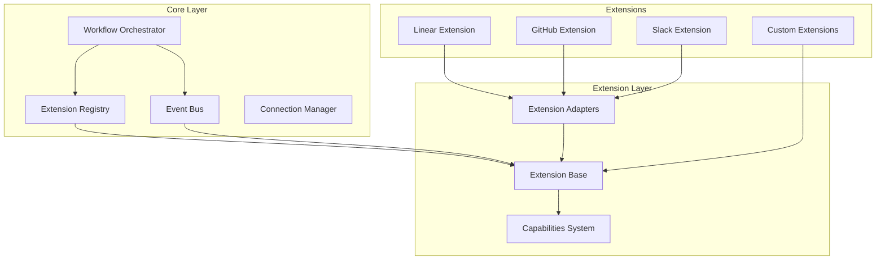

# Unified Extension Protocol Specification

## Overview

The Unified Extension Protocol provides a standardized framework for building, integrating, and orchestrating extensions in the graph-sitter ecosystem. This protocol enables seamless communication between diverse extensions while maintaining backward compatibility with existing implementations.

## Architecture

### Core Components



## Extension Interface

### Base Extension Class

All extensions must inherit from `ExtensionBase` and implement the required methods:

```python
from contexten.extensions.core import ExtensionBase, ExtensionMetadata, ExtensionConfig

class MyExtension(ExtensionBase):
    def _create_metadata(self) -> ExtensionMetadata:
        return ExtensionMetadata(
            name="my_extension",
            version="1.0.0",
            description="My custom extension",
            capabilities=[...],
            dependencies=[...]
        )
    
    async def initialize(self) -> bool:
        # Initialize extension resources
        return True
    
    async def start(self) -> bool:
        # Start extension services
        return True
    
    async def stop(self) -> bool:
        # Stop extension services
        return True
    
    async def health_check(self) -> bool:
        # Check extension health
        return True
```

### Extension Metadata

Extensions must provide metadata describing their capabilities and requirements:

```python
ExtensionMetadata(
    name="extension_name",           # Unique extension identifier
    version="1.0.0",                # Semantic version
    description="Extension purpose", # Human-readable description
    author="Author Name",            # Extension author
    capabilities=[...],              # List of capabilities provided
    dependencies=[...],              # List of required extensions
    tags=["tag1", "tag2"]           # Optional tags for categorization
)
```

## Capability System

### Capability Definition

Extensions advertise their functionality through capabilities:

```python
from contexten.extensions.core import ExtensionCapability, CapabilityType, CapabilityMethod

capability = ExtensionCapability(
    name="issue_management",
    type=CapabilityType.ISSUE_TRACKING,
    description="Create and manage issues",
    methods=[
        CapabilityMethod(
            name="create_issue",
            description="Create a new issue",
            parameters=[
                CapabilityParameter(
                    name="title",
                    type="string",
                    description="Issue title",
                    required=True
                ),
                CapabilityParameter(
                    name="description",
                    type="string",
                    description="Issue description",
                    required=False
                )
            ],
            return_description="Created issue object"
        )
    ]
)
```

### Standard Capability Types

| Type | Description | Examples |
|------|-------------|----------|
| `CODE_ANALYSIS` | Code analysis and metrics | AST parsing, complexity analysis |
| `ISSUE_TRACKING` | Issue management | Create, update, search issues |
| `MESSAGING` | Communication | Send messages, notifications |
| `BUILD_AUTOMATION` | CI/CD operations | Trigger builds, get status |
| `WORKFLOW_AUTOMATION` | Process automation | Workflow execution, task management |

## Event System

### Event Structure

Events follow a standardized structure for inter-extension communication:

```python
ExtensionEvent(
    type="event.type",              # Event type identifier
    source="source_extension",      # Extension that generated the event
    target="target_extension",      # Optional target extension
    data={...},                     # Event payload
    correlation_id="uuid",          # Optional correlation ID
    timestamp=datetime.now(UTC)     # Event timestamp
)
```

### Event Types

#### Core Events
- `extension.registered` - Extension joins the system
- `extension.started` - Extension starts successfully
- `extension.stopped` - Extension stops
- `extension.health.failed` - Extension health check fails
- `workflow.started` - Workflow execution begins
- `workflow.completed` - Workflow execution ends

#### Domain Events
- `code.analyzed` - Code analysis completed
- `issue.created` - New issue created
- `issue.updated` - Issue status changed
- `pr.created` - Pull request created
- `build.started` - CI build started
- `build.completed` - CI build finished
- `message.sent` - Message delivered

### Event Subscription

Extensions can subscribe to events using filters:

```python
from contexten.extensions.core import EventFilter

# Subscribe to specific event types
event_filter = EventFilter(
    event_types=["issue.created", "issue.updated"],
    source_patterns=["linear*"],
    data_filters={"priority": "high"}
)

event_bus.subscribe("my_extension", handler_function, event_filter)
```

## Message System

### Message Structure

For request-response communication between extensions:

```python
ExtensionMessage(
    id="unique_message_id",         # Unique message identifier
    type="message_type",            # Message type
    source="source_extension",      # Sender extension
    target="target_extension",      # Receiver extension
    payload={...},                  # Message data
    correlation_id="uuid",          # Optional correlation ID
    reply_to="response_topic",      # Optional response topic
    ttl=300                         # Time to live in seconds
)
```

### Message Handlers

Extensions register message handlers for different message types:

```python
class MyExtension(ExtensionBase):
    async def start(self) -> bool:
        # Register message handlers
        self.add_message_handler("create_issue", self._handle_create_issue)
        self.add_message_handler("get_status", self._handle_get_status)
        return True
    
    async def _handle_create_issue(self, message: ExtensionMessage) -> Any:
        # Process create issue request
        title = message.payload.get("title")
        description = message.payload.get("description")
        
        # Create issue logic here
        issue = await self.create_issue(title, description)
        return issue
```

## Workflow Orchestration

### Workflow Definition

Workflows define complex multi-extension processes:

```python
from contexten.extensions.core import WorkflowDefinition, TaskDefinition, TaskType

workflow = WorkflowDefinition(
    id="code_review_workflow",
    name="Code Review Process",
    description="Automated code review and issue creation",
    tasks=[
        TaskDefinition(
            id="analyze_code",
            name="Analyze Code",
            type=TaskType.EXTENSION_CALL,
            extension="graph_sitter",
            method="analyze_file",
            parameters={"file_path": "${file_path}"}
        ),
        TaskDefinition(
            id="create_issues",
            name="Create Issues",
            type=TaskType.EXTENSION_CALL,
            extension="linear",
            method="create_issue",
            parameters={
                "title": "Code issues in ${file_path}",
                "description": "Found ${task_analyze_code_result.issue_count} issues"
            },
            depends_on=["analyze_code"]
        )
    ],
    triggers=["code.committed"]
)
```

### Task Types

| Type | Description | Parameters |
|------|-------------|------------|
| `EXTENSION_CALL` | Call extension method | `extension`, `method`, `parameters` |
| `CONDITION` | Conditional execution | `condition` |
| `DELAY` | Wait for specified time | `seconds` |
| `PARALLEL` | Execute tasks in parallel | `tasks` |
| `SEQUENTIAL` | Execute tasks in sequence | `tasks` |

## Connection Management

### Connection Types

The system supports multiple connection types:

```python
from contexten.extensions.core import ConnectionType, ConnectionConfig

# HTTP connection
http_config = ConnectionConfig(
    type=ConnectionType.HTTP,
    name="api_connection",
    auth=AuthConfig(type=AuthType.TOKEN, token="..."),
    endpoints=EndpointConfig(
        base_url="https://api.service.com",
        timeout=30,
        retry_count=3
    )
)

# WebSocket connection
ws_config = ConnectionConfig(
    type=ConnectionType.WEBSOCKET,
    name="realtime_connection",
    auth=AuthConfig(type=AuthType.API_KEY, api_key="..."),
    endpoints=EndpointConfig(
        base_url="wss://api.service.com/ws",
        timeout=60
    )
)

# GraphQL connection
graphql_config = ConnectionConfig(
    type=ConnectionType.GRAPHQL,
    name="graphql_connection",
    auth=AuthConfig(type=AuthType.OAUTH, client_id="...", client_secret="..."),
    endpoints=EndpointConfig(
        base_url="https://api.service.com/graphql",
        timeout=30
    )
)
```

## Extension Registration

### Automatic Discovery

Extensions can be automatically discovered and registered:

```python
# Add discovery paths
registry.add_discovery_path("src/contexten/extensions")

# Discover and register extensions
discovered = await registry.discover_extensions()
```

### Manual Registration

Extensions can also be registered manually:

```python
# Create extension instance
extension = MyExtension()

# Register with metadata
await registry.register_extension(
    extension.metadata,
    instance=extension
)
```

### Dependency Management

The registry handles extension dependencies automatically:

```python
# Extensions with dependencies are started in correct order
start_results = await registry.start_all_extensions()

# Dependencies are checked before stopping
stop_results = await registry.stop_all_extensions()
```

## Configuration Management

### Extension Configuration

Extensions use a standardized configuration format:

```python
ExtensionConfig(
    enabled=True,                   # Enable/disable extension
    log_level="INFO",              # Logging level
    health_check_interval=60,      # Health check frequency (seconds)
    retry_count=3,                 # Default retry count
    retry_delay=1,                 # Default retry delay (seconds)
    timeout=30,                    # Default timeout (seconds)
    custom_config={                # Extension-specific configuration
        "api_key": "...",
        "base_url": "...",
        "features": ["feature1", "feature2"]
    }
)
```

### Environment-Specific Configuration

Configuration can be environment-specific:

```yaml
# config/development.yaml
extensions:
  linear:
    enabled: true
    custom_config:
      api_key: "dev_api_key"
      base_url: "https://api-dev.linear.app"
  
  github:
    enabled: true
    custom_config:
      token: "dev_github_token"

# config/production.yaml
extensions:
  linear:
    enabled: true
    custom_config:
      api_key: "prod_api_key"
      base_url: "https://api.linear.app"
```

## Error Handling

### Extension Errors

Extensions should handle errors gracefully:

```python
from contexten.extensions.core import ExtensionResponse

async def _handle_message(self, message: ExtensionMessage) -> ExtensionResponse:
    try:
        result = await self.process_message(message)
        return ExtensionResponse(
            success=True,
            data=result
        )
    except ValueError as e:
        return ExtensionResponse(
            success=False,
            error=str(e),
            error_code="INVALID_INPUT"
        )
    except Exception as e:
        return ExtensionResponse(
            success=False,
            error="Internal error",
            error_code="INTERNAL_ERROR"
        )
```

### Workflow Error Handling

Workflows can define error handling strategies:

```python
WorkflowDefinition(
    id="my_workflow",
    name="My Workflow",
    tasks=[...],
    on_failure="retry",             # "retry", "skip", "abort"
    max_retries=3
)
```

## Security Considerations

### Authentication

Extensions should use secure authentication methods:

```python
AuthConfig(
    type=AuthType.OAUTH,
    client_id="client_id",
    client_secret="client_secret",
    oauth_config={
        "scope": "read write",
        "redirect_uri": "https://app.com/callback"
    }
)
```

### Authorization

Extensions should implement proper authorization:

```python
async def _handle_message(self, message: ExtensionMessage) -> ExtensionResponse:
    # Check if source extension is authorized
    if not self.is_authorized(message.source, message.type):
        return ExtensionResponse(
            success=False,
            error="Unauthorized",
            error_code="UNAUTHORIZED"
        )
    
    # Process message
    return await self.process_message(message)
```

## Performance Guidelines

### Async/Await

All extension methods should be asynchronous:

```python
async def create_issue(self, title: str, description: str) -> Dict[str, Any]:
    # Use async HTTP client
    async with aiohttp.ClientSession() as session:
        async with session.post(url, json=data) as response:
            return await response.json()
```

### Connection Pooling

Use connection pooling for better performance:

```python
class MyExtension(ExtensionBase):
    async def initialize(self) -> bool:
        # Create connection pool
        self.http_client = aiohttp.ClientSession(
            connector=aiohttp.TCPConnector(limit=100)
        )
        return True
    
    async def stop(self) -> bool:
        # Close connection pool
        await self.http_client.close()
        return True
```

### Caching

Implement caching for frequently accessed data:

```python
from functools import lru_cache
import asyncio

class MyExtension(ExtensionBase):
    def __init__(self):
        super().__init__()
        self._cache = {}
    
    async def get_teams(self) -> List[Dict[str, Any]]:
        # Check cache first
        if "teams" in self._cache:
            return self._cache["teams"]
        
        # Fetch from API
        teams = await self._fetch_teams()
        
        # Cache result
        self._cache["teams"] = teams
        
        # Set cache expiry
        asyncio.create_task(self._expire_cache("teams", 300))
        
        return teams
```

## Testing

### Unit Testing

Test extension functionality in isolation:

```python
import pytest
from unittest.mock import AsyncMock

@pytest.mark.asyncio
async def test_create_issue():
    extension = MyExtension()
    extension._api_client = AsyncMock()
    extension._api_client.create_issue.return_value = {"id": "123"}
    
    result = await extension.create_issue("Test", "Description")
    
    assert result["id"] == "123"
    extension._api_client.create_issue.assert_called_once()
```

### Integration Testing

Test extension interactions:

```python
@pytest.mark.asyncio
async def test_workflow_execution():
    # Set up system
    registry = ExtensionRegistry()
    event_bus = EventBus()
    orchestrator = WorkflowOrchestrator(event_bus, registry)
    
    # Register test extensions
    await registry.register_extension(test_extension.metadata, instance=test_extension)
    
    # Execute workflow
    execution_id = await orchestrator.execute_workflow("test_workflow")
    
    # Verify results
    execution = orchestrator.get_execution(execution_id)
    assert execution.status == WorkflowStatus.COMPLETED
```

## Migration Guide

### Existing Extensions

To migrate existing extensions to the unified protocol:

1. **Create Adapter**: Wrap existing extension with adapter class
2. **Implement Interface**: Ensure adapter implements `ExtensionBase`
3. **Define Capabilities**: Advertise extension capabilities
4. **Register Extension**: Add to extension registry
5. **Test Integration**: Verify functionality through unified interface

### Example Migration

```python
# Before: Existing extension
class OldLinearExtension:
    def create_issue(self, title, description):
        # Existing implementation
        pass

# After: Unified protocol adapter
class LinearAdapter(ExtensionBase):
    def __init__(self):
        super().__init__()
        self.old_extension = OldLinearExtension()
    
    def _create_metadata(self) -> ExtensionMetadata:
        return ExtensionMetadata(
            name="linear",
            capabilities=[issue_management_capability]
        )
    
    async def _handle_create_issue(self, message):
        # Delegate to old extension
        return self.old_extension.create_issue(
            message.payload["title"],
            message.payload["description"]
        )
```

## Best Practices

### Extension Development

1. **Single Responsibility**: Each extension should have a clear, focused purpose
2. **Async Design**: Use async/await for all I/O operations
3. **Error Handling**: Implement comprehensive error handling
4. **Documentation**: Document all capabilities and methods
5. **Testing**: Write comprehensive unit and integration tests

### Capability Design

1. **Granular Methods**: Break functionality into small, focused methods
2. **Clear Parameters**: Use descriptive parameter names and types
3. **Consistent Naming**: Follow consistent naming conventions
4. **Versioning**: Version capabilities for backward compatibility

### Workflow Design

1. **Idempotent Tasks**: Design tasks to be safely retryable
2. **Clear Dependencies**: Explicitly define task dependencies
3. **Error Recovery**: Plan for task failures and recovery
4. **Monitoring**: Include monitoring and logging in workflows

This specification provides the foundation for building a robust, scalable extension ecosystem that can grow and evolve while maintaining compatibility and performance.

