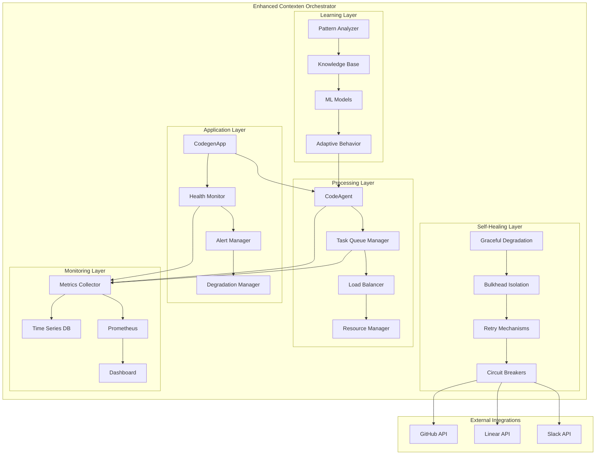
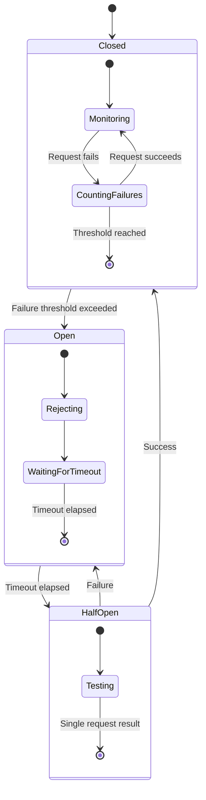
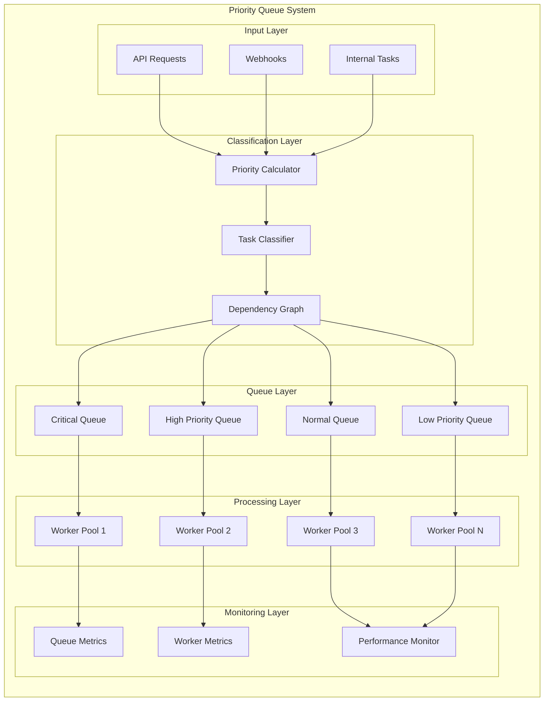
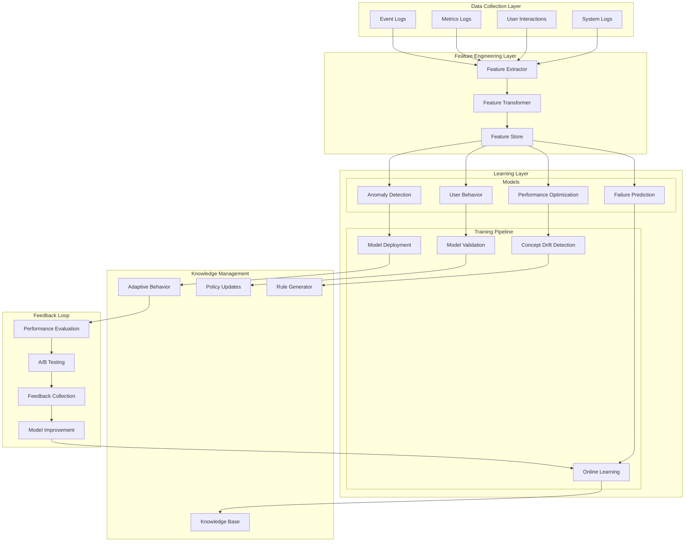
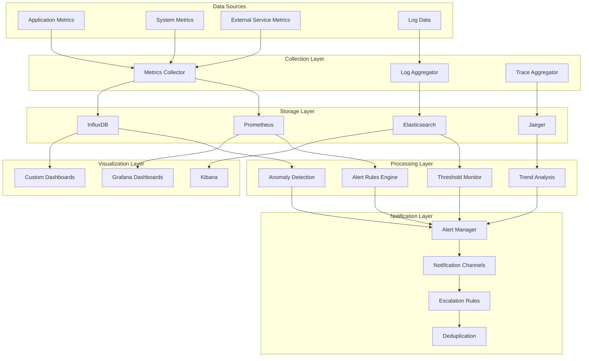
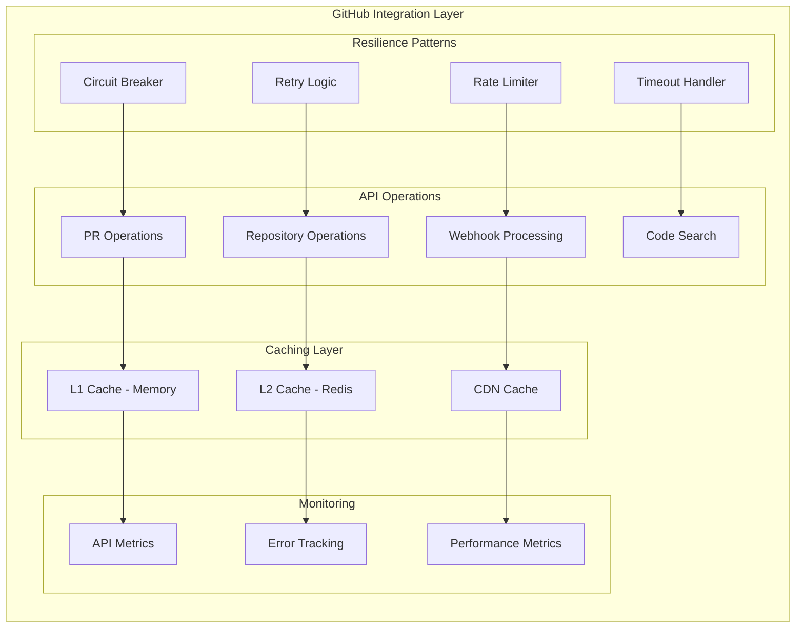
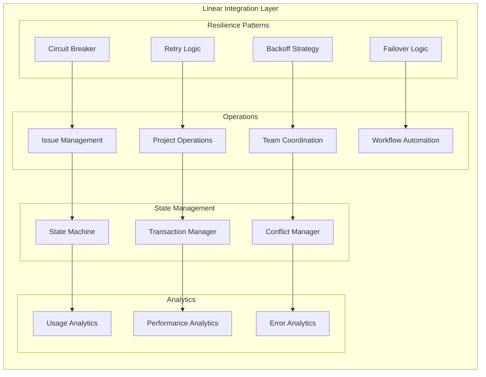
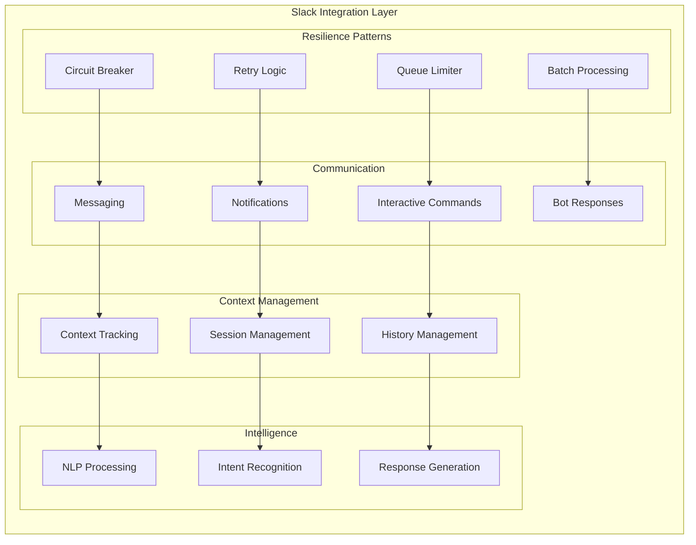
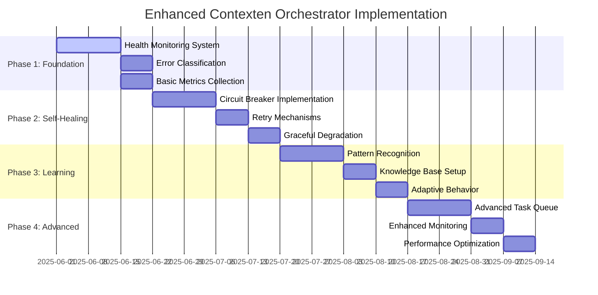

# Enhanced Contexten Orchestrator - Architecture Diagrams and Implementation Details

## System Architecture Overview

## Self-Healing Architecture Components

### Circuit Breaker Pattern Implementation

### Task Queue Management Architecture

## Continuous Learning System Architecture

## Monitoring and Alerting Architecture

## Platform Integration Enhancement

### Enhanced GitHub Integration

### Enhanced Linear Integration

### Enhanced Slack Integration

## Implementation Timeline and Dependencies

## Technology Stack and Dependencies

### Core Technologies
- **Application Framework**: FastAPI, LangChain
- **Task Queue**: Celery with Redis/RabbitMQ
- **Monitoring**: Prometheus, Grafana, InfluxDB
- **Caching**: Redis, Memcached
- **Database**: PostgreSQL, Neo4j (for knowledge graph)
- **Machine Learning**: scikit-learn, TensorFlow/PyTorch
- **Logging**: Elasticsearch, Logstash, Kibana (ELK Stack)

### Infrastructure Requirements
- **Container Orchestration**: Kubernetes
- **Service Mesh**: Istio (for advanced traffic management)
- **Message Broker**: Apache Kafka (for event streaming)
- **Load Balancer**: NGINX, HAProxy
- **Secrets Management**: HashiCorp Vault
- **CI/CD**: GitHub Actions, ArgoCD

This comprehensive architecture provides a robust foundation for implementing the enhanced contexten orchestrator with self-healing capabilities, continuous learning, and advanced platform integrations.

