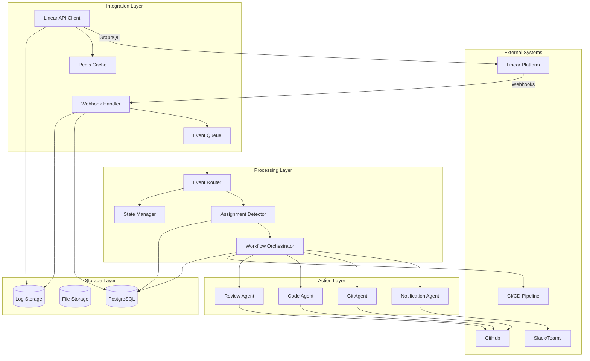
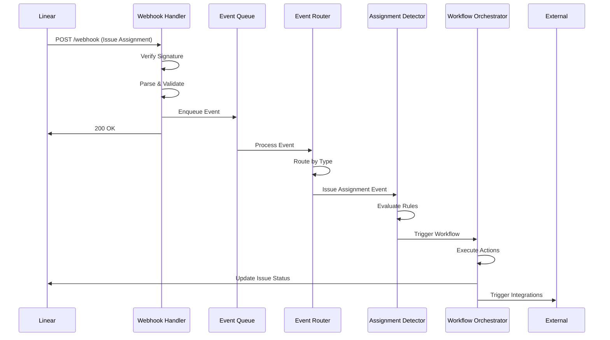
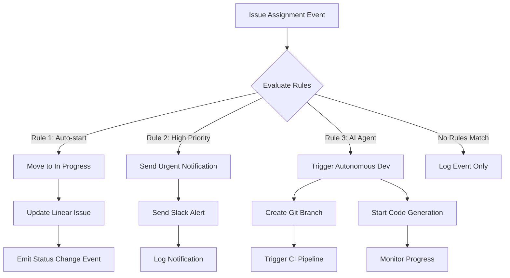
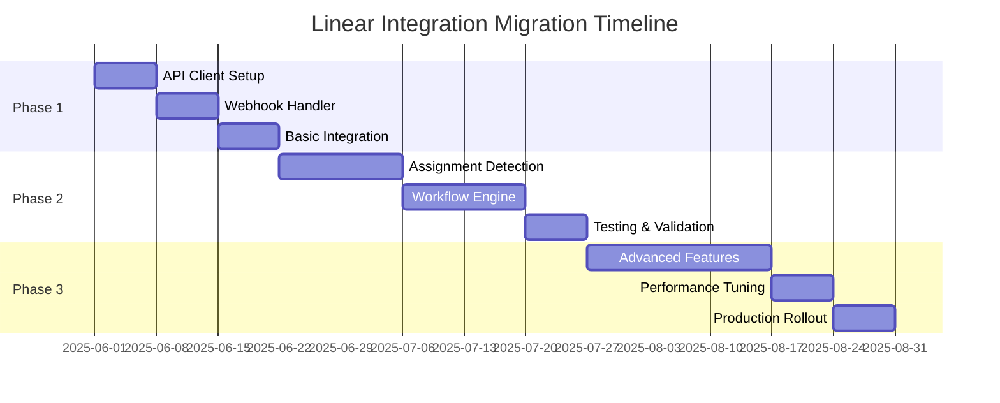

# 🏗️ Linear API Integration Architecture Guide

This document provides detailed architectural guidance for implementing Linear API integration patterns in autonomous development pipelines.

## 📐 System Architecture Overview



## 🔄 Event Flow Architecture

### 1. Webhook Event Processing



### 2. Assignment Detection Flow



## 🏛️ Component Architecture

### 1. Linear API Client Layer

**Responsibilities:**
- GraphQL query optimization
- Rate limiting compliance
- Authentication management
- Response caching
- Error handling and retries

**Key Features:**
- Connection pooling
- Request batching
- Intelligent caching
- Circuit breaker pattern
- Metrics collection

```typescript
interface LinearClientArchitecture {
  authentication: {
    method: 'api-key' | 'oauth';
    tokenRefresh: boolean;
    permissionScopes: string[];
  };
  
  rateLimiting: {
    algorithm: 'leaky-bucket';
    requestsPerHour: number;
    burstCapacity: number;
    backoffStrategy: 'exponential';
  };
  
  caching: {
    levels: ['memory', 'redis'];
    ttl: Record<string, number>;
    invalidationStrategy: 'event-driven';
  };
  
  resilience: {
    retryAttempts: number;
    circuitBreaker: boolean;
    timeouts: Record<string, number>;
  };
}
```

### 2. Webhook Processing Layer

**Responsibilities:**
- Webhook signature verification
- Event parsing and validation
- Duplicate detection
- Queue management
- Security enforcement

**Key Features:**
- Signature verification
- Replay attack prevention
- Rate limiting
- Event deduplication
- Dead letter queues

```typescript
interface WebhookArchitecture {
  security: {
    signatureVerification: boolean;
    timestampValidation: boolean;
    rateLimiting: boolean;
    ipWhitelisting: boolean;
  };
  
  processing: {
    queueType: 'redis-bull';
    concurrency: number;
    retryStrategy: 'exponential-backoff';
    deadLetterQueue: boolean;
  };
  
  monitoring: {
    healthChecks: boolean;
    metrics: string[];
    alerting: boolean;
    logging: 'structured';
  };
}
```

### 3. Event Processing Layer

**Responsibilities:**
- Event routing and filtering
- Business logic execution
- State management
- Workflow orchestration
- Integration coordination

**Key Features:**
- Rule-based routing
- Conditional processing
- State persistence
- Workflow scheduling
- Error recovery

```typescript
interface EventProcessingArchitecture {
  routing: {
    strategy: 'rule-based';
    filters: string[];
    priorities: Record<string, number>;
  };
  
  processing: {
    parallelism: number;
    ordering: 'per-entity';
    stateManagement: 'persistent';
  };
  
  workflows: {
    engine: 'custom' | 'temporal' | 'zeebe';
    scheduling: boolean;
    compensation: boolean;
  };
}
```

## 🔧 Implementation Patterns

### 1. Repository Pattern for Data Access

```typescript
interface LinearRepository {
  // Issue operations
  getIssue(id: string): Promise<Issue>;
  createIssue(input: IssueCreateInput): Promise<Issue>;
  updateIssue(id: string, input: IssueUpdateInput): Promise<Issue>;
  searchIssues(criteria: SearchCriteria): Promise<Issue[]>;
  
  // Team operations
  getTeam(id: string): Promise<Team>;
  getTeamMembers(teamId: string): Promise<User[]>;
  
  // State operations
  getStates(teamId: string): Promise<State[]>;
  getStateByName(teamId: string, name: string): Promise<State>;
  
  // Caching
  invalidateCache(pattern: string): Promise<void>;
  getCacheStats(): CacheStats;
}
```

### 2. Event Sourcing Pattern

```typescript
interface EventStore {
  append(streamId: string, events: DomainEvent[]): Promise<void>;
  getEvents(streamId: string, fromVersion?: number): Promise<DomainEvent[]>;
  subscribe(eventType: string, handler: EventHandler): void;
}

interface DomainEvent {
  id: string;
  type: string;
  aggregateId: string;
  version: number;
  timestamp: Date;
  data: any;
  metadata?: any;
}
```

### 3. CQRS Pattern for Read/Write Separation

```typescript
// Command side - Write operations
interface LinearCommandService {
  createIssue(command: CreateIssueCommand): Promise<void>;
  updateIssue(command: UpdateIssueCommand): Promise<void>;
  assignIssue(command: AssignIssueCommand): Promise<void>;
}

// Query side - Read operations
interface LinearQueryService {
  getIssue(id: string): Promise<IssueView>;
  getAssignedIssues(assigneeId: string): Promise<IssueView[]>;
  getTeamIssues(teamId: string, filters: IssueFilters): Promise<IssueView[]>;
}
```

### 4. Saga Pattern for Distributed Workflows

```typescript
interface AssignmentSaga {
  handle(event: IssueAssignedEvent): Promise<void>;
  compensate(event: SagaFailedEvent): Promise<void>;
}

class AutoStartSaga implements AssignmentSaga {
  async handle(event: IssueAssignedEvent): Promise<void> {
    // Step 1: Validate assignment
    await this.validateAssignment(event);
    
    // Step 2: Move to in progress
    await this.moveToInProgress(event.issueId);
    
    // Step 3: Create branch
    await this.createBranch(event);
    
    // Step 4: Notify stakeholders
    await this.sendNotifications(event);
  }
  
  async compensate(event: SagaFailedEvent): Promise<void> {
    // Rollback operations in reverse order
    await this.deleteNotifications(event.sagaId);
    await this.deleteBranch(event.sagaId);
    await this.revertIssueStatus(event.sagaId);
  }
}
```

## 📊 Performance Optimization Strategies

### 1. Caching Strategy

```typescript
interface CachingStrategy {
  // L1: In-memory cache (fastest)
  memoryCache: {
    maxSize: number;
    ttl: number;
    evictionPolicy: 'LRU';
  };
  
  // L2: Redis cache (shared)
  redisCache: {
    ttl: Record<string, number>;
    keyPatterns: string[];
    compression: boolean;
  };
  
  // L3: Database cache
  databaseCache: {
    queryCache: boolean;
    resultCache: boolean;
    indexOptimization: boolean;
  };
}
```

### 2. Query Optimization

```graphql
# Optimized issue query with minimal fields
query GetIssuesOptimized($teamId: String!, $limit: Int = 50) {
  team(id: $teamId) {
    issues(
      filter: { 
        updatedAt: { gte: $since }
        state: { type: { in: ["backlog", "unstarted", "started"] } }
      }
      orderBy: updatedAt
      first: $limit
    ) {
      nodes {
        id
        identifier
        title
        state { id name type }
        assignee { id name }
        priority
        updatedAt
        # Only essential fields
      }
      pageInfo {
        hasNextPage
        endCursor
      }
    }
  }
}
```

### 3. Batch Processing

```typescript
class BatchProcessor {
  private batchSize = 10;
  private batchTimeout = 1000; // 1 second
  private pendingOperations: Operation[] = [];
  
  async addOperation(operation: Operation): Promise<void> {
    this.pendingOperations.push(operation);
    
    if (this.pendingOperations.length >= this.batchSize) {
      await this.processBatch();
    } else {
      this.scheduleBatchProcessing();
    }
  }
  
  private async processBatch(): Promise<void> {
    const batch = this.pendingOperations.splice(0, this.batchSize);
    
    // Group by operation type
    const grouped = this.groupOperations(batch);
    
    // Execute in parallel
    await Promise.all([
      this.processIssueUpdates(grouped.issueUpdates),
      this.processCommentCreations(grouped.commentCreations),
      this.processStateChanges(grouped.stateChanges)
    ]);
  }
}
```

## 🔒 Security Architecture

### 1. Authentication & Authorization

```typescript
interface SecurityArchitecture {
  authentication: {
    methods: ['api-key', 'oauth2'];
    tokenStorage: 'encrypted';
    rotation: 'automatic';
    validation: 'jwt';
  };
  
  authorization: {
    model: 'rbac';
    permissions: string[];
    scopes: string[];
    enforcement: 'middleware';
  };
  
  encryption: {
    inTransit: 'tls-1.3';
    atRest: 'aes-256';
    keyManagement: 'vault';
  };
}
```

### 2. Webhook Security

```typescript
interface WebhookSecurity {
  signatureVerification: {
    algorithm: 'hmac-sha256';
    secretRotation: boolean;
    timestampValidation: boolean;
  };
  
  rateLimiting: {
    perIP: number;
    perEndpoint: number;
    slidingWindow: boolean;
  };
  
  validation: {
    payloadSize: number;
    contentType: string[];
    schemaValidation: boolean;
  };
}
```

## 📈 Monitoring & Observability

### 1. Metrics Collection

```typescript
interface MetricsArchitecture {
  application: {
    requestLatency: 'histogram';
    requestCount: 'counter';
    errorRate: 'gauge';
    cacheHitRate: 'gauge';
  };
  
  business: {
    issuesProcessed: 'counter';
    assignmentsDetected: 'counter';
    workflowsTriggered: 'counter';
    automationSuccess: 'gauge';
  };
  
  infrastructure: {
    cpuUsage: 'gauge';
    memoryUsage: 'gauge';
    queueDepth: 'gauge';
    connectionPool: 'gauge';
  };
}
```

### 2. Distributed Tracing

```typescript
interface TracingArchitecture {
  spans: {
    webhookProcessing: string[];
    apiCalls: string[];
    databaseQueries: string[];
    externalIntegrations: string[];
  };
  
  correlation: {
    traceId: 'uuid';
    spanId: 'uuid';
    parentSpanId: 'uuid';
    baggage: Record<string, string>;
  };
  
  sampling: {
    strategy: 'adaptive';
    rate: number;
    rules: SamplingRule[];
  };
}
```

### 3. Alerting Strategy

```typescript
interface AlertingArchitecture {
  levels: {
    critical: {
      conditions: string[];
      channels: ['pagerduty', 'slack'];
      escalation: boolean;
    };
    
    warning: {
      conditions: string[];
      channels: ['slack', 'email'];
      aggregation: 'time-based';
    };
    
    info: {
      conditions: string[];
      channels: ['dashboard'];
      retention: '30d';
    };
  };
}
```

## 🚀 Deployment Architecture

### 1. Container Architecture

```dockerfile
# Multi-stage build for optimization
FROM node:18-alpine AS builder
WORKDIR /app
COPY package*.json ./
RUN npm ci --only=production

FROM node:18-alpine AS runtime
WORKDIR /app
COPY --from=builder /app/node_modules ./node_modules
COPY . .
EXPOSE 3000
CMD ["npm", "start"]
```

### 2. Kubernetes Deployment

```yaml
apiVersion: apps/v1
kind: Deployment
metadata:
  name: linear-integration
spec:
  replicas: 3
  selector:
    matchLabels:
      app: linear-integration
  template:
    metadata:
      labels:
        app: linear-integration
    spec:
      containers:
      - name: linear-integration
        image: linear-integration:latest
        ports:
        - containerPort: 3000
        env:
        - name: LINEAR_API_KEY
          valueFrom:
            secretKeyRef:
              name: linear-secrets
              key: api-key
        resources:
          requests:
            memory: "256Mi"
            cpu: "250m"
          limits:
            memory: "512Mi"
            cpu: "500m"
        livenessProbe:
          httpGet:
            path: /health
            port: 3000
          initialDelaySeconds: 30
          periodSeconds: 10
        readinessProbe:
          httpGet:
            path: /ready
            port: 3000
          initialDelaySeconds: 5
          periodSeconds: 5
```

### 3. Infrastructure as Code

```terraform
# Redis for caching and queues
resource "aws_elasticache_cluster" "linear_cache" {
  cluster_id           = "linear-cache"
  engine               = "redis"
  node_type            = "cache.t3.micro"
  num_cache_nodes      = 1
  parameter_group_name = "default.redis7"
  port                 = 6379
  subnet_group_name    = aws_elasticache_subnet_group.linear.name
  security_group_ids   = [aws_security_group.redis.id]
}

# PostgreSQL for persistent storage
resource "aws_db_instance" "linear_db" {
  identifier     = "linear-integration"
  engine         = "postgres"
  engine_version = "14.9"
  instance_class = "db.t3.micro"
  allocated_storage = 20
  
  db_name  = "linear_integration"
  username = "linear_user"
  password = var.db_password
  
  vpc_security_group_ids = [aws_security_group.postgres.id]
  db_subnet_group_name   = aws_db_subnet_group.linear.name
  
  backup_retention_period = 7
  backup_window          = "03:00-04:00"
  maintenance_window     = "sun:04:00-sun:05:00"
  
  skip_final_snapshot = true
}
```

## 🔄 Migration Strategy

### 1. Phased Rollout



### 2. Feature Flags

```typescript
interface FeatureFlags {
  webhookProcessing: boolean;
  assignmentDetection: boolean;
  automaticWorkflows: boolean;
  advancedCaching: boolean;
  batchProcessing: boolean;
}

class FeatureManager {
  async isEnabled(feature: keyof FeatureFlags): Promise<boolean> {
    // Check feature flag from configuration service
    return await this.configService.getFeatureFlag(feature);
  }
}
```

### 3. Rollback Strategy

```typescript
interface RollbackStrategy {
  triggers: {
    errorRate: number;
    latency: number;
    availability: number;
  };
  
  actions: {
    disableFeatures: string[];
    fallbackMode: boolean;
    alertTeam: boolean;
  };
  
  recovery: {
    automaticRetry: boolean;
    manualIntervention: boolean;
    dataConsistency: boolean;
  };
}
```

---

This architecture guide provides the foundation for implementing a robust, scalable, and maintainable Linear API integration system. Each component is designed to be independently deployable and horizontally scalable to meet the demands of autonomous development pipelines.

