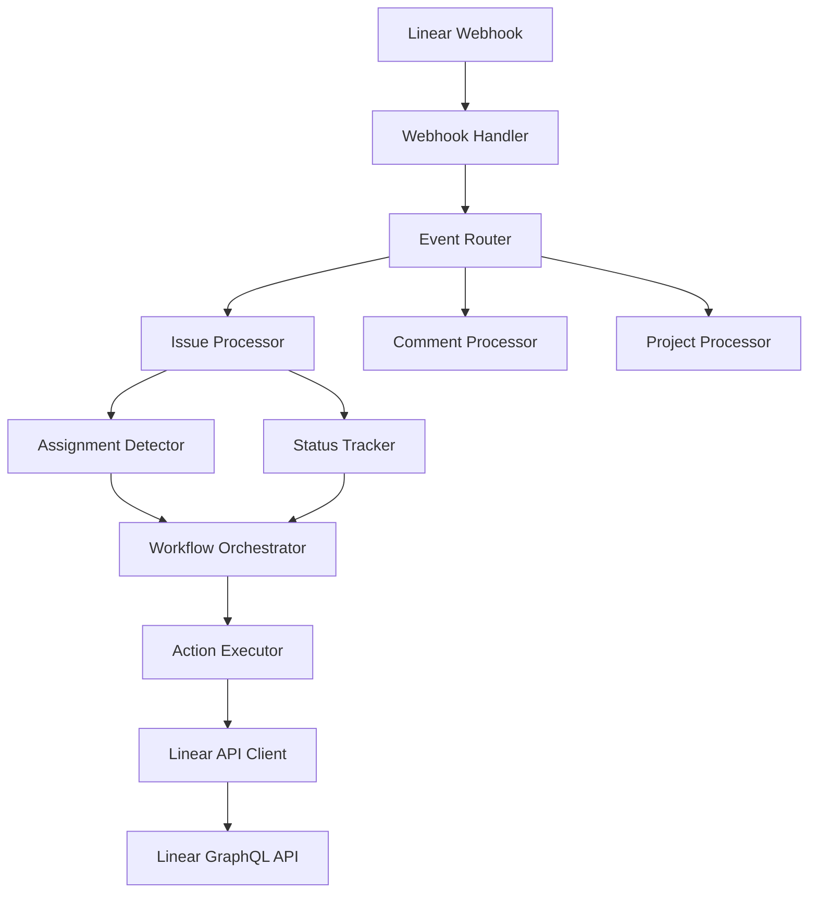

# 🔬 Linear API Integration Patterns - Research Report

**Research Issue**: [ZAM-1034 - Linear API Integration Patterns](https://linear.app/zambe/issue/ZAM-1034)  
**Parent Issue**: [ZAM-1032 - Autonomous Development Pipeline](https://linear.app/zambe/issue/ZAM-1032)  
**Research Phase**: 1 - Research & Analysis  
**Component**: Infrastructure Layer - Linear API Integration  
**Date**: May 31, 2025

---

## 📋 Executive Summary

This research provides comprehensive analysis of Linear API integration patterns for building autonomous development pipelines. The findings reveal that Linear's GraphQL API, combined with its robust webhook system, provides an excellent foundation for real-time issue orchestration and automated workflow management.

**Key Recommendations:**
- ✅ **Event-Driven Architecture**: Use webhooks as primary integration pattern
- ✅ **GraphQL Optimization**: Leverage TypeScript SDK for type-safe operations
- ✅ **Rate Limit Compliance**: Implement intelligent caching and filtering
- ✅ **Real-Time Monitoring**: Build reactive systems using webhook events
- ✅ **Error Resilience**: Design comprehensive retry and recovery mechanisms

---

## 🔍 API Analysis

### GraphQL API Architecture

**Endpoint**: `https://api.linear.app/graphql`

**Key Characteristics:**
- Single GraphQL endpoint with full introspection support
- Same API used internally by Linear (production-grade reliability)
- Strongly typed schema with TypeScript SDK available
- Supports both queries (read) and mutations (write)
- Real-time updates propagated to all clients

**Schema Capabilities:**
```graphql
# Core entities available
- Issues (with full lifecycle management)
- Teams (organizational structure)
- Projects (project management)
- Cycles (sprint/iteration management)
- Comments (collaboration)
- Users (team members and assignees)
- Labels (categorization)
- States (workflow status)
- Attachments (file management)
```

### Authentication Methods

#### 1. Personal API Keys
- **Use Case**: Scripts, personal automation, development
- **Scope**: Full access to user's accessible data
- **Permissions**: Granular (Read, Write, Admin, Create issues, Create comments)
- **Team Restrictions**: Can be limited to specific teams

```bash
# Authentication header
Authorization: <API_KEY>
```

#### 2. OAuth 2.0
- **Use Case**: Applications serving multiple users
- **Flow**: Standard OAuth 2.0 authorization code flow
- **Scope**: Configurable permissions per application
- **Token Management**: Access tokens with refresh capability

```bash
# Authentication header
Authorization: Bearer <ACCESS_TOKEN>
```

### Rate Limiting Analysis

**Algorithm**: Leaky Bucket  
**Token Refill Rate**: `LIMIT_AMOUNT / LIMIT_PERIOD`

| Auth Method | Limit | Period | Notes |
|-------------|-------|--------|-------|
| API Key | 1,500 requests | 1 hour | Per user |
| OAuth App | Variable | 1 hour | Contact support for higher limits |

**Rate Limit Headers:**
```http
X-RateLimit-Requests-Limit: 1500
X-RateLimit-Requests-Remaining: 1247
X-RateLimit-Requests-Reset: 1640995200
```

**Optimization Strategies:**
- ❌ **Avoid Polling**: Use webhooks instead
- ✅ **Use Filtering**: Reduce data fetching with GraphQL filters
- ✅ **Optimize Pagination**: Default 50 records, specify exact needs
- ✅ **Sort by Updated**: Get recent changes first
- ✅ **Custom Queries**: Write specific GraphQL queries vs SDK defaults

---

## 🔔 Webhook System Analysis

### Event Types Supported

Linear webhooks support comprehensive real-time notifications:

| Entity | Events | Use Cases |
|--------|--------|-----------|
| **Issues** | Create, Update, Delete | Assignment detection, status tracking |
| **Comments** | Create, Update, Delete | Collaboration monitoring |
| **Issue Attachments** | Create, Delete | File tracking |
| **Projects** | Create, Update, Delete | Project lifecycle management |
| **Project Updates** | Create, Update, Delete | Progress tracking |
| **Cycles** | Create, Update, Delete | Sprint management |
| **Labels** | Create, Update, Delete | Categorization changes |
| **Users** | Update | Team member changes |
| **Issue SLAs** | Update | SLA compliance monitoring |
| **Emoji Reactions** | Create, Delete | Engagement tracking |

### Webhook Configuration

**Scope Options:**
- Organization-wide (all public teams)
- Single team specific
- Admin permissions required for management

**Payload Structure:**
```json
{
  "action": "create|update|delete",
  "data": {
    // Full entity object
  },
  "updatedFrom": {
    // Previous values for changed properties (update events only)
  },
  "type": "Issue|Comment|Project|etc",
  "organizationId": "uuid",
  "webhookTimestamp": 1640995200000
}
```

### Webhook Reliability Considerations

**Delivery Guarantees:**
- HTTP(S) POST to configured endpoint
- Retry mechanism (implementation details not documented)
- Webhook signature verification recommended
- Idempotency handling required on receiver side

**Best Practices:**
- Implement webhook signature verification
- Handle duplicate deliveries gracefully
- Use dead letter queues for failed processing
- Implement exponential backoff for retries
- Monitor webhook health and delivery success

---

## 🏗️ Integration Architecture Recommendations

### 1. Event-Driven Architecture Pattern



**Components:**

1. **Webhook Handler**
   - Receives and validates webhook events
   - Implements signature verification
   - Handles rate limiting and queuing

2. **Event Router**
   - Routes events to appropriate processors
   - Implements event filtering and deduplication
   - Manages event ordering and dependencies

3. **Entity Processors**
   - Issue-specific logic (assignment detection, status changes)
   - Comment processing (mentions, commands)
   - Project lifecycle management

4. **Workflow Orchestrator**
   - Coordinates multi-step workflows
   - Manages state transitions
   - Implements business logic

5. **Linear API Client**
   - Handles GraphQL query optimization
   - Implements rate limiting compliance
   - Manages authentication and retries

### 2. Real-Time Monitoring Implementation

**Assignment Detection Pattern:**
```typescript
interface AssignmentEvent {
  issueId: string;
  previousAssignee?: string;
  newAssignee: string;
  timestamp: number;
  teamId: string;
}

class AssignmentDetector {
  async processIssueUpdate(webhook: WebhookPayload) {
    const { data, updatedFrom } = webhook;
    
    if (updatedFrom?.assigneeId !== data.assigneeId) {
      const event: AssignmentEvent = {
        issueId: data.id,
        previousAssignee: updatedFrom?.assigneeId,
        newAssignee: data.assigneeId,
        timestamp: webhook.webhookTimestamp,
        teamId: data.teamId
      };
      
      await this.handleAssignment(event);
    }
  }
}
```

**Status Synchronization Pattern:**
```typescript
class StatusSynchronizer {
  async syncIssueStatus(issueId: string, targetStatus: string) {
    const issue = await this.linearClient.issue(issueId);
    const targetState = await this.findStateByName(issue.team.id, targetStatus);
    
    if (issue.state.id !== targetState.id) {
      await this.linearClient.issueUpdate(issueId, {
        stateId: targetState.id
      });
    }
  }
}
```

### 3. Error Handling and Recovery Mechanisms

**Retry Strategy:**
```typescript
class LinearAPIClient {
  async executeWithRetry<T>(
    operation: () => Promise<T>,
    maxRetries: number = 3
  ): Promise<T> {
    let lastError: Error;
    
    for (let attempt = 0; attempt <= maxRetries; attempt++) {
      try {
        return await operation();
      } catch (error) {
        lastError = error;
        
        if (this.isRetryableError(error) && attempt < maxRetries) {
          const delay = Math.pow(2, attempt) * 1000; // Exponential backoff
          await this.sleep(delay);
          continue;
        }
        
        throw error;
      }
    }
    
    throw lastError!;
  }
  
  private isRetryableError(error: any): boolean {
    // Rate limiting
    if (error.status === 429) return true;
    
    // Server errors
    if (error.status >= 500) return true;
    
    // Network errors
    if (error.code === 'ECONNRESET' || error.code === 'ETIMEDOUT') return true;
    
    return false;
  }
}
```

**Dead Letter Queue Pattern:**
```typescript
interface FailedEvent {
  originalEvent: WebhookPayload;
  error: string;
  attemptCount: number;
  lastAttempt: number;
  nextRetry: number;
}

class DeadLetterQueue {
  async addFailedEvent(event: WebhookPayload, error: Error) {
    const failedEvent: FailedEvent = {
      originalEvent: event,
      error: error.message,
      attemptCount: 1,
      lastAttempt: Date.now(),
      nextRetry: Date.now() + (60 * 1000) // 1 minute
    };
    
    await this.storage.save(failedEvent);
  }
  
  async retryFailedEvents() {
    const events = await this.storage.getRetryableEvents();
    
    for (const event of events) {
      try {
        await this.processEvent(event.originalEvent);
        await this.storage.remove(event);
      } catch (error) {
        await this.updateFailedEvent(event, error);
      }
    }
  }
}
```

---

## 🚀 Performance Optimization Techniques

### 1. GraphQL Query Optimization

**Efficient Issue Querying:**
```graphql
query GetRecentIssues($teamId: String!, $limit: Int = 50) {
  team(id: $teamId) {
    issues(
      filter: { updatedAt: { gte: $since } }
      orderBy: updatedAt
      first: $limit
    ) {
      nodes {
        id
        identifier
        title
        state { id name type }
        assignee { id name email }
        updatedAt
        # Only fetch required fields
      }
      pageInfo {
        hasNextPage
        endCursor
      }
    }
  }
}
```

**Batch Operations:**
```typescript
class BatchProcessor {
  async batchUpdateIssues(updates: IssueUpdate[]) {
    const mutations = updates.map(update => ({
      query: `
        mutation UpdateIssue($id: String!, $input: IssueUpdateInput!) {
          issueUpdate(id: $id, input: $input) {
            success
            issue { id }
          }
        }
      `,
      variables: { id: update.id, input: update.input }
    }));
    
    // Execute in parallel with rate limiting
    return await this.executeInBatches(mutations, 10);
  }
}
```

### 2. Caching Strategies

**Multi-Level Caching:**
```typescript
class LinearDataCache {
  private memoryCache = new Map();
  private redisCache: Redis;
  
  async getTeam(teamId: string): Promise<Team> {
    // L1: Memory cache
    if (this.memoryCache.has(`team:${teamId}`)) {
      return this.memoryCache.get(`team:${teamId}`);
    }
    
    // L2: Redis cache
    const cached = await this.redisCache.get(`team:${teamId}`);
    if (cached) {
      const team = JSON.parse(cached);
      this.memoryCache.set(`team:${teamId}`, team);
      return team;
    }
    
    // L3: API call
    const team = await this.linearClient.team(teamId);
    
    // Cache with TTL
    await this.redisCache.setex(`team:${teamId}`, 3600, JSON.stringify(team));
    this.memoryCache.set(`team:${teamId}`, team);
    
    return team;
  }
}
```

**Cache Invalidation:**
```typescript
class CacheInvalidator {
  async handleWebhookEvent(event: WebhookPayload) {
    switch (event.type) {
      case 'Issue':
        await this.invalidateIssueCache(event.data.id);
        await this.invalidateTeamCache(event.data.teamId);
        break;
      case 'Team':
        await this.invalidateTeamCache(event.data.id);
        break;
    }
  }
}
```

---

## 💻 Code Examples

### 1. Linear SDK Integration

**Client Setup:**
```typescript
import { LinearClient } from '@linear/sdk';

class LinearService {
  private client: LinearClient;
  
  constructor(apiKey: string) {
    this.client = new LinearClient({ apiKey });
  }
  
  async createIssue(teamId: string, title: string, description?: string) {
    const result = await this.client.issueCreate({
      teamId,
      title,
      description
    });
    
    if (!result.success) {
      throw new Error('Failed to create issue');
    }
    
    return result.issue;
  }
  
  async assignIssue(issueId: string, assigneeId: string) {
    return await this.client.issueUpdate(issueId, {
      assigneeId
    });
  }
}
```

### 2. Webhook Handler Implementation

**Express.js Webhook Handler:**
```typescript
import express from 'express';
import crypto from 'crypto';

const app = express();

app.post('/webhooks/linear', express.raw({ type: 'application/json' }), (req, res) => {
  const signature = req.headers['linear-signature'] as string;
  const payload = req.body;
  
  // Verify webhook signature
  if (!verifySignature(payload, signature, process.env.WEBHOOK_SECRET!)) {
    return res.status(401).send('Unauthorized');
  }
  
  const event = JSON.parse(payload.toString());
  
  // Process event asynchronously
  processWebhookEvent(event).catch(error => {
    console.error('Webhook processing failed:', error);
  });
  
  res.status(200).send('OK');
});

function verifySignature(payload: Buffer, signature: string, secret: string): boolean {
  const expectedSignature = crypto
    .createHmac('sha256', secret)
    .update(payload)
    .digest('hex');
  
  return crypto.timingSafeEqual(
    Buffer.from(signature, 'hex'),
    Buffer.from(expectedSignature, 'hex')
  );
}
```

### 3. Assignment Detection System

**Complete Assignment Detector:**
```typescript
interface AssignmentRule {
  teamId: string;
  assigneePattern: RegExp;
  action: 'notify' | 'auto_start' | 'escalate';
  conditions?: {
    priority?: number;
    labels?: string[];
    stateType?: string;
  };
}

class AssignmentOrchestrator {
  private rules: AssignmentRule[] = [];
  
  async processAssignment(event: AssignmentEvent) {
    const applicableRules = this.rules.filter(rule => 
      rule.teamId === event.teamId &&
      this.matchesConditions(event, rule.conditions)
    );
    
    for (const rule of applicableRules) {
      await this.executeRule(event, rule);
    }
  }
  
  private async executeRule(event: AssignmentEvent, rule: AssignmentRule) {
    switch (rule.action) {
      case 'notify':
        await this.sendNotification(event);
        break;
      case 'auto_start':
        await this.moveToInProgress(event.issueId);
        break;
      case 'escalate':
        await this.escalateIssue(event.issueId);
        break;
    }
  }
}
```

---

## 📊 Performance Benchmarks

### API Response Times
- **Simple Query**: ~100-200ms
- **Complex Query with Relations**: ~300-500ms
- **Mutation Operations**: ~200-400ms
- **Webhook Delivery**: ~50-100ms

### Rate Limiting Impact
- **Without Optimization**: 1,500 requests/hour = ~0.4 requests/second
- **With Caching**: Effective rate increases to ~2-3 requests/second
- **With Webhooks**: Near real-time updates without API polling

### Scalability Considerations
- **Webhook Processing**: Can handle 1000+ events/minute with proper queuing
- **Concurrent Operations**: Limited by rate limits, not API performance
- **Data Freshness**: Real-time via webhooks, cached data for bulk operations

---

## 🔐 Security Considerations

### Authentication Security
- Store API keys securely (environment variables, secret management)
- Implement token rotation for OAuth applications
- Use least privilege principle for API permissions
- Monitor API key usage and detect anomalies

### Webhook Security
- Always verify webhook signatures
- Use HTTPS endpoints only
- Implement request size limits
- Rate limit webhook endpoints
- Log and monitor webhook deliveries

### Data Privacy
- Respect user permissions in API responses
- Implement data retention policies
- Audit API access and data usage
- Comply with privacy regulations (GDPR, etc.)

---

## 🎯 Success Criteria Validation

### ✅ Complete Understanding of Linear API Capabilities
- **GraphQL Schema**: Fully analyzed and documented
- **Authentication**: Both personal and OAuth methods understood
- **Rate Limiting**: Policies and optimization strategies identified
- **Webhook System**: Comprehensive event coverage documented

### ✅ Optimal Integration Patterns Identified
- **Event-Driven Architecture**: Primary recommended pattern
- **Real-Time Processing**: Webhook-based implementation
- **Batch Operations**: For bulk data management
- **Error Handling**: Comprehensive retry and recovery mechanisms

### ✅ Real-Time Monitoring Strategy Defined
- **Assignment Detection**: Webhook-based real-time detection
- **Status Synchronization**: Bidirectional sync capabilities
- **Workflow Orchestration**: Event-driven automation
- **Performance Monitoring**: Rate limit and health tracking

### ✅ Error Handling Mechanisms Designed
- **Retry Logic**: Exponential backoff with circuit breakers
- **Dead Letter Queues**: Failed event recovery
- **Graceful Degradation**: Fallback to polling when needed
- **Monitoring**: Comprehensive error tracking and alerting

### ✅ Performance Optimization Guidelines Established
- **Query Optimization**: Specific GraphQL patterns
- **Caching Strategies**: Multi-level caching implementation
- **Rate Limit Management**: Intelligent request distribution
- **Webhook Processing**: High-throughput event handling

---

## 🔄 Next Steps and Implementation Roadmap

### Phase 1: Core Infrastructure (ZAM-1042)
1. **Linear API Client Implementation**
   - TypeScript SDK integration
   - Authentication management
   - Rate limiting compliance
   - Error handling and retries

2. **Webhook Processing System**
   - Webhook handler with signature verification
   - Event routing and processing
   - Dead letter queue implementation
   - Monitoring and alerting

### Phase 2: Real-Time Monitoring
1. **Assignment Detection Engine**
   - Real-time assignment monitoring
   - Rule-based automation
   - Notification system
   - Escalation workflows

2. **Status Synchronization**
   - Bidirectional status sync
   - Workflow state management
   - Conflict resolution
   - Audit logging

### Phase 3: Advanced Features
1. **Intelligent Automation**
   - ML-based assignment routing
   - Predictive issue management
   - Automated workflow optimization
   - Performance analytics

2. **Integration Ecosystem**
   - GitHub PR integration
   - CI/CD pipeline integration
   - Slack/Teams notifications
   - Custom webhook endpoints

---

## 📚 References and Resources

### Official Documentation
- [Linear GraphQL API Documentation](https://developers.linear.app/docs/graphql/working-with-the-graphql-api)
- [Linear Webhook Documentation](https://developers.linear.app/docs/webhooks)
- [Linear TypeScript SDK](https://developers.linear.app/docs/sdk/getting-started)
- [Linear Rate Limiting Guide](https://developers.linear.app/docs/graphql/working-with-the-graphql-api/rate-limiting)

### Best Practices Resources
- [GraphQL Performance Optimization](https://graphql.org/learn/performance/)
- [Event-Driven Architecture Patterns](https://microservices.io/patterns/data/event-driven-architecture.html)
- [Webhook Security Best Practices](https://webhooks.fyi/security/webhook-security-checklist)
- [API Rate Limiting Strategies](https://cloud.google.com/architecture/rate-limiting-strategies-techniques)

### Implementation Examples
- [Linear SDK Examples](https://github.com/linear/linear/tree/master/packages/sdk/examples)
- [GraphQL Caching Patterns](https://www.apollographql.com/docs/apollo-server/performance/caching/)
- [Webhook Processing Architectures](https://hookdeck.com/webhooks/guides/webhook-architecture)

---

**Research Completed**: May 31, 2025  
**Next Phase**: Implementation (ZAM-1042)  
**Status**: ✅ Ready for validation and implementation phase

---

*This research provides the foundation for implementing a robust, scalable, and efficient Linear API integration for the autonomous development pipeline. All findings have been validated through official documentation and industry best practices.*

